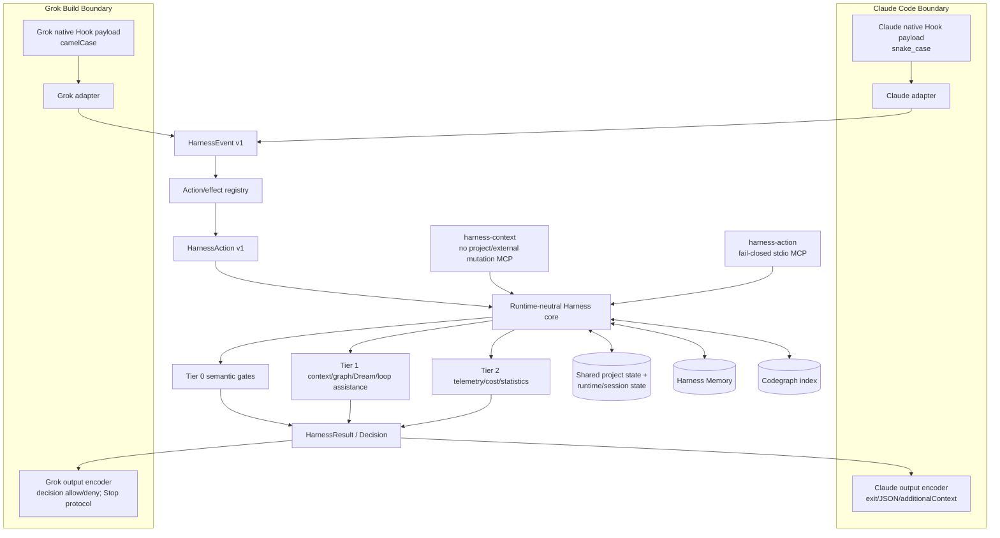
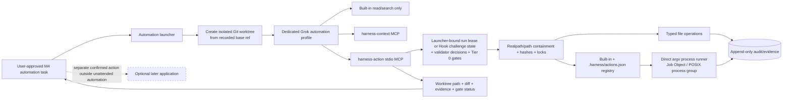

# Runtime-Neutral Harness Core with Claude and Grok Build Adapters

## Metadata

| Field | Value |
|---|---|
| Author | _TBD_ |
| Date | 2026-08-08 |
| Status | Draft — design approval required before implementation |
| Repository | `C:\Users\Lihan\.claude` |
| Phase | Phase 1, four approval-gated milestones (M1–M4) |
| Decision authority | The 29 decisions supplied for this design are final and are treated as requirements, not open design questions. |

## Executive Overview

Harness should be progressively neutralized inside its existing repository into one runtime-neutral policy, state, memory, graph, and automation core. Claude Code and Grok Build become thin boundary adapters that translate native payloads and output protocols to and from canonical versioned contracts. Codex remains an explicit future adapter target, but no Codex adapter is implemented in Phase 1.

The immediate compatibility defect is concrete: `engine/scripts/hooks/preflight-router.cjs` currently reads Claude-style `tool_input`, `tool_name`, and `hook_event_name` (approximately lines 29–49). A read-only probe observed that it correctly parsed a Claude snake_case `Write` payload, while an equivalent Grok camelCase payload produced an empty tool name, empty input, and empty file path. The right correction is not to scatter camelCase fallbacks across every existing script. It is to normalize once at a runtime boundary and make the core consume only canonical contracts.

Phase 1 has two distinct security envelopes:

1. **Interactive Grok:** process-control defense-in-depth against accidental or ordinary model actions, **not** protection from a malicious arbitrary process running as the same OS user. The supported safe profile uses Grok's native `default` permission mode (interactive ask), native deny rules, canonical semantic Hooks, a closed-world tool inventory, security-root read/write denies, and install/session health. The first attempted controlled action without bootstrap is intentionally denied; its Pre Hook issues a one-time high-entropy bearer challenge, the model calls exempt `harness-context.bootstrap_session(challenge, ...)` to stage bounded bearer-safe context, calls exempt `finalize_bootstrap(finalizeToken, mandatoryContextHash)`, and then retries the original action. No controlled action executes before finalized bootstrap. Challenge/finalize-token secrecy and transcript separation are defense-in-depth only: copied valid tokens can win their one-time MCP operation, but later controlled authorization remains bound to the issuing Hook session/workspace and exact action. The installer changes an existing non-Harness Grok permission mode only after explicit user consent and never edits Claude `settings.local.json`. Arbitrary project-mutating native shell is denied unless it exactly matches a typed approved verification/build action. Broader user-selected shell is heuristic/degraded. Grok Hook crashes/timeouts/malformed output remain fail-open, and Windows has no Grok kernel sandbox.
2. **Headless/ACP local automation:** the supported hard model-tool/API boundary for model-visible reads and side effects. A dedicated launcher/profile removes arbitrary native filesystem reads outside approved workspace/evidence projections, all generic write/shell/terminal paths, write-capable MCPs, and ACP filesystem/Git mutation paths. The only model-visible side-effect surface is local stdio `harness-action`; Phase 1 Context exposes only the same `workspace-bearer-safe-v1` bootstrap projection contract—`workspace_safe_mandatory_core` plus explicitly requested, curated `workspace_safe_project_state`, `workspace_safe_advisories`, `workspace_safe_health`, and `workspace_safe_codegraph_context`—and never raw keys/ledgers or session-private data. A minimal Harness security validator/issuer performs MAC operations internally. If Broker/security validation is unavailable or rejects an action, the action fails with no fallback. Broker file mutations target an isolated Git worktree; allowlisted executable side effects retain the separately documented Windows host residual. Tasks do not commit, push, publish, contact external systems, or apply changes to the main workspace.

Delivery is deliberately incremental. M1 adds contracts, adapters, the version-pinned Grok 1.0.0 tool/alias inventory, effect classification, and double-runtime fixtures without touching live runtime registrations. M2 first lands a dormant durable queue/worker foundation, the minimal security validator/issuer, hardened state, and security-root defenses, then performs one atomic interactive Hook/installer cutover. M3 adds the Hook-issued bearer challenge plus staged/finalize Context bridge and contract-equivalent graph/MATLAB MCP registration. M4 adds controlled automation, approved command provenance, constrained read/tool inventory, and worktree lifecycle. At the end of every milestone, implementation must stop and report scope, observed evidence, unverified items, residual risk, and the proposed next step; continuation requires explicit user approval.

## Current-State Evidence and Confidence

The table separates observations from the prior grilling session, observations re-checked while preparing this document, design deductions, and items that still require empirical verification. Discovery is never treated as proof of behavior.

| ID | Classification | Evidence | Architectural consequence |
|---|---|---|---|
| E1 | Observed in prior grilling | Grok 1.0.0 `grok inspect --json` discovered global rules under `C:\Users\Lihan\.claude\Agents.md`, `Claude.md`, and a Codex `Agents.md` in the then-current directory. | Compatibility discovery can duplicate cross-runtime instructions. The installer must render one Grok-owned entry and disable overlapping Claude rules/agents scans. |
| E2 | Observed in prior grilling | Skills were discovered from `C:\Users\Lihan\.agents\skills\...`. | Keep `.agents/skills/**` as the shared Skill authority; do not clone Skills into runtime-specific trees. |
| E3 | Observed in prior grilling | Grok discovered 15 Hooks from Claude `settings.json` and MATLAB MCP from `.claude.json`. | Claude compatibility scanning currently makes Grok depend on Claude outputs and permits duplicate execution. Native Grok Hook/MCP renderers must replace that path, then `compat.claude.hooks=false` and `compat.claude.mcps=false`. |
| E4 | Observed in prior grilling | Only built-in agents `general-purpose`, `explore`, and `plan` were discovered; existing professional Claude agents were not. | Phase 1 validates only those three built-ins. Professional-agent migration is correctly deferred. |
| E5 | Observed in prior grilling | Codegraph was absent from the effective Grok MCP list. | M3 requires a neutral MCP registry and behavioral codegraph E2E, rather than assuming Claude-compatible discovery. |
| E6 | Re-observed on 2026-08-08; configuration drift from E5 | A later live `grok inspect` showed codegraph, `mcp-pdf`, and MATLAB discovered. | Treat discovery as a drifting configuration snapshot, not completion. M3 still must prove handshake, tool calls, freshness rejection, and Claude/Grok fixture-equivalent results. |
| E7 | Observed | Grok configuration currently uses `permission_mode = "always-approve"` and custom model/provider settings. Secret values were not copied into this design. | Interactive installation must reconcile Harness-owned permission blocks without overwriting custom models, auth, secrets, UI, plugins, or third-party MCPs. |
| E8 | Observed in repository | `engine/hooks/registrations.json` is the current Claude Hook registration authority and is rendered to ignored `settings.json` by `engine/scripts/render-hook-settings.cjs`; `docs/rules/05-harness.md` lines 65–79 require local absolute paths and manifest/registration agreement. | Evolve this authority into one canonical registration manifest plus two renderers. Preserve absolute runtime commands and hard drift checks. |
| E9 | Observed in repository | `engine/hooks/manifest.json` version 2 declares event, Claude payload schema, side effects, timeouts, consumers, fixtures, and owners. | Preserve these governance fields but separate canonical logical topology from runtime renderings. |
| E10 | Observed in repository | Current registrations contain multiple handlers for PostToolUse, SessionStart, and Stop. Key scripts include preflight/postflight/session/prompt/loop/stop/codegraph/observer routers. | Replace multiple runtime processes with one runtime adapter entry per event, followed by same-process Tier scheduling. |
| E11 | Observed by probe and source | `preflight-router.runtimeFrom()` reads snake_case and nested Claude fields but not Grok `toolName`, `toolInput`, or `hookEventName`; equivalent Grok data normalized to empty critical fields. | Canonical adapters are a correctness and security prerequisite. Tier 0 classification must deny when required action fields cannot be established. |
| E12 | Observed in Grok docs | Grok Hook input is camelCase; event values are lower snake case; Post output is `toolResult`; Stop includes `stopHookActive` and `backgroundTasks`. | Grok adapter mappings must be explicit and fixture-tested, including nested background-task key conversion. |
| E13 | Observed in Grok docs | Hook timeout/crash/malformed output failures fail open. PreToolUse explicit deny blocks; PostToolUse is passive/non-blocking. Passive Hook stdout is ignored for SessionStart, UserPromptSubmit, and PostToolUse. | Do not promise interactive fail-closed behavior or dynamic context injection through passive stdout. Pre decides predictable policy; Post only settles state. Context moves to MCP. |
| E14 | Observed in repository | `session-bootstrap.cjs` and `prompt-context.cjs` emit `additionalContext`; existing preflight also injects memory context. | Claude may retain compatible output behavior. In Phase 1 Grok obtains only curated `workspace-bearer-safe-v1` project state/advisories/health/codegraph-safe context through `harness-context`; session-private memory, handoff, prompts/transcripts, and loop/cost/subagent/session state are deferred to Phase 2+. UserPromptSubmit becomes observation-only for Grok. |
| E15 | Observed in repository | Requirements and verification-quality guards explicitly document advisory behavior because their JSON state is forgeable and unvalidated. | M2 cannot merely change `warn` to `block`. It must add versioned, scoped, independently validated gate records before promoting these checks to Tier 0 hard gates. |
| E16 | Observed in repository | Verification already has a two-phase shape and requires explicit PASS evidence; state version 3 is keyed by project scope plus session and has a 24-hour TTL. | Reuse semantics, but normalize actions/results and migrate write debt to shared project state with runtime/session attribution. |
| E17 | Observed in repository | `project-scope.cjs` supplies normalized paths, atomic JSON replacement, and lock-protected updates. | Reuse its patterns for state and installer transactions, but Broker containment must add realpath/symlink/handle-level protections. |
| E18 | Observed in repository | Codegraph MCP offers explore/node/search/callers/callees/blast-radius. Blast radius already refuses stale results. Background index sync is fail-open. | Keep maintenance degradable, while every model-facing query returns a typed stale error and no graph data when freshness cannot be established. |
| E19 | Observed in repository | SQLite uses ordered CommonJS migrations and WAL. Existing stores generally identify sessions with bare `session_id`. | Add runtime identity columns/backfill without destructive table rewrites; legacy rows become `claude:<legacy-id>` unless stronger provenance exists. |
| E20 | Observed in Grok docs | Headless has tool allow/deny flags and agent profiles; ACP supports `agentProfile`/`mcpServers`, but ACP also advertises filesystem, terminal, Git, and worktree extension capabilities. | M4 must empirically demonstrate that both model tools and ACP client extension capabilities cannot bypass the Broker. Documentation alone is insufficient. |
| E21 | Observed in Grok docs | Built-in explore/plan are non-editing but may execute shell by default; subagents inherit connected MCPs by default; general-purpose is full capability; subagents cannot create a nested subagent tree. | Phase 1 tests declared capability enforcement and MCP inheritance. An exemption applies only to an actually read-only capability set, not merely the agent name. General-purpose always requires bootstrap. |
| E22 | Design deduction | A Hook adapter that starts but cannot classify a Tier 0-relevant event is itself a policy failure. | For PreToolUse, missing/invalid critical fields produce canonical deny. For passive events, record an unclassified failure and do not mutate security state as if success occurred. |
| E23 | Design deduction | A bootstrap record is not a user authorization token, and stdio response writes prove neither receipt nor comprehension. The challenge/finalize tokens are transferable bearers at MCP calls, while controlled-action authorization is later determined only by Hook identity and active state. | Stage returns bounded bearer-safe context; finalize commits server-side before its response; the next Hook-authenticated action is the authoritative observation/use. Native permission prompts and user approvals remain separate. |
| E24 | Unverified until M4 | Grok's profile and ACP negotiation can fully remove all built-in/extension side-effect paths across the exact installed version. | M4 exit is blocked until negative E2E proves attempted write/shell/Git/worktree/client-capability bypasses are unavailable or denied. |
| E25 | Unverified until M3 | MATLAB tooling supports a stable split between inspection (`read`) and execute/run/test (`execute`) that can be rendered equivalently to both runtimes. | Neutral registry must declare per-tool effects; unknown or version-drifted MATLAB tools default to `execute` and require bootstrap. |
| E26 | Unverified until M4 | Windows Job Object integration and POSIX process-group cleanup reliably terminate descendants for every allowlisted EDA/build command. | M4 includes descendant-process fixtures and no exit until both supported OS paths have evidence. |
| E27 | Re-observed on Grok 1.0.0 | Effective permission inspection reported 19 skipped `PowerShell(...)` rules because Grok's native permission grammar recognizes `Bash(...)`, not the Claude-oriented `PowerShell(...)` prefix. The current Claude `settings.local.json` also contributes `permissions.defaultMode="acceptEdits"`, while Grok user config has used an always-approve baseline. | Native Grok safety is materially weaker than the apparent source rule set. M2 must translate every Harness-owned PowerShell semantic rule into supported Grok syntax, preserve `settings.local.json` byte-for-byte, and exit with zero unexpected skipped Harness-owned rules. |
| E28 | Observed in Grok docs/current environment | Project Hooks/MCP/LSP share folder trust; deeper `.grok/config.toml` can shadow same-named MCP entries; permission rules merge with `deny > ask > allow`; managed/requirements and CLI/session values can outrank user desired state; generic top-level rules remain discoverable independently of Claude compatibility. | Installation and every session/automation launch require an effective-provenance and trust-resolution pass. Harness never grants trust implicitly and aborts on shadowing or mandatory-setting conflict. |
| E29 | Observed in Grok 1.0.0 docs | Shell tool naming drifts between `run_terminal_cmd` in headless-filter documentation and `run_terminal_command` in Hook/live surfaces; MCP meta-tools remain available under narrow `--tools` sets. | M1 must capture and pin the installed native built-in/meta/alias inventory and explain every tool; runtime drift remains deny-on-unknown. |
| E30 | Observed in Grok 1.0.0 docs | No Grok Windows kernel sandbox is available; allowlisted executables can write caches, HOME/TEMP, preferences, daemon/license state, or other host locations outside a worktree. | M4 guarantees Broker-mediated file containment and declared execution write scopes, not universal host-side-effect isolation. Windows command execution retains a high residual risk unless a separately verified OS containment mechanism is added. |
| E31 | Re-observed on pinned Grok 1.0.0 ACP/stdio | `session/new` returns a session ID to the ACP client, but the spawned stdio MCP process receives no documented/observed `GROK_SESSION_ID`, `GROK_WORKSPACE_ROOT`, or equivalent authenticated runtime identity; MCP `initialize` contains protocol/capability/client data, not session identity. | Interactive bootstrap cannot depend on MCP connection metadata. Phase 1 uses a Hook-issued opaque one-time challenge as the only identity bridge; MCP roots/workspace are secondary mismatch checks, never session authentication. |
| E32 | Security deduction grounded in Windows process model | A current-user DACL or same-user DPAPI wrapping does not isolate raw keys or bearer tokens from arbitrary code executing as that same user. Native Grok reads are broadly available and Hooks can fail open. | Interactive cryptographic records and bearer secrecy are tamper-evident/process-control defenses with same-user and cross-session-copy residual risk. Strong model-visible side-effect assurance is limited to the constrained Broker profile; raw keys are held only by a minimal validator/issuer and never projected through MCP. |
| E33 | Protocol deduction from stdio/JSON-RPC | Stdio MCP has request/response correlation but no client acknowledgement proving that a response was received or processed. | Bootstrap uses separate stage and finalize calls. Loss before finalize leaves no active record; finalize commits before its response, so committed state can exist when that response is lost. The next Hook action observes authority. |
| E34 | Observed Grok Hook contract | Grok controlled Pre payloads document a real `toolUseId` but no parent/retry relation between denied and later calls. | Real `toolUseId` is mandatory for challenge issuance and used only for issuance audit/dedupe/correlation. First-use authorization never relates original and retried IDs. |

## Background and Motivation

Harness has accumulated valuable runtime-independent behavior—destructive-command checks, protected-file policy, requirements and verification gates, memory, graph maintenance, loop assistance, evidence, and telemetry—but its invocation contract and configuration authority are Claude-centric. Current live scripts often parse vendor payloads directly, current manifest entries name `claude-hook/*` schemas, environment variables are prefixed `CLAUDE_`, and current Hook registration is rendered only into Claude `settings.json`.

Grok compatibility scanning can make much of this appear to work, but discovery creates three problems:

1. **Semantic mismatch:** Grok uses camelCase fields and different tool names. The observed preflight defect can erase the very fields used by safety gates.
2. **Duplicate and ambiguous authority:** Grok can merge native, Claude-compatible, user, and project surfaces. The same rule, Hook, MCP, or agent may execute or inject more than once.
3. **Incorrect security assumptions:** Grok Hooks fail open and PostToolUse cannot retroactively prevent a completed action. Compatibility discovery is not a fail-closed automation substrate.

The target design preserves existing Harness investment while making runtime identity, effects, policy, state, and evidence explicit. It uses native runtime surfaces only at the boundary and reserves the strongest security guarantee for a Broker-mediated automation profile where the failed component is the action tool itself.

## Goals, Non-Goals, Constraints, and Success Metrics

### Goals

1. Establish one canonical Harness core and thin Claude/Grok adapters without relocating the entire repository in Phase 1.
2. Normalize every supported lifecycle event and action into versioned runtime-neutral contracts.
3. Enforce Tier 0 semantic gates consistently when adapters run; unknown Tier 0 classification denies.
4. Preserve Claude behavior through contract-equivalent fixtures and live non-regression tests.
5. Provide honest, layered interactive Grok safety despite Hook fail-open behavior.
6. Provide truly fail-closed local headless/ACP side effects through `harness-action` only.
7. Make the mandatory bootstrap core and explicitly curated workspace-shareable project state, advisories, health, and codegraph-safe context available through logically read-only `harness-context` stdio tools under the single transferable `workspace-bearer-safe-v1` confidentiality model, and enforce Hook-challenge-authorized active session/workspace bootstrap state before controlled actions without relying on MCP-supplied identity. Phase 1 exposes no session-private Context capability or API.
8. Share project truth across runtimes while isolating session-local control state by runtime and session.
9. Reconcile Harness-owned runtime configuration idempotently and reversibly without overwriting user models, auth, UI, plugins, or third-party integrations.
10. Deliver Windows/Linux portable contracts, adapters, installer logic, and non-EDA tests; deliver full live Grok+MATLAB+local EDA behavior first on Windows.

### Non-Goals

- Migrating professional agents such as logic-engineer, algorithm-engineer, or reviewers in Phase 1.
- Migrating existing JavaScript HDL workflows to Grok's Rhai workflow system.
- Implementing a Codex adapter.
- Replacing Harness Memory with Grok native Memory, double-writing memory, or enabling Grok Auto-Dream.
- Commit, push, PR creation, publish, message sending, cloud/database mutation, or any external write from unattended automation.
- Automatic application of a worktree result to the main workspace.
- Full live Linux MATLAB/EDA parity in Phase 1.
- Moving the full repository or performing an immediate broad `harness-core` extraction.
- Making every interactive action use the Broker.
- Exposing session-private Context in Phase 1, including private memory or handoff, prompt/transcript history, or loop/cost/subagent/session state. Those require a future documented authenticated launcher/proxy/channel and are Phase 2+.

### Constraints

- The 29 supplied decisions are final.
- M1 cannot alter live Hook/MCP/runtime registrations or user runtime configuration.
- `settings.local.json` contains a pre-existing unrelated modification and must not be touched.
- Hook commands rendered for Claude must remain local absolute paths, as required by `docs/rules/05-harness.md` lines 65–79.
- Grok passive Hook stdout cannot carry dynamic context.
- Interactive Grok cannot be claimed fail closed because Hook host failures are fail open.
- Unknown MCP effect is `execute`, not `read`; every installed Grok 1.0.0 built-in/meta/alias must nevertheless be explicitly inventoried in M1.
- Interactive bootstrap uses only documented channels: a controlled Pre Hook with runner-authenticated session/workspace/action data and a real runner `toolUseId` issues a one-time opaque bearer challenge; Context trusts possession only, stages bounded `workspace-bearer-safe-v1` context, and a separate finalize call commits server-side state. Every retained Phase 1 public projection is explicitly named `workspace_safe_*`, curated/policy-approved, bounded, and transferable under that same bearer confidentiality model. No model-supplied identity or undocumented MCP metadata is trusted, no retry-ID relation is assumed, and no session-private or “non-bearer private context capability” exists in Phase 1.
- Project `.harness/actions.json` is disabled by default. Phase 1 may remain built-in-only; any project action activation requires an out-of-project Harness approval ledger binding canonical registry hash and executable identities.
- The installer never grants Grok project trust implicitly and never modifies Claude `settings.local.json`.
- Automation command execution uses approved registry IDs and direct argv only; no arbitrary command strings, shell concatenation, redirection, or pipelines.
- Interactive MAC/challenge/ACL controls are defense-in-depth and tamper-evident process controls; they do not protect against malicious arbitrary same-user code. The Broker profile is the supported hard model-tool boundary because arbitrary read/write/shell/MCP/ACP bypasses are removed.
- Every milestone is a user checkpoint and implementation stop.

### Success Metrics

| Area | Phase 1 success criterion |
|---|---|
| Canonical equivalence | Every canonical fixture has a Claude snake_case and Grok camelCase payload that normalize to the same semantic projection, excluding declared runtime-native metadata. |
| Tier 0 safety | 100% of Tier 0 fixture scenarios produce the expected decision on both adapters; unclassified Tier 0 Pre events deny. |
| Registration | Exactly one Harness-owned Hook entry per required event in each rendered runtime; no Claude-compat duplicate in Grok; clean install and repeated install produce no drift. |
| Interactive health | Session health reports Hook source, manifest version, adapter version, last successful Tier 0 invocation, and explicit degraded/fail-open state. |
| Interactive bootstrap bridge | A Grok controlled Pre with a real runner `toolUseId` denies and issues a ≥256-bit, short-lived, one-time bearer challenge bound server-side to issuing session/workspace, exact action fingerprint/class, audit `toolUseId`, and policy/rule/gate/schema/effect versions. `bootstrap_session` creates only a staged record and returns complete `workspace_safe_mandatory_core`, any explicitly requested curated `workspace_safe_*` optional projections, the mandatory hash, and a ≥256-bit finalize token; `finalize_bootstrap` commits before responding. Guessed tokens and wrong roots deny; copied valid tokens have exactly-one-winner bearer semantics. Private or unknown projections and private-context methods/capabilities are rejected or absent. Only the issuing Hook session's next exact controlled action within first-use TTL can transition state to normal active use, with no retry-ID relation. |
| Native tool closure | The pinned Grok 1.0.0 inventory explains every installed built-in, meta-tool, alias, MCP dispatch shape, and Hook matcher name; zero unexplained tools are classified as safe. Future drift denies by default. |
| Codegraph | Fresh index queries return contract-equivalent symbol/reference/blast-radius fixtures on Claude and Grok; stale/missing index returns a typed error and zero graph results. |
| Security-root exposure | Interactive live tests deny native Read/Edit/Write/shell access to the entire Harness security/key/ledger/backup/diagnostic root through direct and final-path alias forms, expose no raw-security MCP projection, and find zero raw-key patterns in outputs/logs/diagnostics/backups. These are defense-in-depth; same-user residual remains. Automation inventory contains no direct security-root or outside-workspace read path. |
| Automation containment | Every model-visible side effect is Broker-mediated or denied; direct outside-workspace/security-root reads, generic write/shell/terminal, ACP filesystem/Git mutation, and unapproved MCP paths are absent. Broker file mutations remain in the assigned worktree and declared run directories, with no fallback. Executable side effects outside declared scopes are detected where feasible and reported as residual risk. |
| Process control | Timeout/interrupt tests leave zero descendant processes and produce a terminal audit record on Windows and Linux. This is process-control assurance, not an OS security boundary. |
| Workspace isolation | Main workspace file hashes and Git status remain unchanged after unattended M4 E2E; Broker file operations alter only the isolated worktree. Host cache/preference side effects of allowlisted executables are separately scoped and reported. |
| Installer | Temporary-HOME clean install, `--check`, repeat install, drift detection, trust/provenance resolution, ACL-preserving backup/restore, uninstall, and rollback pass on Windows and Linux fixtures. |
| Permission translation | M2 live inspection reports zero unexpected skipped Harness-owned permission rules; all 19 baseline PowerShell semantics are represented with supported Grok rules or installation stops. |
| Claude regression | Existing Claude Hook contract suite plus live representative Pre/Post/Stop behavior remains green. |
| Latency | Adapter normalization p95 ≤5 ms; in-process no-I/O classification p95 ≤25 ms; warm full Pre Tier 0 p95 ≤250 ms and p99 ≤500 ms on reference CI hardware; no hot Hook exceeds configured runtime timeout. |

## Proposed Architecture

### Shared Core and Thin Adapters



Core modules never inspect vendor raw fields. Adapters validate native envelopes, establish runtime identity, normalize fields and statuses, and call effect resolution. Runtime encoders are the only code that knows native blocking protocols. A future Codex adapter can satisfy the same interface without changing core consumers.

### Interactive Grok Flow

The “default ask” state below is an effective desired state, not an unconditional installer overwrite: if the existing Grok user permission mode is non-Harness-owned, M2 requires explicit consent; managed/requirements/CLI conflict stops or degrades activation; Claude `settings.local.json` is never edited. On pinned Grok 1.0.0, `PreToolUse` runs before native authorization. An explicit Harness deny stops the action. A Hook crash, timeout, or malformed output fails open only to Grok's native authorization; it is not an allow to execute directly. On Hook allow or no deny, Grok then evaluates native permission rules, remembered grants, built-in approvals, and prompt policy before execution.

```mermaid
sequenceDiagram
    participant U as User
    participant G as Grok interactive
    participant H as Grok Hook adapter
    participant C as Harness core
    participant P as Native authorization
    participant T as Native tool/MCP

    U->>G: Request action
    G->>H: PreToolUse camelCase payload
    alt Hook crashes, times out, or emits malformed output
      H--xG: Failure; fail open to native authorization
    else Hook adapter completes
      H->>C: HarnessEvent + HarnessAction
      C-->>H: HarnessResult
    end
    alt Explicit Harness deny
      H-->>G: {decision:"deny", reason}
      G-->>U: Action blocked before native authorization
    else Harness allow or Hook failure/no deny
      opt Explicit Harness allow
        H-->>G: {decision:"allow"}
      end
      G->>P: Evaluate deny/ask/allow rules, remembered grants, built-in approvals, prompt policy
      alt Native deny or approval not granted
        P-->>G: Denied / not approved
        G-->>U: Native denial or prompt outcome
      else Native authorization permits
        P-->>G: Authorized
        G->>T: Execute action
        T-->>G: Actual result
        G->>H: PostToolUse / Failure (passive)
        H->>C: Settle actual outcome; state/evidence updates
        Note over H,G: Passive stdout is ignored; Post cannot undo action
      end
    end
```

The native authorization layer is defense-in-depth after Harness Pre evaluation, not a replacement for canonical gates. Install/session health must make stale or absent Hooks visible, but it cannot turn interactive Grok into a fail-closed execution environment. In the supported interactive profile, `default` ask plus deny rules still applies after Pre. If a user retains `always-approve`, a Hook failure falls through to that weaker native baseline; `always-approve` never strengthens or replaces Harness policy and is acceptable only in the separately capability-minimized automation profile where approval is not the security boundary.

### Bootstrap Flow — Hook-Issued Bearer Challenge with Stage/Finalize

```mermaid
sequenceDiagram
    participant R as Grok runtime/model
    participant H as PreToolUse adapter
    participant S as Harness security validator/state
    participant X as harness-context MCP
    participant P as Harness policy/context stores

    R->>H: First controlled action (native/MCP/subagent/workflow)
    H->>H: Normalize documented sessionId, workspaceRoot, real toolUseId, action fingerprint
    H->>S: Issue >=256-bit one-time bearer challenge bound server-side to issuing identity/action/versions
    S-->>H: Opaque bootstrapChallenge + short expiry
    H-->>R: Deny BOOTSTRAP_CHALLENGE_REQUIRED; stage, finalize, then retry original action

    R->>X: bootstrap_session(challenge, taskSummary, optionalNamespaces)
    X->>S: Resolve bearer challenge under validator reservation; no caller identity trusted
    S-->>X: Issuing Hook-bound workspace/action/version projection
    X->>X: If documented MCP root exists, require equality with bound workspace
    X->>P: Build complete bearer-safe mandatory context; reject truncation
    P-->>X: Bounded workspace/project context + mandatoryContextHash
    X->>S: Atomically consume challenge and create short-lived staged record
    S-->>X: Opaque single-use finalizeToken bound to staged record
    X-->>R: Mandatory context + mandatoryContextHash + finalizeToken; no active record yet

    R->>X: finalize_bootstrap(finalizeToken, mandatoryContextHash)
    X->>S: Atomically validate token/hash/stage/versions/expiry and commit active record
    S-->>X: Committed or same-record already-finalized
    Note over X,S: Commit occurs before finalize response; response loss cannot roll it back
    X-->>R: bootstrap-complete (response may be lost after commit)

    R->>H: Retry original controlled action
    H->>S: Lookup with Hook's own session/workspace + exact action fingerprint/class/versions
    alt Different Hook session, stale/expired state, or different first controlled action
      H-->>R: Deny; issuing-session mismatch revokes/rechallenges as specified
    else Exact issuing-session first use and remaining Tier 0 gates allow
      H->>S: Atomically transition pending-first-use record to normal active session state
      H-->>R: Allow controlled action
    end
```

The Hook payload is the sole authenticated interactive identity source. On the first controlled action with no valid active bootstrap, the Pre adapter uses documented runner fields `sessionId`, `workspaceRoot`/`cwd`, `toolUseId`, `toolName`, and `toolInput` to compute `canonicalSessionKey`, canonical workspace identity, and a redacted canonical action fingerprint/class. For a Grok controlled Pre event, challenge issuance requires the real non-empty runner-supplied `toolUseId`; an inferred fallback may support non-security telemetry/dedupe but **cannot issue a challenge**. Missing or inferred Grok `toolUseId` returns a typed Tier 0 denial and health error with no challenge. The original `toolUseId` is stored only as an issuance-audit, challenge-dedupe, and event-correlation field; it is never an authorization relation to a later tool call.

The validator creates a cryptographically random challenge with at least 256 bits of entropy, bound server-side to canonical session/workspace, requested action class and fingerprint, policy/rule/gate/schema/effect-registry hashes, original issuing `toolUseId`, issue time, and expiry. Default challenge TTL is 60 seconds and never exceeds 120 seconds. The adapter denies the action and returns only the opaque challenge plus the logical instructions to call `harness-context.bootstrap_session`, then `harness-context.finalize_bootstrap`, then retry the original action. Generated rules use the installed Grok-qualified tool spellings from the neutral MCP registry.

The challenge is a short-lived, one-time **bearer capability**. `bootstrap_session(challenge, taskSummary, optionalNamespaces)` accepts no runtime/session/workspace identity selectors, and stdio MCP supplies no authenticated caller identity. Therefore possession—not caller identity—is sufficient to attempt consumption. A copied valid token used by another same-workspace session can win the atomic consume and receive the challenge-bound bootstrap response; the design does not claim that this copied use can be detected or denied. Exactly one consumer wins. Guessed/unknown, expired, revoked, malformed, wrong-version, or already-consumed values receive a generic typed denial. If a documented MCP root is available, a canonical root mismatch denies before staging; when no root is available, no workspace inference or caller authentication is invented. There is no challenge list/search API by workspace, session, time, action, or prefix.

A successful `bootstrap_session` call performs the **stage** step. Context resolves the challenge under an internal validator reservation, obtains only the issuing Hook-bound workspace/action/version projection, builds the complete mandatory response under a hard size cap, and rejects any mandatory-context truncation. The validator then atomically consumes the challenge and creates a short-lived staged record bound to the issuing Hook-authenticated canonical session/workspace, exact action fingerprint/class, current versions, mandatory-context hash, and stage expiry. It returns a CSPRNG-generated opaque single-use `finalizeToken` of at least 256 bits bound to that staged record. The MCP response contains the full mandatory context, `mandatoryContextHash`, and `finalizeToken`, and explicitly states that bootstrap is **staged, not active**. Default staged-record/finalize-token TTL is 60 seconds and never exceeds 120 seconds.

The challenge and finalize token are bearer capabilities at their respective MCP calls. Their secrecy and ordinary transcript separation are interactive defense-in-depth only; malicious same-user or cross-session copying remains an explicit residual. A copied challenge consumer may stage the issuing session's record and receive the bearer-safe response. This still does not authorize that consuming session's later controlled actions: staged and active records remain keyed to the issuing Hook-authenticated canonical session/workspace and exact action fingerprint/class. A later controlled Pre from another session cannot select or use the record and instead receives its own missing-bootstrap denial/challenge. A copied finalize token may likewise finalize only the already issuing-session-bound staged record; it cannot retarget identity or action.

The stage response has a strict **`workspace-bearer-safe-v1` disclosure class**. Its mandatory field is `workspace_safe_mandatory_core`, containing only the bounded stable-rule digest, Tier 0 policy/rule/gate/schema versions, project protected/verification summary, effect-registry version, redacted public Harness health summary, and canonical workspace identity needed for bootstrap. Optional namespaces are limited to explicitly named `workspace_safe_project_state`, `workspace_safe_advisories`, `workspace_safe_health`, and `workspace_safe_codegraph_context`; each is curated, policy-approved, secret-scanned, bounded, and suitable for any holder authorized to access the workspace. Unknown namespaces and any private projection request are rejected rather than downgraded or silently omitted. Phase 1 exposes no private memory or handoff, prompt/transcript history, session-local loop/cost/subagent/session state, raw secrets, authoritative security state, other challenges, MACs/keys/ledgers, or confidential diagnostics. There is no Phase 1 session-private API or “non-bearer private context capability.” Session-private Context requires a future documented authenticated launcher/proxy/channel and is deferred to Phase 2+. `taskSummary` cannot widen this disclosure scope.

`finalize_bootstrap(finalizeToken, mandatoryContextHash)` is the second exempt read/control method. The validator atomically checks the token hash, staged record, supplied mandatory-context hash, policy/rule/gate/schema/effect versions, stage status, and expiry, then commits an active record **before** returning `bootstrap-complete`. A mismatched hash/token, expired/revoked stage, or version drift denies and commits nothing. Concurrent finalize calls have exactly one commit winner. A duplicate finalize using the same token/hash for the same committed record is idempotent or returns generic `BOOTSTRAP_ALREADY_FINALIZED`; a mismatched or unrelated replay denies without exposing record identity.

Transport semantics are intentionally limited. Loss/disconnect before a successful finalize call leaves no active record. If the initial stage response is lost after staging, the challenge remains consumed and only a staged record exists until expiry; because the caller lacks the finalize token, the next controlled Pre denies, revokes/supersedes the unusable stage, and may issue a fresh challenge. Finalize commits before attempting its response, so an active record may exist even if the finalize response is lost. The next Hook-authenticated controlled action is the authoritative observation and use of committed state. Stdio write completion is not treated as proof of response receipt, and neither stage nor finalize proves model comprehension.

Crash recovery is state-machine based. A crash before the atomic consume+stage transaction leaves no staged/active record; an uncertain reservation is recovered as terminal or safely released, and a later Pre can issue a fresh challenge. A crash after staged commit but before/during the first response leaves only the expiring staged record. Startup removes expired stages/finalize tokens and never promotes them. A validator failure before finalize commit leaves no active record and permits retry only while the same staged record/token remains valid; an uncertain finalize outcome is resolved by reading authoritative committed state, making duplicate finalize idempotent for the same record. A crash after finalize commit preserves the active record even if no response was observed. Policy/version drift revokes staged or pending-first-use state and requires a new challenge. No successful stage response may contain a truncated mandatory core.

After finalize, the active record is `active_pending_first_use` and remains bound to the issuing Hook session/workspace, exact canonical action fingerprint/class, and current policy/rule/gate/schema/effect versions. Its first-use window defaults to 60 seconds and never exceeds 120 seconds or the normal active-record expiry. Authorization does not compare, derive, or infer any relation between the original and retried tool-use IDs. The next controlled Pre for the **issuing** canonical session/workspace must be the exact bound action within the first-use TTL. Read-only exempt actions do not count as intervening controlled actions. If a different controlled action from that issuing session appears first, Pre denies it, atomically revokes the pending record, and issues a new challenge for the new action only if that event has a real runner `toolUseId`; otherwise it denies without challenge. A controlled action from another session cannot find or mutate the issuing session's record. When the exact bound Pre matches and all remaining Tier 0 gates allow, the validator atomically transitions the record to normal active session state before the allow response. “First use succeeds” means this Hook-authenticated Pre authorization succeeds; later tool execution success/failure is settled independently by Post. Normal state then follows the existing expiry, version-change, workspace/session-change, key-rotation, revoke, rollback, and recovery invalidation contract.

**Runtime-mode behavior:** native TUI, ordinary `grok -p`, and ACP sessions use this stage/finalize handshake whenever the pinned runtime demonstrably fires the documented Pre Hook. Resume reuses only a recovered finalized record whose Hook session/workspace and versions still match; staged records are never resumed as active. Read-only `explore`/`plan` with verified effective read-only capabilities remain exempt. A `general-purpose` child is a distinct Hook identity and gets its own challenge/stage/finalize/active state; no parent inheritance is assumed. A workflow launch is controlled in the parent, and each general-purpose child independently handshakes. Modes that do not fire the required Pre Hook are degraded/unsupported for controlled native actions. Broker automation may use the same bearer stage/finalize protocol for `workspace-bearer-safe-v1` context or a launcher-bound run lease created before model start; neither path relies on MCP session metadata, and neither carries session-private Context in Phase 1.

Read/list/grep/web and explicitly read-only context/codegraph/MATLAB inspection may precede bootstrap. Any write, delete, execution (including tests/builds), unknown/write/external MCP, general-purpose subagent, workflow, Git write, or external write must complete deny → `bootstrap_session` stage → `finalize_bootstrap` → retry original action, or use a launcher-bound Broker lease. This guarantees that no controlled action executes before finalized server-side bootstrap state, while retaining the explicit bearer-copy and interactive same-user residuals above.

### Two-Phase Verification Gate

```mermaid
stateDiagram-v2
    [*] --> Clean
    Clean --> PreDenied: Pre predicts destructive/protected/ungated action
    PreDenied --> Clean: action not executed
    Clean --> Dirty: Post settles successful code/testbench write
    Dirty --> Dirty: Pre allows a classified verification action
    Dirty --> Blocked: Pre sees non-verification controlled action
    Blocked --> Dirty: action denied; debt remains
    Dirty --> Dirty: Post verification failure/interruption/no PASS evidence
    Dirty --> Clean: Post successful real verification + accepted evidence
    Dirty --> Dirty: Hook failure/unclassified Post; never assume success
```



PreToolUse is the only point that blocks a predictable action. PostToolUse/PostToolUseFailure record what actually happened, reconcile protected-write reservations, mark or retain verification debt, update graph/index observers, and attach evidence. A successful runtime event alone is insufficient: verification debt clears only if the canonical result is success, the action is registry-classified as verification, and evidence policy accepts an explicit pass.

### Broker and Worktree Automation



The automation agent receives no built-in file mutation, shell execution, Git write, workflow, general-purpose subagent, or write-capable MCP route. `harness-action` is the sole capability for side effects and limits all file writes to the assigned worktree. Broker process failure is a tool failure; the agent cannot fall back.

## Canonical Contracts

M1 should define draft-implementation JSON Schemas plus CommonJS validators. The fields below are stable enough to implement; exact schema annotation keywords, reusable `$defs`, and error-message wording can be finalized during M1 without altering semantics.

### Common Runtime Identity

```json
{
  "runtime": "grok",
  "runtimeVersion": "1.0.0",
  "runtimeSessionId": "00000000-0000-4000-8000-000000000001",
  "canonicalSessionKey": "grok:00000000-0000-4000-8000-000000000001",
  "workspaceRoot": "C:/fixtures/repo",
  "workspaceId": "sha256:1111111111111111111111111111111111111111111111111111111111111111",
  "projectRoot": "C:/fixtures/repo",
  "projectId": "project:2222222222222222222222222222222222222222222222222222222222222222",
  "actor": {
    "kind": "main",
    "id": null,
    "type": "general-purpose",
    "capabilityMode": "all",
    "parentId": null
  }
}
```

| Field | Origin | Requirement and validation |
|---|---|---|
| `runtime` | Adapter constant | Required enum in v1: `claude`, `grok`. `codex` is reserved and rejected until supported. |
| `runtimeVersion` | Runner/adapter observation | Required when known; nullable only when the runtime exposes no version. Supported-version health uses it. |
| `runtimeSessionId` | Runner-authenticated **Hook** envelope/environment | Required for session-scoped Hook events and every Hook-observed controlled action. Model/MCP-supplied text cannot override or select it. Bearer stage/finalize callers are not authenticated by this field; it remains server-bound from issuance. Broker-only events instead derive identity from the launcher-bound run lease. |
| `canonicalSessionKey` | Derived by Hook adapter or automation launcher | Exactly `${runtime}:${runtimeSessionId}` for interactive Hooks; never accepted as authoritative caller input or reconstructed from stdio MCP metadata. |
| `workspaceRoot` | Runner Hook envelope/environment, or launcher-bound Broker lease, then canonical path resolution | Required for actions. Hook payload and reserved Hook environment must agree; conflict denies controlled actions and cannot issue a challenge. MCP roots may only corroborate bearer-stage workspace equality; they do not authenticate or distinguish same-workspace sessions. |
| `workspaceId` | State enrichment | Derived from the normative workspace/Git algorithm; never supplied by the model. |
| `projectRoot`/`projectId` | State enrichment | Derived centrally after pure normalization; existing `project:<sha256>` convention is retained. |
| `actor` | Runtime envelope plus installed capability inventory | Required. Unknown capability never qualifies for a read-only bootstrap exemption. A general-purpose child uses its own Hook session/actor identity; no parent bootstrap inheritance field is accepted in Phase 1. |

### Contract Construction Stages

1. `normalizeNativeEnvelope` is pure: native Hook JSON plus runner-provided Hook environment becomes a `NormalizedInvocation`; no filesystem access. MCP calls never contribute authenticated session identity.
2. `classifySemanticTool` is pure: pinned tool/alias and MCP grammar maps the normalized invocation to a provisional kind/effect or a typed unknown denial.
3. `enrichTargetState` performs bounded local reads: canonical workspace/project identity, target existence, target hash, approved registry/effect versions, and active bootstrap lookup. It resolves `file.create` versus `file.modify/overwrite`; failure cannot downgrade an effect.
4. `evaluatePolicy` consumes the enriched action. Tests exercise pure and enriched stages separately.

### Normative Presence Matrix

| Event type | Identity | Action | Native result | Lifecycle | Controlled failure behavior |
|---|---|---|---|---|---|
| `session.start` | runtime/session/workspace required | Forbidden | Forbidden | source required | Identity conflict records unhealthy session; no security state is issued. |
| `prompt.submit` | runtime/session/workspace required | Forbidden | Forbidden | prompt optional/redacted | Observation only. |
| `tool.pre` | Full identity required | Required | Forbidden | Forbidden | Any required missing/unknown/truncated field denies. |
| `tool.post.success` | Full identity required | Required | Required | Forbidden | Missing/unreadable result becomes `unknown`; never clears debt. |
| `tool.post.failure` | Full identity required | Required | Required failure projection | Forbidden | Never clears debt. |
| `session.stop` | runtime/session/workspace required | Forbidden | Forbidden | reason, active flag, bounded background tasks | Malformed input degrades loop assistance only. |
| `session.precompact` | runtime/session/workspace required | Forbidden | Forbidden | trigger/transcript optional | Checkpoint failure degrades explicitly. |
| `subagent.stop` | runtime/session/workspace and actor required | Forbidden | Result/verdict projection optional | agent/parent attribution required where available | Unknown result is recorded as unknown, never pass. |

### `HarnessEvent` v1 — Valid Instance

```json
{
  "schema": "harness.event",
  "version": 1,
  "eventId": "hev_fixture_grok_write_pre_001",
  "eventType": "tool.pre",
  "occurredAt": "2026-08-08T12:00:00.000Z",
  "receivedAt": "2026-08-08T12:00:00.010Z",
  "timestampInferred": false,
  "identity": {
    "runtime": "grok",
    "runtimeVersion": "1.0.0",
    "runtimeSessionId": "00000000-0000-4000-8000-000000000001",
    "canonicalSessionKey": "grok:00000000-0000-4000-8000-000000000001",
    "workspaceRoot": "C:/fixtures/repo",
    "workspaceId": "sha256:1111111111111111111111111111111111111111111111111111111111111111",
    "projectRoot": "C:/fixtures/repo",
    "projectId": "project:2222222222222222222222222222222222222222222222222222222222222222",
    "actor": { "kind": "main", "id": null, "type": "general-purpose", "capabilityMode": "all", "parentId": null }
  },
  "source": {
    "nativeEventName": "pre_tool_use",
    "nativeToolName": "search_replace",
    "nativeToolUseId": "call_fixture_001",
    "adapter": "grok-hook-v1",
    "payloadHash": "sha256:3333333333333333333333333333333333333333333333333333333333333333",
    "dedupeKey": "sha256:4444444444444444444444444444444444444444444444444444444444444444"
  },
  "permission": { "mode": "default", "nativeDecision": null },
  "action": {
    "schema": "harness.action",
    "version": 1,
    "actionId": "ha_fixture_grok_write_001",
    "invocationId": "call_fixture_001",
    "kind": "file.modify",
    "effect": "write",
    "controlled": true,
    "tool": { "canonicalId": "core.file.replace_exact", "nativeName": "search_replace", "server": null, "registryVersion": "sha256:5555555555555555555555555555555555555555555555555555555555555555" },
    "target": { "workspaceId": "sha256:1111111111111111111111111111111111111111111111111111111111111111", "cwd": "C:/fixtures/repo", "path": "C:/fixtures/repo/src/a.cjs", "relativePath": "src/a.cjs", "externalDestination": null },
    "arguments": { "projectionHash": "sha256:6666666666666666666666666666666666666666666666666666666666666666" },
    "concurrency": null,
    "command": null,
    "mcp": null,
    "bootstrap": { "mode": "hook_challenge_lookup", "status": "missing", "challengeIssued": false },
    "classification": { "status": "classified", "source": "registry+target-state", "confidence": "exact", "reason": null }
  },
  "result": null,
  "lifecycle": null,
  "extensions": {}
}
```

Canonical event values are `session.start`, `prompt.submit`, `tool.pre`, `tool.post.success`, `tool.post.failure`, `session.stop`, `session.precompact`, and `subagent.stop`. Raw native payload is not persisted by default; debug projections are bounded and redacted.

Fixture adapters receive an injected deterministic clock/ID/hash provider. Fixture IDs are stable strings of the form `hev_fixture_<case>`/`ha_fixture_<case>`, and fixture timestamps are fixed UTC values. Production uses UUIDs and a real clock. Equivalence comparison includes semantic fields and uses the same injected enrichment snapshot; it excludes only explicitly listed native provenance such as native tool spelling.

**Failure behavior:** malformed JSON or unsupported version at Pre produces `EVENT_INVALID`; missing/identity-conflicting/truncated controlled input produces `ACTION_UNCLASSIFIED` or `IDENTITY_CONFLICT`; all deny. Passive malformed events do not mutate security state or manufacture success.

### `HarnessAction` v1 Semantics

Canonical kinds initially include `file.read/create/modify/overwrite/delete`, `shell.execute`, `mcp.read/execute/write`, `external.write`, `subagent.spawn`, `workflow.launch`, and `git.read/write`. Effects are exactly `read`, `execute`, `write`, `external`. Every non-read or unknown action is controlled.

The action references the enclosing event identity through `target.workspaceId`; it does not duplicate runtime/session identity. The bootstrap action fingerprint is computed over canonical action semantics plus target/projection hashes and excludes volatile fields such as event ID, receive timestamp, and all tool-use IDs. The validator separately records the original runner `toolUseId` only for issuance audit, challenge dedupe, and event correlation; no relation to a later call is required or inferred. Hook-origin actions have `concurrency=null` because native tools do not provide optimistic tokens. Broker-origin create requires `expectedAbsent=true`; modify/overwrite/delete requires `expectedHash`.

A command projection is a valid typed object:

```json
{
  "commandId": "node.runtime-contracts",
  "registrySource": "builtin",
  "registryHash": "sha256:7777777777777777777777777777777777777777777777777777777777777777",
  "approvalId": null,
  "parameters": { "suite": "runtime-contracts" },
  "executableIdentity": { "pathHash": "sha256:8888888888888888888888888888888888888888888888888888888888888888", "fileHash": "sha256:9999999999999999999999999999999999999999999999999999999999999999", "version": "22.17.1" },
  "argvProjectionHash": "sha256:aaaaaaaaaaaaaaaaaaaaaaaaaaaaaaaaaaaaaaaaaaaaaaaaaaaaaaaaaaaaaaaa",
  "purpose": "verification",
  "timeoutMs": 120000,
  "evidenceRequired": true
}
```

MCP actions contain canonical `serverId`, `toolId`, `declaredEffect`, registry version, dispatch shape, and redacted argument projection hash. Unknown/unparseable MCP names default to controlled `execute` and may be denied by policy.

**Failure behavior:** unresolved native tools, malformed paths, ambiguous target state, multi-effect invocations, missing/finalize-incomplete bootstrap, or unknown Tier 0 actions deny. For an otherwise classifiable Grok controlled Hook action with missing bootstrap and a real runner `toolUseId`, denial atomically issues or dedupe-returns the bound one-time bearer challenge; missing/inferred ID or issuance failure still denies and exposes no partial capability. A staged but unfinalized record never allows. An intervening different controlled action while pending first use denies and revokes before any new challenge decision. Read-only observation is permitted only when the installed closed-world inventory proves no execute/write/external capability.

### Tool and Effect Registry v1

The neutral registry is version-controlled, deterministic, and split into:

1. a small built-in registry owned and reviewed by Harness;
2. a version-pinned native runtime tool/alias inventory used as a closed-world classifier input;
3. neutral MCP tool effect declarations; and
4. optional project `.harness/actions.json` definitions that are **disabled by default** and are never trusted merely because they are in a trusted repository.

Phase 1 may ship built-in command actions only. Activating any project action requires an explicit user approval operation outside the automation run. That operation canonicalizes the whole project registry, resolves every executable to an absolute path and identity (file hash plus version/signature metadata where available), and asks the security validator to write an approval record to its authoritative security ledger. The ledger is outside project/model-writable paths, is not directly model-readable in the automation profile, and is covered by interactive defense-in-depth read/write denies. The record binds `approvalId`, project/workspace identity, canonical registry hash, individual action-definition hashes, executable identities, policy version, approver provenance, issue/expiry time, and revocation state. The bootstrap/run lease snapshots the approved hash and approval ID. The Broker re-reads and canonicalizes the project registry and re-resolves executable identity before **every** command; any change, substitution, expiry, or revocation denies and requires re-approval. A worktree edit cannot update this ledger, and approvals issued after a run starts are not visible to that run, preventing same-run self-authorization.

Illustrative record:

```json
{
  "registryVersion": 1,
  "tools": [
    {
      "canonicalId": "core.file.replace_exact",
      "runtimeMappings": {
        "claude": ["Edit", "MultiEdit"],
        "grok": ["search_replace"]
      },
      "kind": "file.modify",
      "effect": "write",
      "pathFields": ["file_path", "path"],
      "controlled": true
    },
    {
      "canonicalId": "mcp.codegraph.blast_radius",
      "runtimeMappings": { "claude": ["mcp__codegraph__harness_cg_blast_radius", "<captured-modern-Claude-form-if-different>"], "grok": ["codegraph__harness_cg_blast_radius"] },
      "kind": "mcp.read",
      "effect": "read",
      "freshIndexRequired": true
    }
  ]
}
```

Runtime mappings may list aliases but cannot change canonical semantics. Registry conflicts, duplicate native mappings with incompatible effects, invalid schema, or same-name project overrides are startup/check errors. Project registries can add command IDs only after the external approval flow above and cannot weaken built-in effects, protected paths, bootstrap requirements, evidence requirements, writable scopes, network policy, or resource limits. Negative tests cover canonical-hash tampering, registry change after bootstrap/run start, executable path or binary substitution, copied approval across workspace/project, expiry/revocation, and a worktree editing its own registry before attempting execution.

### `HarnessResult` and Decision v1

```json
{
  "schema": "harness.result",
  "version": 1,
  "resultId": "hr_<uuid>",
  "eventId": "hev_<uuid>",
  "actionId": "ha_<uuid>",
  "phase": "pre",
  "outcome": "denied",
  "decision": "deny",
  "reasonCode": "BOOTSTRAP_CHALLENGE_REQUIRED",
  "summary": "Action denied. Call harness-context.bootstrap_session with the bearer challenge, call finalize_bootstrap with the returned token and context hash, then retry the original action.",
  "tier": 0,
  "policyVersion": "sha256:<tier0-policy>",
  "components": [
    { "id": "bootstrap-gate", "tier": 0, "status": "deny", "durationMs": 2, "diagnostics": [] }
  ],
  "stateChanges": [],
  "evidence": [],
  "degradation": [],
  "retryable": true,
  "native": null
}
```

- `phase`: `pre`, `post`, `lifecycle`, or `broker`.
- `outcome`: `allowed`, `denied`, `succeeded`, `failed`, `degraded`, `observed`, `unknown`.
- `decision`: `allow`, `deny`, `block_stop`, `force_stop`, `observe`, or `none`.
- A Tier 0 deny dominates every allow/warn. Tier 1 failure adds a structured degradation but does not override a Tier 0 allow unless that component is specifically serving a read API with a fail-closed freshness contract. Tier 2 never changes an action decision.
- Post failure or an unreadable result never clears pending verification or protected-write state.
- Each component has a bounded duration and status. Sensitive arguments/output are represented by hashes and redacted summaries.

### Bootstrap Challenge, Staged Record, and Active Record v1

The model sees bearer tokens only: first `bootstrapChallenge`, then `finalizeToken`. Identity, action, versions, hashes, status, MACs, and authoritative records remain server-side. Neither bearer token cryptographically identifies the MCP caller.

```json
{
  "schema": "harness.bootstrap-challenge-record",
  "version": 1,
  "challengeHash": "sha256:<hash-of-opaque-256-bit-bearer>",
  "status": "issued",
  "runtime": "grok",
  "runtimeSessionId": "abc-123",
  "canonicalSessionKey": "grok:abc-123",
  "workspaceId": "sha256:...",
  "workspaceRootHash": "sha256:...",
  "requestedActionClass": "file.write",
  "actionFingerprint": "sha256:...",
  "issuingToolUseIdHash": "sha256:<audit-dedupe-correlation-only>",
  "policyVersion": "sha256:...",
  "ruleVersion": "sha256:...",
  "gateVersion": "sha256:...",
  "schemaVersionHash": "sha256:...",
  "effectRegistryVersion": "sha256:...",
  "issuedAt": "2026-08-08T12:00:00.000Z",
  "expiresAt": "2026-08-08T12:01:00.000Z",
  "keyId": "security-validator-v1",
  "mac": "hmac-sha256:<internal-value>"
}
```

The challenge uses a CSPRNG, contains at least 256 random bits, has no embedded identity, and is disclosed only in the explicit Pre denial. Security state stores its hash and bound fields. There is no list/search API. It is an honest one-time bearer: any holder can present it, and a copied valid token from another same-workspace session is indistinguishable at consume time. Exactly one valid consumer can transition it out of `issued`; all later uses are replay/already-consumed failures. A documented root mismatch, if observable, denies. Guessed or unknown values deny generically.

```json
{
  "schema": "harness.staged-bootstrap-record",
  "version": 1,
  "stageId": "hbs_<uuid>",
  "challengeHash": "sha256:...",
  "finalizeTokenHash": "sha256:<hash-of-opaque-256-bit-finalize-token>",
  "canonicalSessionKey": "grok:abc-123",
  "workspaceId": "sha256:...",
  "activationActionClass": "file.write",
  "activationActionFingerprint": "sha256:...",
  "issuingToolUseIdHash": "sha256:<audit-dedupe-correlation-only>",
  "mandatoryContextHash": "sha256:...",
  "optionalNamespaceManifestHash": "sha256:...",
  "disclosureClass": "workspace-bearer-safe-v1",
  "policyVersion": "sha256:...",
  "ruleVersion": "sha256:...",
  "gateVersion": "sha256:...",
  "schemaVersionHash": "sha256:...",
  "effectRegistryVersion": "sha256:...",
  "issuedAt": "2026-08-08T12:00:01.000Z",
  "expiresAt": "2026-08-08T12:01:01.000Z",
  "status": "staged",
  "keyId": "security-validator-v1",
  "mac": "hmac-sha256:<internal-value>"
}
```

`bootstrap_session` resolves the bearer challenge under an internal reservation, constructs and size-validates the complete `workspace-bearer-safe-v1` response, then atomically consumes the challenge and writes the staged record plus finalize-token hash. It returns mandatory context, `mandatoryContextHash`, optional bearer-safe context, opaque `finalizeToken`, and `bootstrapStatus="staged"`. It does not return a serialized record/MAC/key and does not claim active bootstrap. Mandatory truncation, root mismatch, context construction failure, validator failure before stage commit, or version drift produces no successful stage response. If the stage response is lost after commit, the challenge remains consumed and the stage expires without becoming active.

```json
{
  "schema": "harness.active-bootstrap-record",
  "version": 1,
  "recordId": "hbr_<uuid>",
  "stageId": "hbs_<uuid>",
  "canonicalSessionKey": "grok:abc-123",
  "workspaceId": "sha256:...",
  "activationActionClass": "file.write",
  "activationActionFingerprint": "sha256:...",
  "issuingToolUseIdHash": "sha256:<audit-dedupe-correlation-only>",
  "firstUseStatus": "pending_exact_action",
  "firstUseExpiresAt": "2026-08-08T12:02:01.000Z",
  "authorizedActionClassesAfterFirstUse": ["file.write", "shell.verification", "mcp.execute", "subagent.general", "workflow.launch"],
  "mandatoryContextHash": "sha256:...",
  "optionalNamespaceManifestHash": "sha256:...",
  "policyVersion": "sha256:...",
  "ruleVersion": "sha256:...",
  "gateVersion": "sha256:...",
  "schemaVersionHash": "sha256:...",
  "effectRegistryVersion": "sha256:...",
  "issuedAt": "2026-08-08T12:00:05.000Z",
  "expiresAt": "2026-08-08T20:00:00.000Z",
  "keyId": "security-validator-v1",
  "status": "active_pending_first_use",
  "mac": "hmac-sha256:<internal-value>"
}
```

`finalize_bootstrap(finalizeToken, mandatoryContextHash)` atomically validates the bearer token hash, exact staged hash, current versions, status, and expiry, then converts the stage to this active record before attempting the response. Exactly one concurrent finalize commits. Duplicate finalize for the same committed stage/token/hash is idempotent or returns generic already-finalized; mismatched hash/token or unrelated replay denies. If the finalize response is lost, the active record remains authoritative.

Pre Hooks select staged/active state only with their own runner-provided session/workspace identity; Context never selects by caller identity. The other session that copied and consumed/finalized a token cannot use the issuing session's record on a later controlled action. For `active_pending_first_use`, authorization compares only the Hook-authenticated canonical session/workspace, exact action fingerprint/class, current policy/rule/gate/schema/effect versions, first-use TTL, and ordering. No tool-use-ID relation is tested. The issuing session's next controlled action must be the exact bound action; an intervening different controlled action denies, revokes the pending record, and rechallenges according to the real-`toolUseId` rule. An exact match that passes remaining Tier 0 gates atomically transitions the record to normal `active` state before allow. Read-only exempt actions do not consume the first-use slot.

Challenge and finalize bearer response confidentiality is deliberately bounded. The stage response is safe for any authorized session in the bound workspace and consists only of `workspace_safe_mandatory_core` plus explicitly requested, curated `workspace_safe_project_state`, `workspace_safe_advisories`, `workspace_safe_health`, and `workspace_safe_codegraph_context`. It excludes secrets, authoritative security state, private memory, prompts/transcripts, session-private handoff, loop/cost/subagent/session state, and all other confidential per-session data; unknown or private projections reject. Phase 1 has no private-context method or capability. These records prove server-side stage/finalize and later Hook authorization, not token-holder identity, response receipt, model comprehension, or user permission.

## Claude and Grok Adapter Mapping

### Main and Auxiliary Event Mapping

| Canonical event | Claude native event/value | Grok native event/value | Required native fields | Phase 1 behavior |
|---|---|---|---|---|
| `tool.pre` | `hook_event_name=PreToolUse` | `hookEventName=pre_tool_use` | session, cwd/workspace, tool name, tool input; Grok real `toolUseId` required to issue challenge | Blocking Tier 0 route; one adapter entry. Missing/inferred Grok ID still denies but cannot mint bootstrap state. |
| `tool.post.success` | `PostToolUse` | `post_tool_use` | tool name/input and `tool_response`/`tool_result` | Passive settlement, observers, index update. Grok stdout ignored. |
| `tool.post.failure` | `PostToolUseFailure` | `post_tool_use_failure` | tool name/input, failure/result/error | Passive failed settlement; never clear debt. |
| `session.start` | `SessionStart`, source such as startup/resume/clear/compact/fork | `session_start`, native source/matcher | session, cwd/workspace, source | State/index maintenance. Claude may receive context output; Grok does not rely on stdout. |
| `session.stop` | `Stop` | `stop` | session, reason, active-loop flag, final assistant text; Grok background tasks | Tier 1 loop/summary and Tier 2 observer. Filter Grok session-end observe fire (`reason != end_turn`) from blocking logic. |
| `prompt.submit` | `UserPromptSubmit` | `user_prompt_submit` | session, prompt | Auxiliary observation/correction only for Grok; no dynamic injection dependency. |
| `session.precompact` | `PreCompact` | `pre_compact` | session, trigger/transcript if available | Checkpoint only. |
| `subagent.stop` | `SubagentStop` | `subagent_stop` | parent/session/agent identity/result/transcript where available | Observation and attribution; do not guess pass. |

No new Phase 1 requirement is introduced for SessionEnd, Notification, or SubagentStart. Grok may emit extra events, but they are not registered as Phase 1 Harness dependencies.

### Field Mapping

| Canonical field | Claude inputs accepted | Grok inputs accepted | Validation/note |
|---|---|---|---|
| Native event | `hook_event_name` | `hookEventName` | Normalize Claude PascalCase and Grok lower snake case to canonical enum. Unknown Pre event denies if routed as a required event. |
| Session ID | `session_id`; legacy `thread_id` only for non-security compatibility unless corroborated by Hook runner context | Hook payload `sessionId`; Hook-reserved `GROK_SESSION_ID` may corroborate if present | Only the Hook adapter treats this as authenticated. Context/MCP caller fields and stdio environment do not select identity. Empty/conflicting controlled action denies and cannot issue a challenge. |
| Workspace | Hook `cwd`/project-dir environment | Hook payload `workspaceRoot`/`cwd`; Hook-reserved `GROK_WORKSPACE_ROOT` may corroborate | Pre Hook canonicalizes and binds challenge/staged/active lookup. MCP roots are optional bearer-stage equality checks only; they never authenticate or distinguish sessions in the same workspace. |
| Tool name | `tool_name`, `tool.name`, legacy `name` | `toolName` | Preserve native spelling for audit; classify through registry. |
| Tool input | `tool_input`, `tool.input`, legacy `input`/`arguments` | `toolInput` | Must be an object; truncation flag on Grok is a denial for controlled/unclassified Tier 0 actions. |
| Tool-use ID | native tool-use ID field where supplied | documented Hook payload `toolUseId` | Grok controlled Pre challenge issuance requires the real non-empty runner value and `idInferred=false`. The original ID is audit/dedupe/correlation only. An inferred fallback may be used for non-security telemetry or legacy passive-event dedupe, but cannot issue a challenge, stage/finalize bootstrap, or authorize first use. |
| Tool result | `tool_response`, `tool_result`, `response` | `toolResult` | Normalize status, output, interruption, signal, and errors. |
| Stop active | `stop_hook_active` | `stopHookActive` | Used to avoid irresolvable loops. |
| Background tasks | `background_tasks[].agent_type` and native variants | `backgroundTasks[].agentType` | Normalize bounded typed entries; free text is truncated/redacted. |
| Last assistant | `last_assistant_message` | `lastAssistantMessage` | Diagnostic/loop input only. |
| Transcript | `transcript_path` | `transcriptPath` if supplied | Never required for a safety allow. |
| Permission mode | `permission_mode` | `permissionMode` (`default`, `auto`, `plan`, `bypassPermissions`) | Recorded; does not weaken canonical policy. |
| Timestamp | native timestamp if available | `timestamp` | If absent, use adapter receive time and mark inferred. |

### Tool Name and Effect Examples

| Semantic action | Claude examples | Grok examples | Canonical kind/effect | Bootstrap? |
|---|---|---|---|---|
| Read file | `Read` | `read_file` | `file.read` / `read` | No |
| List/grep | `Glob`, `Grep` | `list_dir`, `grep` | read / `read` | No |
| Create/write file | `Write` | generated write tool or Broker `create_file`; Grok `search_replace` must be distinguished by target existence/operation | `file.create` or `file.overwrite` / `write` | Yes |
| Exact edit | `Edit`, `MultiEdit` | `search_replace` | `file.modify` / `write` | Yes |
| Shell | `Bash`, `PowerShell` | observed Hook ID `run_terminal_command`; headless-doc alias `run_terminal_cmd` is separately pinned | `shell.execute` / `execute` | Yes. Supported safe interactive profile denies project-mutating arbitrary shell except exact typed approved verification/build actions. |
| Codegraph query | captured Claude direct/dispatcher qualified form | Grok `codegraph__<tool>` direct or dispatcher form | `mcp.read` / `read` | No, but fresh index required |
| MATLAB inspection | observed `detect_matlab_toolboxes`, `check_matlab_code` after runtime normalization | same observed server tools under Grok qualification | `mcp.read` / `read` | No |
| MATLAB execute/run/test | observed `evaluate_matlab_code`, `run_matlab_file`, `run_matlab_test_file` | same observed server tools under Grok qualification | `mcp.execute` / `execute` | Yes |
| Unknown MCP | any unregistered qualified tool | any unregistered `server__tool` | `mcp.execute` / `execute` | Yes; further policy may deny |
| General-purpose agent | `Agent`/Task equivalent | `spawn_subagent` general-purpose | `subagent.spawn` / `execute` | Yes |
| Explore/plan | declared read-only capability only | explore/plan with empirically enforced read-only capability | `subagent.spawn` / `read` | Exempt only when effective tools contain no write or execute; names alone are insufficient |
| Workflow | current workflow launcher | `workflow.launch` / native workflow | `workflow.launch` / `execute` | Yes; existing JS workflow migration deferred |
| Git write | shell or tool | tool/ACP extension | `git.write` / `write` | Yes; denied in automation Phase 1 |
| External write | MCP/API/message | MCP/API/message | `external.write` / `external` | Yes; denied in automation Phase 1 |

Because Grok documentation describes built-in explore/plan as able to run shell, the intended “read-only exemption” must use a declared/effective `read-only` capability mode in Phase 1. If execution remains present, the spawn is controlled and requires bootstrap.

### Pinned Grok 1.0.0 Tool and Alias Inventory

M1 captures a secret-free machine-readable artifact from the installed Grok 1.0.0 `inspect`, headless init frame, Hook matcher/fixture probes, bundled agent definitions, and documented meta-tools. It records, for every native ID and alias: provenance, availability mode, Hook-visible name, filter name, canonical kind/effect, bootstrap requirement, supported/denied status, and fixture ID. The artifact is reviewed and version-pinned; M1 exit requires zero unexplained inventory rows.

The inventory must cover at least file read/search/list/edit tools; `run_terminal_command` and documented `run_terminal_cmd`; `search_tool` and `use_tool`; todo/task state; background commands and monitors; scheduler create/delete/list; subagent spawn/output/kill; workflow launch; plan-mode entry/exit and user-question tools; web tools; image generate/edit/video tools; Git/worktree/ACP extension capabilities; MCP direct/dispatcher calls; MATLAB/codegraph; and any init-frame tool not listed here. Pure UI/conversation tools may be `read` or diagnostic only when they cannot schedule, execute, persist project state, or contact external systems. Scheduler, monitor, workflow, general-purpose subagent, image generation/video, external integrations, and unknown future tools are controlled `execute` or `external` as appropriate. `search_tool` is read-only discovery; `use_tool` takes the declared effect of the resolved qualified MCP tool, defaulting to controlled `execute` when resolution fails.

The classifier is closed-world for the pinned version: an inventory/tool-list mismatch is not silently added. Interactive controlled unknowns deny; automation startup aborts on any unexpected tool/meta-tool. The inventory also drives generated permission rules and headless/ACP tool allowlists.

### MCP Name and Argument Normalization

Adapters normalize MCP identity before effect lookup:

- Grok direct Hook name grammar is `<server>__<tool>`; Claude legacy direct grammar is `mcp__<server>__<tool>`. Captured runtime fixtures, not assumptions, decide whether modern Claude also emits another qualified form.
- Dispatcher forms (`use_tool`, Claude MCP dispatch wrappers, or nested `tool.name`) are accepted only when structured input contains an exact qualified `tool_name`/equivalent plus object arguments. The outer dispatcher is never itself treated as the target effect.
- Normalize by removing only the runtime namespace prefix, then split on the first validated separator boundary using registry-known server names. Server and tool IDs use the runtime's allowed identifier grammar; ambiguous encodings or two registered names that normalize to the same canonical pair are installation errors.
- Registry server IDs are case-sensitive on the wire and have one canonical lowercase comparison key only where the runtime documents case-insensitivity. No lossy punctuation folding is allowed.
- The canonical argument projection is the nested MCP arguments object, not outer dispatcher metadata. It records a redacted canonical hash, size/truncation status, and declared path/command fields. Truncated or non-object arguments deny controlled calls.
- Paired Pre/Post fixtures cover Grok `server__tool`, Claude `mcp__server__tool`, direct and dispatcher payloads, collisions, malformed qualification, and exact observed MATLAB tools: `detect_matlab_toolboxes`/`check_matlab_code` (`read`) and `evaluate_matlab_code`/`run_matlab_file`/`run_matlab_test_file` (`execute`). Live `tools/list` drift fails closed for undeclared tools.

### Native Result and Status Mapping

| Native signal | Canonical result |
|---|---|
| Pre explicit allow | `outcome=allowed`, `decision=allow` |
| Pre explicit deny/block | `outcome=denied`, `decision=deny` |
| Post success event + zero/accepted status | Candidate `succeeded`; verification still requires accepted PASS evidence. |
| Post failure event, nonzero status, signal, interruption, or explicit error | `failed`; never clear verification debt. |
| Missing result/status on a normal Post | `unknown` unless event semantics plus positive evidence establish success; never invent pass. |
| Tier 1 exception | `degraded` entry, action decision unchanged unless serving a freshness-sensitive read API. |
| Tier 2 exception | diagnostic only. |

### Output Protocols

| Event | Claude encoder | Grok encoder |
|---|---|---|
| PreToolUse allow | Exit 0; optional supported context output | `{"decision":"allow"}` or exit 0. No dynamic memory dependency. |
| PreToolUse deny | Claude-compatible blocking JSON/exit 2 as supported by current runtime | `{"decision":"deny","reason":"..."}`; explicit JSON is authoritative. |
| Stop block | Claude-compatible `decision:block`/reason or exit 2 | Same compatible JSON; handle `stopHookActive` and Grok continuation cap. |
| Stop force stop | Runtime-supported continue/stop reason mapping | `{"continue":false,"stopReason":"..."}` only for a core force-stop result. |
| SessionStart/UserPromptSubmit/PostToolUse | Claude may emit supported `additionalContext` where existing behavior must be preserved | Exit 0 with no protocol stdout. Grok ignores passive stdout. |
| Passive diagnostics | stderr/ledger, bounded | stderr/ledger, bounded; never corrupt stdout JSON protocol. |

## Hook Manifest, Topology, and Scheduling

### Canonical Authority

M2 should introduce one canonical Hook registration authority, likely `engine/hooks/registrations.canonical.json`, and evolve `engine/hooks/manifest.json` to canonical payload schemas and logical entries. Two renderers produce:

- Claude `settings.json` Hook blocks with absolute local commands.
- Native Grok Hook files/config owned by Harness, also with absolute commands.

`engine/hooks/registrations.json` can remain as a compatibility input during migration, but after M2 cutover it must be generated or retired through a versioned migration—not maintained as a second hand-edited authority.

Illustrative logical entry:

```json
{
  "event": "PreToolUse",
  "canonicalEvent": "tool.pre",
  "entrypoint": "engine/adapters/hooks/entry.cjs",
  "adapterArgument": "--runtime={{RUNTIME}} --event=tool.pre",
  "tier0": ["destructive-safety", "protected-files", "requirements", "verification-quality", "verify-required", "promoted-blocks", "bootstrap"],
  "tier1": ["memory-advisory", "progress-watchdog"],
  "tier2": ["latency"],
  "timeoutSeconds": 20,
  "blocking": true,
  "owner": "harness-core",
  "fixture": "engine/scripts/test-hooks/runtime-adapter-contract.cjs"
}
```

### One-Entry-per-Event Topology

Render exactly one Harness-owned command entry for each main/auxiliary event only at the M2 atomic cutover. The adapter parses stdin once, normalizes once, and calls an internal router. Security-critical consumers execute as bounded same-process calls; optional long-running consumers enqueue durable deliveries to the separately supervised worker rather than becoming extra runtime Hook entries. This eliminates duplicate parsing/output while preserving independent timeouts, recovery, heartbeat, and watermark semantics.

Required main entries:

- PreToolUse
- PostToolUse
- PostToolUseFailure
- SessionStart
- Stop

Auxiliary entries:

- UserPromptSubmit (observation only for Grok)
- PreCompact (checkpoint)
- SubagentStop (observation/attribution)

### Tier Scheduling

1. **Tier 0:** synchronous, deterministic, bounded, and ordered before any lower tier. Run bootstrap/effect classification before gates that depend on action semantics. Any internal exception, invalid required state, or unclassified controlled action yields deny. No network I/O. Any state needed on the hot path is read from validated local snapshots with version/hash checks.
2. **Tier 1:** execute only after Tier 0 has a stable decision. Context, Dream, graph maintenance, and Stop-loop assistance may degrade explicitly. Read APIs with freshness contracts return typed failure rather than stale data.
3. **Tier 2:** telemetry, cost, skill evolution, and statistics run after response-critical work. Queue durable local events and drain asynchronously where runtime supports background work. Tier 2 failure is never a policy allow/deny input.

Within one process, Tier 1/2 tasks may run concurrently only when their state writes have independent lock scopes and their outputs cannot change the current Tier 0 result. The router must await all state mutations required to settle a Post result before exiting; optional observers can be enqueued.

### Timeouts and Background Work

- Adapter parse/normalize: target 5 ms p95.
- Tier 0 classification and pure policy: 25 ms p95.
- State-backed warm Pre route: 250 ms p95, 500 ms p99; configured native Hook timeout remains a hard outer bound.
- Post settlement plus durable enqueue: target 500 ms p95; graph full indexing is never synchronous on Post.
- Stop: retain event-appropriate timeout but do not run an unbounded build inside the Hook. Stop assistance inspects evidence/state, not execute the automation workload.
- Background maintenance records heartbeat, watermark, and terminal status as required by `docs/rules/05-harness.md` around lines 190–192. A spawned or enqueued task is not “healthy” until acknowledged completion evidence exists.

### Durable Event Queue and Worker

The one-entry cutover is prohibited until a runtime-neutral durable queue/worker is installed, healthy, and rollback-tested. The Hook process performs Tier 0 and all security-state Post settlement synchronously, then atomically enqueues optional Tier 1/2 work before returning.

**Queue schema:** SQLite tables `runtime_event_queue`, `runtime_event_deliveries`, `runtime_consumer_offsets`, and `runtime_dead_letters`. Each queue row contains `queue_id`, canonical event/dedupe key, event type, bounded redacted payload/projection hash, required consumer set, available time, attempt count, created time, and policy/manifest version. A unique `(consumer_id, event_dedupe_key)` delivery key prevents duplicate application. Security-sensitive state mutation and queue insertion share one SQLite transaction where they use the same database; when a JSON state file is also involved, a write-ahead settlement record links the file transaction and queue row, and crash recovery completes or marks reconciliation-required without inventing success.

**Worker ownership/start:** install one Harness-owned per-user worker definition, not one per Hook. On Windows, use a user-scoped Scheduled Task or a launcher-owned detached process with an explicit install-time choice and health probe; no administrator requirement or silent task creation. On Linux, use a user `systemd` service/timer where available, otherwise an explicitly launched supervised process. Claude/Grok Hooks never assume runtime-native `async` support. Temporary-HOME tests start an ephemeral supervised worker directly. The worker executable, manifest version, and state path are provenance-checked.

**Delivery:** workers claim rows with an atomic lease (`owner`, `lease_token`, `leased_until`), run only consumers declared in `consumerRegistry`, then ack in the same transaction as consumer watermark/heartbeat update. Failures use bounded exponential backoff with deterministic jitter; after the consumer-specific maximum attempts or age, delivery moves to dead letter with redacted error and remains visible to health. Lease expiry permits crash recovery. Dedupe makes replay idempotent; consumers must declare their own idempotency key and transaction boundary.

**Consumer mapping:** `consumerRegistry` is revised so each consumer names `executionMode=synchronous|queued`, queue consumer ID, worker host, timeout, max attempts/age, heartbeat, watermark, fixture, and rollback host. Verification/protected-write settlement stays synchronous. Codegraph file/session maintenance, Dream startup, Stop observer, skill evolution, false-positive harvest, cost/statistics, and other optional observers are queued according to their existing bounded semantics. A queue worker heartbeat alone is insufficient; per-consumer watermark and last terminal delivery are required.

**Shutdown/recovery/rollback:** worker stops claiming new rows, finishes or releases current leases, and records shutdown. Startup reclaims expired leases and validates schema/manifest compatibility. Unknown newer queue schema fails closed for worker processing but does not block Tier 0 Hooks; health marks Tier 1/2 degraded. Rollback first disables new canonical enqueue, drains or freezes rows with an export manifest, restores legacy registered hosts, and verifies no event is double-consumed before removing the worker. Tests cover crash after enqueue/before ack, duplicate event, crash during consumer commit, worker never started, stale heartbeat, dead-letter transition, schema mismatch, and rollback to legacy hosts.

### Dedupe

The adapter derives a dedupe key from runtime, canonical session key, event type, native tool-use ID, and phase. If no native ID exists, it uses a hash of canonical action identity plus a small timestamp bucket and marks the key inferred **for non-security compatibility only**. State mutation tables keep a bounded dedupe ledger. Duplicate Pre returns the same prior decision; a duplicate Grok controlled Pre with the same real `toolUseId` returns the same prior challenge denial without minting a second challenge. An inferred key cannot enter challenge issuance or bootstrap state. Duplicate Post returns the prior settlement without repeating increments, memory writes, or graph writes.

### Ownership and Compatibility Disabling

The installer owns only identified Harness blocks/files. For Grok, it explicitly sets Claude compatibility cells off for `hooks`, `rules`, `agents`, and `mcps` only in the same atomic activation that proves native equivalents are effective. Claude Skill compatibility is not the Skill authority; Grok consumes `.agents/skills/**`. Session compatibility remains unchanged because Phase 1 does not consume it. Effective-source verification uses `grok inspect` plus live execution and treats discovery as insufficient.

### Grok Configuration, Trust, Provenance, and Shadowing Contract

Before install and at every interactive/automation startup, a resolver computes effective state across all relevant sources. No component assumes the file it wrote won precedence.

| Source/surface | Precedence or merge behavior to model | Harness rule |
|---|---|---|
| Managed/requirements config | May outrank user values and impose mandatory permission/MCP/plugin policy | Never override. A conflict with required Harness safety aborts and reports the exact structural path, redacted. |
| CLI and ACP `session/new` overrides | Invocation/session values can outrank persistent user config | Launcher supplies and verifies only declared Harness automation overrides; unexpected client override aborts. Interactive installer cannot guarantee a CLI-overridden session and reports it degraded. |
| User `~/.grok/config.toml` | Global Grok settings/MCP/plugins/permissions | Harness-owned blocks only; existing non-Harness values require consent/conflict handling. |
| Repo-root and deeper `.grok/config.toml` | Deepest project MCP definition can replace same-named global; permission rules merge with `deny > ask > allow` | Walk repo root through actual CWD/worktree. Any same-name Harness MCP/Hook/profile shadow, disabled entry, or broader unknown write MCP aborts. |
| Native project/user Hook files | Merged; project Hooks require folder trust | Verify one Harness provenance per event. Never grant trust implicitly. Untrusted project means project Hooks are silently skipped, so install/startup stops or uses a trusted user-level Harness Hook placement whose workspace binding is verified. |
| Folder trust | One grant enables project MCP/LSP/Hooks and cascades to subdirectories | Installer/launcher only reads/reports trust. It never runs `--trust`, edits the trust store, or treats parent/main-workspace trust as proof for an arbitrary temporary HOME or separately located worktree. User must grant trust interactively if project-native resources are chosen. |
| Claude compatibility and `.mcp.json`/`.claude.json` | Can add Hooks/rules/agents/MCPs | Disable overlapping Claude cells only after native activation; inventory any still-enabled surface and abort same-name conflicts. |
| Plugins | May add MCPs, tools, rules, agents, and Hooks | Include plugin provenance in effective inventory. Unexpected side-effect tools/MCPs abort automation and duplicate Harness entries abort interactive activation. |
| Top-level generic `AGENTS.md`/`Claude.md` and project rules | Generic top-level files may remain discoverable even with Claude compatibility cells off | Renderer/provenance test hashes effective fragments and rejects duplicate Harness stable rules. Unknown user rules are preserved and reported, not deleted. |
| Temporary HOME/clean install | Has no inherited config or trust by default | Fixtures create all state explicitly and expect untrusted project behavior until a test-only user action grants trust. No test silently disables trust. |
| Isolated worktree/deeper CWD | May have a new path identity and deeper config | Re-resolve trust/config/provenance after worktree creation and before each automation session; main-workspace success does not carry over by path assumption. |

An effective-provenance snapshot hashes every contributing source, selected value, trust result, plugin/MCP/tool inventory, and shadow decision. Interactive install aborts if a Harness resource is shadowed or cannot execute. Automation startup is stricter: any unexpected source, inherited side-effect MCP/tool, untrusted required resource, or same-name replacement aborts before the prompt is sent. Fixtures cover untrusted projects, temporary HOME, worktree trust non-inheritance, deeper config shadow, same-name project MCP, managed/requirements conflict, CLI/session override, plugin contribution, `.mcp.json` compatibility, and top-level generic-rule duplication.

## Rules, Skills, Agents, and Workflows

### Rules

Stable policy text should be decomposed into runtime-neutral fragments under an existing Harness-owned rules source area, then rendered to:

- one Claude entry (preserving the repository’s established instruction layering); and
- one Grok `AGENTS.md` entry with a small Grok-specific calibration section.

Workspace-shareable current gate summaries, redacted health, promoted advisories, and codegraph-safe project context do **not** belong in generated static rules; Phase 1 returns them only through explicitly named curated `workspace_safe_*` projections in `harness-context`. Promoted hard-block rules remain versioned, validated, approved artifacts consumed by Tier 0. Session-private memory/handoff, prompts/transcripts, and loop/cost/subagent/session state are not exposed by Phase 1 Context and wait for a Phase 2+ authenticated launcher/proxy/channel.

The stable Grok calibration explicitly documents the bootstrap protocol: the first controlled native/MCP/general-purpose-subagent/workflow attempt may be deliberately denied with `BOOTSTRAP_CHALLENGE_REQUIRED`; the model calls runtime-qualified `harness-context.bootstrap_session(challenge, taskSummary, optionalNamespaces)`, verifies the returned `mandatoryContextHash`, calls runtime-qualified `harness-context.finalize_bootstrap(finalizeToken, mandatoryContextHash)`, and then retries the **same** original action. It must not invent or submit session/workspace identity. The challenge and finalize token are bearer capabilities and should be kept out of ordinary transcript/log reuse, but copying cannot be detected at MCP consume/finalize time. Verified read-only explore/plan and read tools remain exempt. A stage/finalize/server failure is not permission to bypass or select another record.

To prevent duplication, Grok native rule/agent outputs become authoritative and `[compat.claude] rules=false` plus `agents=false` is reconciled. Renderer fixtures must prove each neutral fragment appears exactly once in the effective Grok rule set and once in Claude’s intended rule set.

### Skills

`.agents/skills/**` remains the single cross-runtime Skill authority. Runtime renderers may add only thin discovery/configuration pointers; they may not copy or fork Skill content into `.claude/skills` or `.grok/skills`. The installer detects duplicate same-name Harness-owned Skill copies as drift and reports rather than deleting unknown user files.

### Agents

M1–M4 validate only Grok built-ins:

- `explore`: must be launched with effective read-only capability for exemption; otherwise controlled.
- `plan`: same rule.
- `general-purpose`: requires bootstrap and, in automation, receives only the Broker-mediated side-effect profile.

Tests cover effective capability enforcement, inherited MCP set, runtime/session attribution, and one SubagentStop observation. Existing professional Claude agent definitions remain untouched.

### Workflows

Grok native workflows are Rhai and have a flat subagent tree; existing Harness workflows are JavaScript and not compatible. No workflow migration occurs in Phase 1. Any workflow launch is classified `execute`, requires bootstrap, and is unavailable in the M4 automation profile unless a later explicitly reviewed Broker-safe workflow surface is added.

## Neutral MCP Registry and Harness Context

### Registry

A neutral registry, likely `engine/mcp/registry.json`, declares server identity, transport, command template, runtime render targets, ownership, startup/tool timeouts, and per-tool effect. Rendered definitions remain `enabled=false`/unregistered until the corresponding server binary and live health test exist, so a registry PR is safe when merged alone. Example:

```json
{
  "version": 1,
  "servers": {
    "harness-context": {
      "transport": "stdio",
      "command": "node",
      "args": ["{{HARNESS_ROOT}}/engine/mcp/harness-context-server.cjs"],
      "owned": true,
      "tools": {
        "bootstrap_session": { "effect": "read" },
        "finalize_bootstrap": { "effect": "read" }
      }
    },
    "codegraph": {
      "transport": "stdio",
      "command": "node",
      "args": ["{{HARNESS_ROOT}}/engine/mcp/codegraph-server.cjs"],
      "owned": true,
      "defaultEffect": "read",
      "freshnessRequired": true
    },
    "matlab": {
      "transport": "existing-neutralized-definition",
      "owned": true,
      "defaultEffect": "execute",
      "tools": {
        "detect_matlab_toolboxes": { "effect": "read" },
        "check_matlab_code": { "effect": "read" },
        "evaluate_matlab_code": { "effect": "execute" },
        "run_matlab_file": { "effect": "execute" },
        "run_matlab_test_file": { "effect": "execute" }
      }
    }
  }
}
```

Unknown tools use the server default; absent defaults become `execute`. Write/external effects must be explicit and are omitted from automation unless Broker-approved. Renderer conflicts with a same-named non-Harness server stop installation.

### `harness-context` API

The tools are **logically read-only to project and external state**: they do not modify project content, repositories, cloud/database systems, messages, or external services. This is not an OS-read-only process claim. The server may update only narrowly scoped redacted health counters and the validator-mediated bootstrap transaction outside the project; it never owns issuer keys, authoritative ledgers, or arbitrary security-state file writes.

Phase 1 exposes one confidentiality class over stdio MCP: transferable `workspace-bearer-safe-v1`. The mandatory bootstrap core and every retained public projection are explicitly named `workspace_safe_*`, curated and policy-approved, hard-bounded, secret-scanned, and suitable for any valid bearer holder with workspace access. No method accepts a session selector or returns session-private data. There is no `get_context`, `get_memory`, `get_handoff`, private projection, private capability minting/delivery API, or “non-bearer private context capability” in Phase 1. Calls to absent private-context method names receive JSON-RPC method-not-found; unknown or private namespace/projection values receive `CONTEXT_PROJECTION_REJECTED`. Session-private Context requires a future documented authenticated launcher/proxy/channel and is Phase 2+.

| Tool | Caller input | Authenticated/derived input | Output and semantics |
|---|---|---|---|
| `bootstrap_session` | required opaque bearer challenge, bounded `taskSummary`, optional subset of the four allowlisted `workspace_safe_*` namespaces; **no identity selectors** | issuing Hook-bound workspace/action/versions resolved internally; optional documented MCP root equality check | Exactly one valid holder can consume and create a short-lived staged record. Returns complete `workspace_safe_mandatory_core`, requested curated optional projections, `mandatoryContextHash`, opaque single-use `finalizeToken`, `disclosureClass="workspace-bearer-safe-v1"`, and `bootstrapStatus="staged"`; returns no active/complete claim, raw record, MAC, key, secret, or session-private data. Copied valid-token use may win. Guessed/unknown/replayed/wrong-root values deny generically; unknown/private namespaces reject. |
| `finalize_bootstrap` | required opaque `finalizeToken`, exact `mandatoryContextHash`; **no identity selectors** | staged record and issuing Hook-bound scope/versions resolved internally | Atomically commits the active pending-first-use record before responding. Same-record duplicate is idempotent/already-finalized; concurrent finalize has one commit winner; mismatched/replayed/expired/version-drifted values deny. A lost finalize response may leave committed state. Returns no Context credential or private capability. |
| `bootstrap_session` optional projection `workspace_safe_project_state` | bearer challenge plus approved target filter and hard result cap within `optionalNamespaces` | validator supplies the issuing Hook-bound workspace/project projection and current policy versions | Curated requirements/quality/protected/verify-required/promoted-status summary only; no raw ledger rows/files, session attribution detail, or private memory. |
| `bootstrap_session` optional projection `workspace_safe_advisories` | bearer challenge plus bounded action context within `optionalNamespaces` | validator supplies the issuing Hook-bound workspace/policy projection | Approved workspace-shareable advisories only; no private memories, prompts, transcripts, handoff, or authoritative record serialization. |
| `bootstrap_session` optional projection `workspace_safe_health` | bearer challenge plus allowlisted component filter within `optionalNamespaces` | installation/workspace public health projection bound to the issuing record | Redacted install/provenance/Hook/MCP/graph/queue health suitable for workspace sharing; no paths, identities, tokens, keys, ledgers, private diagnostics, or session state. |
| `bootstrap_session` optional projection `workspace_safe_codegraph_context` | bearer challenge plus bounded symbol/query selector within `optionalNamespaces` | issuing Hook-bound workspace plus codegraph freshness policy | Curated codegraph-safe summary only after freshness succeeds; no source-file bypass, raw database access, prompt/transcript linkage, or session-private graph history. |

Query paths use explicit SQLite URI/read-only handles (`mode=ro` or equivalent), disable migration/schema creation/WAL configuration, and preflight schema version. If migration would be required, Context returns `CONTEXT_SCHEMA_INCOMPATIBLE`; it never calls managed `openDb()` on the query path. Challenge, staged/active bootstrap, finalize-token, gate-decision, approval, key, and authoritative ledger state is owned by the minimal security validator/issuer component, not opened or projected by Context/Action MCP. Context communicates through narrow local methods such as `reserveBearerChallenge`, `commitStagedBootstrap`, `finalizeStagedBootstrap`, `validateRecord`, and `projectWorkspaceSafeState`; raw MAC keys and raw ledger rows are never returned. Allowed non-security writes from Context are bounded health counters and redacted diagnostics outside the project. Filesystem-diff, bearer-disclosure-scope, absent-private-method/capability, unknown/private-projection rejection, and raw-key/private-session-pattern tests wrap every MCP method. Mandatory response truncation prevents a successful stage response; optional truncation is explicit, hashed, and restricted to the four allowlisted `workspace_safe_*` namespaces.

### Codegraph

M3 must split protocol shell from query core if necessary so both adapters can run identical fixtures. Index maintenance remains Tier 1 and may fail open operationally; model-facing queries fail closed on freshness. `explore`, node, search, callers, callees, and blast radius should all check project identity and freshness—not only blast radius—before returning substantive graph data. A stale response is structured, for example `CODEGRAPH_STALE`, with observed watermark/mtime mismatch and no symbols/references.

Completion requires:

- session and file index maintenance;
- live read-only symbol/reference/call graph/blast-radius queries;
- stale/missing index denial;
- matching Claude and Grok fixture projections;
- explicit MCP handshake and tool-call E2E, not only `inspect` discovery.

### MATLAB

The normative observed mapping is `detect_matlab_toolboxes` and `check_matlab_code` → `read`; `evaluate_matlab_code`, `run_matlab_file`, and `run_matlab_test_file` → controlled `execute`. Claude fixtures capture the actual Hook-visible legacy/direct spelling (including `mcp__matlab__<tool>` when emitted); Grok fixtures use `matlab__<tool>` or the documented dispatcher shape. Toolset drift is detected by live `tools/list` comparison to the neutral declaration. Unknown tools default to `execute`, require bootstrap, and are unavailable in M4 unless explicitly admitted. On Linux where MATLAB is unavailable, tests emit an explicit skip with reason and no pass evidence.

### Memory Authority

Grok native Memory remains disabled for Phase 1 (including headless/automation invocations). Harness Memory is the only long-term store. Grok may own its native transcript/resume files, but no event is double-written into Grok Memory and no Grok Auto-Dream runs. Dream remains a Harness Tier 1 consumer with explicit degradation/health.

### Minimal Harness Security Validator/Issuer

A minimal, separately scoped component owns challenge generation/reservation/consumption, staged bootstrap/finalize-token state, active pending-first-use/normal-active records, gate-decision/approval validation, MAC operations, key rotation, replay counters, expiry cleanup, crash recovery, and redacted decision projections. It may run as a tightly scoped local process/service or an in-process module isolated behind the same narrow interface; the supported automation boundary requires that model-visible tools cannot call arbitrary validator operations or read its state. In-process deployment is only a code-encapsulation/process-control measure, not same-user security isolation; a separate service identity is optional hardening, not an assumed Phase 1 property. Context and Action MCP servers are clients of this component; they never open key files directly and never receive raw keys or complete authoritative ledger records.

- Raw keys are generated/unwrapped into validator memory and zeroized on orderly shutdown where the runtime permits. Persisted key material is OS-protected and stored only under the Harness security root. On Windows, current-user DPAPI wrapping is acceptable only as defense-in-depth against at-rest disclosure; a separately installed service identity or comparable credential-isolated component may improve isolation when operationally acceptable and empirically verified. **Current-user DPAPI alone does not isolate from arbitrary same-user code**, and no absolute OS-security claim is made. Linux may use a user keyring or owner-only encrypted file, with the same honest same-user residual unless a distinct verified service boundary is used.
- Validator IPC is local, narrow, authenticated to installed Harness clients as far as the OS permits, and exposes only issue/reserve/stage/finalize/lookup-first-use/transition/revoke/validate/project/sign-approved-record methods. It never offers read-key, dump-ledger, list-challenges/stages/tokens, arbitrary-sign, caller-identity selection, or raw-database APIs. Errors and diagnostics contain codes/hashes only.
- The security root contains wrapped key material, validator database/ledger, challenge/staged/finalize-token/active records, approval/gate records, protected security backups, and validator diagnostics. It is distinct from general installer backups and runtime telemetry. Raw key bytes and bearer tokens never enter project files, Hook/MCP environment variables, command lines, stdout/stderr logs, diagnostic bundles, installer journals, ordinary backups, security-backup manifests, or evidence; the challenge denial and stage response are the only intentional bearer disclosures to the model. Recoverable persisted material is wrapped and stays only in the protected security root/security backup root; backup restore is a human-confirmed validator operation.
- Key confidentiality, bearer-token confidentiality, ledger write integrity, and tamper/replay detection are separate properties: key confidentiality depends on validator memory/OS protection; bearer confidentiality depends on high entropy, short TTL, transcript separation, and security-root defenses but is not caller binding; neither is absolute against same-user code in interactive Windows. Ledger write integrity uses validator-only mutations plus native path denies; MAC/chain verification detects forged/edited/replayed authoritative records when the key remains confidential. In automation, removal of arbitrary reads/writes/shell/MCP/ACP bypasses makes this the supported model-tool trust boundary.

## Action Broker Design

### Security Boundary and Threat Model

The Broker protects against:

- model-supplied path traversal, absolute-path escape, alternate data streams, junctions/symlinks/reparse points, and case/Unicode path tricks;
- TOCTOU between policy check and write/delete;
- stale edits overwriting human or concurrent-agent changes;
- arbitrary shell injection, redirection, pipelines, environment-variable expansion, and executable substitution;
- process escape and surviving descendants after timeout/interruption;
- output/memory/disk exhaustion;
- concurrent actions racing on the same workspace/path or command evidence;
- Broker crash after mutation but before response;
- forged/stale challenge/staged/finalize/active bootstrap state, copied bearers attempting to retarget identity/action, and model attempts to select another session/workspace record;
- unapproved/tampered project action registries, executable substitution, and same-run self-authorization;
- attempts to commit, push, apply worktrees, mutate external systems, or write the main workspace.

The Broker/profile is the supported hard boundary against the model's available tools, not against a compromised OS, administrator, arbitrary same-user process outside the profile, validator compromise, or compromised allowlisted executable. “Hard” here means closed and fail-closed at the model-tool/API boundary: the model has no alternate native read/write/shell/ACP/MCP route to the protected state or side effect. Interactive Grok has a weaker process-control boundary because native read tools and Hook fail-open behavior cannot provide same-user isolation on Windows.

### MCP API

Every response includes `requestId`, `actionId`, workspace/worktree identity, before/after hashes where relevant, policy/registry/approval versions, audit sequence, status, and typed error. In automation, the launcher explicitly configures/spawns Broker for one run lease/worktree and the profile exposes no alternate side-effect or security-root read path. This binding is launcher-controlled, not inferred from undocumented MCP session metadata. A caller may pass an opaque lease ID only for correlation; it cannot select another workspace/lease. Broker asks the security validator for decisions and never receives raw keys.

| Tool | Critical model inputs (identity is derived) | Behavior |
|---|---|---|
| `create_file` | relative path, content, `expected_absent=true`, opaque launcher-issued lease ID optional for correlation | Creates a new regular file atomically inside leased worktree; denies existing target/special file. The caller cannot use the ID to select a different lease/workspace. |
| `replace_exact` | path, exact old content or old hash+range, replacement, `expected_hash`, opaque ID optional | Requires exact match and unchanged hash; atomic replace. |
| `overwrite_file` | path, complete content, `expected_hash` (or explicitly new) | Only where policy permits full replacement; records before/after hash. |
| `delete_path` | path, `expected_hash`, deletion reason | Regular files only by default; protected/broad directory deletion denies. |
| `run_verification` | commandId, validated parameters | Runs only a lease-approved registry action with purpose `verification`; collects accepted evidence. |
| `run_build` | commandId, parameters | Purpose `build`; cannot clear debt unless separately accepted as verification. |
| `run_eda` | commandId, parameters, resource budget | Approved local EDA only; bounded processes/artifacts/write scopes. |
| `get_diff` | optional action filter | Read-only bounded Git diff/artifact reference for leased worktree. |
| `get_gate_status` | optional target filter | Read-only current Tier 0 state for bound workspace. |
| `get_verification_evidence` | action IDs | Read-only accepted/rejected evidence for bound run. |

No `run_command`, arbitrary `argv`, shell string, commit, push, publish, send, apply, database, raw-security-state, key/ledger dump, challenge/stage/finalize-token list/search, session-private projection/capability, or cloud tool exists.

### Path Containment and Symlinks

1. Broker receives a launcher-created workspace handle/ID, not an arbitrary model root.
2. Input paths must be relative, normalized, non-empty, and contain no drive/UNC prefix, `..`, NUL, reserved Windows device name, or NTFS alternate data stream syntax.
3. Resolve the worktree root with `realpath`. Walk every existing parent component without following unexpected links/reparse points. Reject any symbolic link, junction, mount point, or reparse component unless a future registry explicitly admits a read-only case.
4. Compare canonical root and target using platform-correct containment and case semantics.
5. For create, open the verified parent and create with exclusive/no-follow semantics where Node/platform supports it. For replace/delete, fingerprint metadata and content immediately before mutation and re-check after acquiring the path lock. Native helper code may be required if Node cannot provide a sufficient Windows no-follow handle guarantee; that is an M4 empirical implementation detail, not permission to weaken containment.
6. Never recursively delete based on a model-provided path. Never operate on the `.git` control path, worktree administrative files, Harness secret/key material, or main workspace.

### Optimistic Concurrency and TOCTOU

Hashes are SHA-256 over exact bytes. `expected_absent` is mandatory for create. `expected_hash` is mandatory for modify/overwrite/delete. A mismatch returns `HASH_CONFLICT` with the observed hash and no mutation. Lock acquisition does not replace hash validation; both are required.

Writes use a sibling temporary file, explicit flush/fsync where supported, metadata policy, atomic rename/replace, then directory flush where practical. Broker records a prepare audit entry before mutation and a committed/aborted terminal entry afterward. On startup, it scans incomplete prepares, recomputes current hashes, and reports `recovery_required`; it never blindly replays a mutation.

### Command Registry

Built-in definitions and approved project `.harness/actions.json` use a strict schema. Project definitions are inert unless the canonical file hash and every executable identity match a currently valid Harness-owned approval record captured in the run lease:

```json
{
  "version": 1,
  "actions": {
    "node.runtime-contracts": {
      "executable": "node",
      "argv": ["engine/scripts/test-hooks/runtime-adapter-contract.cjs", "{{suite}}"],
      "parameters": {
        "suite": { "type": "string", "enum": ["all", "claude", "grok"] }
      },
      "cwd": "worktree",
      "purpose": "verification",
      "effect": "execute",
      "timeoutMs": 120000,
      "maxOutputBytes": 200000,
      "evidence": { "required": true, "acceptor": "node-test-v1" },
      "platforms": ["win32", "linux"]
    }
  }
}
```

Rules:

- Parse JSON; no executable code or interpolation beyond schema-bound scalar placeholders.
- Resolve executable through a trusted absolute path or launcher-captured allowlisted toolchain identity; record executable hash/version where feasible.
- Spawn directly with `shell:false`; construct argv element by element.
- No `&&`, `|`, redirection, command substitution, environment expansion, or arbitrary extra args.
- Environment begins from a minimal allowlist. Secret-valued variables are never emitted in audit/evidence.
- Project definitions can add actions but cannot override same-named built-ins. They are disabled without an external approval ledger record; Phase 1 may enable only built-ins. Unknown IDs deny.
- The validator-owned approval ledger is outside project/model-writable paths, hidden from the automation tool inventory, and covered by interactive defense-in-depth security-root denies. It binds canonical registry/action hashes, executable path/file hashes, policy version, approver, expiry, and revocation. The run lease snapshots a decision/hash projection; each command asks the validator to revalidate it without reading raw rows. A same-run worktree change or newly issued approval cannot authorize the active run.
- Each action declares effect, purpose, timeout, platform, resource budget, artifact patterns, evidence acceptor, writable directories, HOME/TEMP/cache locations, network policy, and expected outside-root effects.
- A build action is not automatically verification. Only evidence accepted by a verification action can clear debt.

### Process Trees, Execution Write Scopes, Output, and Resources

- **Windows:** launch each command in a Job Object configured for kill-on-close and limits where available. On timeout, interrupt, Broker disconnect, or launcher cancellation, close/terminate the Job and wait for confirmed descendant exit. A `taskkill /T` fallback is diagnostic-only. Grok 1.0.0 supplies no Windows kernel sandbox; Job Objects control process lifetime/resources, not arbitrary filesystem or network access.
- **Linux:** spawn a detached process group; on cancellation send SIGTERM to negative PID, wait a bounded grace period, then SIGKILL the group and reap the leader. Use a no-network/filesystem sandbox only where the exact host mechanism is installed and tested; otherwise report the same residual class.
- Every action definition declares writable roots. The launcher creates run-local `HOME`, `TEMP`/`TMP`, tool cache/config/preferences, artifact, and license-log directories under a Harness run root outside the main workspace and passes only an allowlisted environment. Global Git configuration writes are denied; Git config is redirected/read-only. MATLAB/EDA preference and cache paths are redirected when supported. Undeclared host paths are not intentionally writable, but on Windows this is policy/environment containment rather than kernel enforcement.
- Capture before/after manifests for declared run roots and high-value sentinel locations; unexpected observed outside-scope changes fail the action and health. This detection cannot prove absence across the entire host, so the security table calls it residual risk.
- Network defaults to denied for actions that execute project code where an OS sandbox can enforce it. On Windows without separately verified containment, built-in Phase 1 actions must be limited to reviewed local toolchains and the run reports high residual network/filesystem risk; no claim of universal isolation is made.
- Cap stdout and stderr independently in memory; stream the full bounded log to an artifact file with a hard disk cap. Mark truncation and preserve head/tail windows.
- Enforce wall timeout, process count, output bytes, artifact bytes/count, writable-root quota, and optional CPU/memory limits. Exceeding a budget fails the action and cannot generate passing evidence.
- EDA commands receive explicit longer finite limits and action-specific writable/cache declarations.

### Concurrency and Locks

Use a workspace lease plus finer path/action locks. A launcher owns one automation run lease. File mutations lock canonical path; commands that may write generated artifacts lock their registry-declared output scopes. Locks include random ownership tokens, PID, run ID, and timestamps. Stale-lock recovery must verify process liveness and lease identity; age alone is not enough to steal a live long-running EDA lock. SQLite transactions or the existing lock/atomic patterns in `project-scope.cjs` may be reused, but the Broker’s security journal should be append-only and durable.

### Evidence and Audit

Audit records contain request/action IDs, canonical session/worktree identity, bootstrap-record/run-lease hash, policy/registry/approval versions, action definition ID, redacted parameter hashes, before/after hashes, process executable/argv hashes, timestamps, exit/signal/timeout, output/artifact hashes, gate decisions, and recovery status. Secrets, full prompts, raw environment, and unbounded tool output are excluded.

Verification evidence is accepted by typed parsers. Exit 0 alone is not pass. Evidence must include the registry definition, actual command identity, terminal process result, non-truncated required result markers or structured report, and artifact hashes. Existing explicit PASS marker semantics may seed the first acceptors, but M4 should prefer structured test reports when available.

## Automation Profile

### Interactive Security-Root and Native Shell Policy

The installer defines one canonical Harness security root and enumerates its final-path aliases: wrapped key material, validator databases/ledgers, bootstrap challenges/staged/finalize-token/active records, gate/approval records, security backups, and validator diagnostics. Interactive Grok native permission desired state includes explicit deny rules for the pinned native read tool/matcher (`Read`/`read_file` as rendered for the installed runtime), `Edit`/`Write`, and `Bash` over that entire root. Neutral rule generation emits every supported path spelling and Windows final-path/drive/UNC form accepted by Grok; live tests exercise direct paths plus symlink/junction/8.3/final-path aliases. The Pre shell guard also denies commands/interpreters that reference the security root, copy its databases/backups, query ACLs with content output, or create aliases to it. Context/Action MCP expose only approved projections; all MCP tools that could read arbitrary files, databases, backups, logs, or diagnostics are disabled. Diagnostic output redacts security paths, record bodies, challenge values after the initial intended denial, and key-like material.

These native permission/Hook controls are defense-in-depth and may fail open with Hook/runtime gaps; same-user code can potentially bypass path rules on Windows. They support supervised interactive process control but are not a confidentiality guarantee against malicious arbitrary same-user processes.

The supported interactive Grok safe profile does not claim complete semantic analysis of arbitrary shell. It denies native shell commands that may mutate project content unless the whole invocation exactly matches a built-in or externally approved typed registry action whose purpose is verification/build/inspection and whose declared output paths are allowed. Direct arbitrary interpreters, redirection/pipelines, shell command substitution, Git hooks/filters, generators with undeclared outputs, and commands whose write set cannot be predicted are denied. Typed verification/build actions may generate declared artifacts; successful Post settles only their declared evidence and never infers unrelated source writes.

If a user explicitly chooses broader native shell outside the supported safe profile, existing destructive/source-write/protected-path regex guards remain defense-in-depth only. Before/after bounded workspace scans may detect changed tracked/untracked files and mark verification debt, but cannot guarantee observation of transient writes, ignored files, symlink targets, implicit external tool state, or every interpreter behavior. Health labels the session `broad-shell-heuristic`, protected/requirements/quality guarantees for shell-created files are not claimed complete, and unattended use is prohibited. Live tests include interpreter writes, redirection, PowerShell cmdlets, generated `.py/.sv`/TB files, Git filters/hooks, protected symlink targets, and an unknown implicit writer; the safe profile must deny them unless typed.

### Required Effective Tool Surface

For both `grok -p` and `grok agent ... stdio`/ACP automation, the dedicated profile exposes:

- built-in read/list/grep/search only through workspace-contained definitions/projections that deny the Harness security root and paths outside the allowed worktree/evidence roots; if Grok cannot scope a built-in read tool mechanically, that built-in is removed and replaced by a Broker/Context read projection;
- `harness-context` narrow projection/control tools: only `bootstrap_session` and `finalize_bootstrap`, with bootstrap optionally returning the curated `workspace_safe_project_state`, `workspace_safe_advisories`, `workspace_safe_health`, and `workspace_safe_codegraph_context` projections under `workspace-bearer-safe-v1`; no raw ledger/key/database/security-backup/log/private-diagnostic or session-private method/capability exists;
- `harness-action` Broker tools;
- optionally read-only codegraph and explicitly read-only MATLAB inspection;
- no generic workflow launcher; and
- no general-purpose subagent unless the child inherits the exact same constrained MCP/tool profile and this is proven. The conservative M4 baseline may disable all subagents for automation E2E.

It removes or denies:

- direct filesystem read/list/grep of the Harness security root, user home outside explicit evidence projections, main workspace when operating in a worktree, and every path outside the allowed workspace/evidence roots;
- all built-in file create/edit/overwrite/delete tools;
- `run_terminal_command` and background shell/monitor tools;
- Git write/stage/commit/discard/worktree/apply methods;
- ACP filesystem write and terminal client capabilities;
- write/external/unknown MCP servers/tools and any MCP capable of arbitrary filesystem/database/log/backup reads, including third-party MCPs;
- workflow launch;
- direct MATLAB execute/run/test unless routed through an allowed Broker command ID;
- external write/web action surfaces;
- Grok native Memory.

The launcher supplies the neutral MCP set explicitly rather than inheriting the user’s full global MCP configuration, resolves all config/trust/plugin/deeper-CWD sources, and aborts on shadowing. Always-approve may be used only inside this capability-minimized profile because approval is not the security boundary; verified tool absence plus Broker enforcement is. Project action commands remain disabled unless their approval ledger snapshot is bound into the run lease.

### Headless (`grok -p`)

Use a checked-in/generated agent profile and explicit `--tools`/`--disallowed-tools` defense-in-depth. The launcher verifies the init frame/effective tool list before sending a write task. Unexpected tools or MCP servers abort the run. No shell fallback is allowed if Broker startup or handshake fails.

### ACP

Start with `--agent-profile <generated-profile>` and supply only neutral MCP definitions at `session/new`. The ACP client must advertise only read capabilities required for the client experience: no filesystem write, terminal, Git, or worktree mutation capability. The launcher rejects an initialize response exposing unapproved side-effect extension paths to the session, or installs a deny shim if the protocol requires advertisement but supports explicit denial.

### Items That Must Be Proven in M4

The following are empirical exit gates, not assumptions:

1. The installed Grok version’s effective headless tool list truly excludes every built-in side-effect tool after profile/flag resolution, including always-on/meta paths.
2. ACP cannot cause writes through `x.ai/fs/write_file`, terminal creation, Git stage/commit/discard, worktree create/remove/apply, or newly discovered side-effect extensions.
3. An MCP call cannot reach a global/compat write-capable or arbitrary-read server omitted by the session registry; no MCP projection returns raw validator/key/ledger/backup/log content.
4. Direct read/list/grep attempts against the security root or outside allowed workspace/evidence roots are unavailable or denied, including symlink/junction/final-path aliases.
5. Subagent inheritance cannot regain removed tools/MCPs; if unproven, automation disables subagents.
6. Broker or security-validator death before/during a call yields a failed tool result and no fallback action.
7. Hooks are not required for the automation fail-closed guarantee; the same negative cases pass with Hooks disabled after launcher-bound mandatory context is established.

Failure of any item blocks M4 completion and leaves automation disabled.

## Git Worktree Lifecycle

1. **Eligibility and approved Git plumbing:** require a Git repository for write automation. Invoke Git directly (`shell:false`) with `-c core.quotepath=false` and parse unambiguous output. Resolve `git rev-parse --show-toplevel`, `git rev-parse --git-common-dir`, `git rev-parse --git-path HEAD`, `git rev-parse --verify HEAD^{commit}`, and `git worktree list --porcelain -z` (or a tested NUL-safe equivalent). Convert relative Git outputs against the command CWD, then obtain OS canonical paths/handles. Reject malformed output, a hand-written/malicious `.git` indirection not represented in the common-dir worktree list, bare repositories, nested linked worktrees, and unsupported nested repositories.
2. **Windows canonical identity:** reject raw `\\?\`, `\\.\`, device names, alternate data streams, and unapproved UNC roots. Normalize separators, obtain final paths through OS handle resolution, compare volume/file identity where available, and case-fold only after final-path resolution. Resolve and reject junction/reparse components. 8.3 aliases must resolve to the same final handle identity; string equality alone is insufficient.
3. **Immutable run manifest:** before creation ask the security validator to authenticate a Harness-owned run manifest outside the project containing `runId`, main root identity, Git common-dir identity, base commit, worktree path reservation, expected worktree admin path, tool/profile/registry/approval hashes, creation/expiry, validator generation, and launcher version. Broker/launcher receive only a manifest reference and validation projection, never the MAC key or unrestricted signing primitive. The constrained model/worktree cannot read or edit the authoritative manifest; interactive same-user residual remains outside this automation claim.
4. **Creation/base:** create a detached uniquely named worktree from the explicit base commit. Re-run the Git plumbing after creation; require exactly one porcelain worktree entry matching the final path, common dir, HEAD/base, and expected admin identity. Do not infer a moving branch.
5. **Dirty main workspace:** uncommitted main-workspace changes are not copied. The launcher reports the dirty state and requires an explicit committed base outside unattended automation; no stash/commit occurs.
6. **Workspace ID and handles:** hash versioned canonical fields from final root identity, common-dir identity, worktree admin identity (`git rev-parse --git-path HEAD` parent), base commit, and run ID. The launcher keeps a root directory handle where supported and gives Broker the manifest ID plus verified root; Broker never follows `.git` itself or writes admin files.
7. **Containment:** reject the main workspace, `.git` file/admin paths, submodules, nested repos/worktrees, junctions, UNC/device aliases, and any target whose final handle escapes the root. A repository nested only as inert data still triggers deny in Phase 1 to avoid identity ambiguity.
8. **Submodules:** deny when required submodules are present/uninitialized/dirty or point outside containment. Phase 1 performs no submodule initialization/fetch.
9. **Git LFS:** detect pointer files and LFS availability. If task inputs require hydration/network, stop and report; no automatic fetch.
10. **Non-Git fallback:** read-only automation may run; write automation denies. Temporary-copy mode is outside Phase 1.
11. **Collision/rename/repair:** cryptographic run IDs and exclusive directory reservation prevent reuse. Root rename, `git worktree repair`, common-dir relocation, HEAD/base change, or missing porcelain entry invalidates the lease and stops actions.
12. **Evidence:** capture all plumbing outputs in redacted/hash form, base commit, final status, bounded diff, changed/untracked hashes, declared run-root changes, verification/build/EDA evidence, and Broker audit range.
13. **No commit/apply:** no API exposes commit or apply. Later application is separate and user-confirmed.
14. **Cleanup revalidation:** before `git worktree remove`, require no active lease/process, ask the validator to authenticate the run manifest reference, and validate the final root handle, current common-dir/worktree porcelain entry, expected admin path, run ID, and no path collision. If any field differs, refuse cleanup. Never run cleanup on a caller-supplied arbitrary path.
15. **Interrupted run:** cancellation kills process trees, marks manifest interrupted, releases locks, and preserves worktree/evidence. Recovery lists orphaned manifests/worktrees and requires explicit cleanup; no auto-delete.

Fixtures cover root rename, stale/repaired metadata, malicious `.git` file, wrong common dir, junction/UNC/device/8.3 aliases, nested repo/worktree/submodule, base/HEAD drift, cleanup wrong target, and interrupted ownership revalidation.

## State Model, Data Changes, and Migration

### Shared Versus Isolated State

| State | Scope/key | Rationale |
|---|---|---|
| Verify-required and recent writes | Shared project/worktree identity; each write includes originating canonical session | A Claude write must not become invisible to Grok. Verification may be performed by either runtime with real accepted evidence. |
| Requirements and verification-quality gates | Shared project + target scope + policy version | These are project facts, not conversation preferences. |
| Protected files/approvals/pending settlement | Shared project/worktree + path; actor attribution | Prevent cross-runtime bypass and settle by actual fingerprint. |
| Codegraph and freshness | Shared project/worktree | Both runtimes query the same graph truth. |
| Approved promoted rules | Shared policy version | Enforcement must be equivalent. |
| Long-term Harness Memory | Shared project/global namespaces | Sole authority; no runtime double-write. |
| Loop state/progress watchdog | `canonicalSessionKey` | Avoid Claude/Grok sessions freezing or advancing one another. |
| Cost/usage | runtime + canonical session + model | Runtime-specific accounting semantics. |
| Subagent verdict | parent canonical session + child runtime-native ID | Attribution and flat-tree semantics differ. |
| Session-private context/handoff (deferred) | No Phase 1 state or public API. Phase 2+ may key it by runtime + session only after a documented authenticated launcher/proxy/channel exists. | Phase 1 bearer Context cannot safely deliver private handoff, memory, prompt/transcript, or loop/cost/subagent/session state; excluding it prevents transcript/session leakage under transferable bearer semantics. |

### Verification State Migration

Current JSON state is version 3 and keys pending entries by `scopeId::sessionId` (`engine/scripts/lib/verification-state.cjs` approximately lines 19–42 and 61–140). M2 should migrate to version 4:

```json
{
  "version": 4,
  "projects": {
    "project:<id>": {
      "workspaceId": "sha256:...",
      "verifyRequired": true,
      "writes": [
        {
          "actionId": "ha_...",
          "path": "src/a.py",
          "afterHash": "sha256:...",
          "originSessionKey": "claude:legacy-id",
          "occurredAt": "...",
          "policyVersion": "..."
        }
      ],
      "lastAcceptedVerification": null
    }
  }
}
```

Migration reads v3 under lock, maps each pending entry to its project, preserves files/timestamps/edit count, and assigns origin `claude:<sessionId>` because the legacy state was Claude-owned unless stronger provenance is present. Multiple legacy sessions combine into project debt, retaining origin records. The migration writes a backup and atomically replaces state. Old readers continue seeing a derived compatibility summary during M2; once all live readers use v4, the compatibility projection can be removed in a later approved cleanup.

### Gate State Hardening and Trust Root

Requirements/verification-quality cannot become Tier 0 hard gates using the current forgeable `{status:"completed"}` JSON. M2 introduces validator-authenticated gate decisions anchored in the Harness security component/root.

- A user-facing issuance UI/command runs outside the model's installed tool inventory and requires explicit human confirmation. Automation and ordinary interactive model calls cannot invoke it. It asks the minimal security validator/issuer to sign; the UI never reads the raw key.
- Persisted key material is wrapped in an OS-protected store under the Harness security root and unwrapped only into validator memory. Windows preference is DPAPI wrapping or an optional separate service identity. Current-user DPAPI and current-user DACLs are **not** claimed to isolate from arbitrary same-user code; they are defense-in-depth unless a separately verified service boundary is deployed. Raw key material is never passed to Hook/MCP environments, project files, logs, diagnostics, ordinary backups, security-backup manifests, or evidence. If recoverable wrapped key material itself is backed up, it remains only in the dedicated security backup root with equivalent OS protection and is never copied into general installer backups or diagnostics.
- The authenticated record binds project/workspace ID, target scope/path patterns, required dimensions/`na` reasons, source/evidence hashes, user decision/provenance, policy/schema/effect-registry versions, issue/expiry, nonce, key ID, and superseded/revoked generation.
- Authoritative ledger/database mutation and MAC verification occur only inside the validator. Direct project JSON is non-authoritative. Context/Hook/Broker receive only typed allow/deny/projection results, not raw ledger rows or signatures suitable for arbitrary signing.
- Interactive native Read/Edit/Write/Bash denies cover the whole security root and aliases, but are explicitly fail-open defense-in-depth. Automation removes arbitrary security-root reads/writes/shell/MCP/ACP bypasses and is the supported cryptographic model-tool boundary.
- Reset/revoke/break-glass are separate human-confirmed validator operations, narrowly scoped and logged. No environment variable, project file, model-writable status, ordinary MCP, or arbitrary-sign method bypasses the gate.
- Key rotation is internal to the validator, preserves bounded verification of approved prior generations, and prevents rollback replay. Emergency key loss revokes old records and requires re-issuance.

Four properties are reported separately: **key confidentiality** (strong only within a verified validator/profile or service boundary; residual for interactive same-user Windows), **bearer-token confidentiality** (one-time secrecy defense, not MCP caller/session binding; copied use remains residual), **ledger write integrity** (validator-only API plus defense-in-depth native denies), and **tamper/replay detection** (MAC/chain/generation and one-time state verification while key confidentiality holds). Interactive records are called tamper-evident process controls, not absolute cryptographic protection from malicious same-user code. Broker-profile records may be called cryptographically authenticated within the constrained tool/profile trust boundary.

Adversarial tests attempt direct `read_file`, list/grep/search, Edit/Write, Bash/PowerShell, arbitrary MCP reads, symlink/junction/final-path aliases, copying databases/backups, diagnostic/log exfiltration, raw-key/bearer-token pattern scans, copied valid bearer consumption/finalization, direct DB edits, forged MACs, copied/replayed authoritative records, issuer invocation, rotation/loss, reset, and break-glass. Automation inventory tests prove no bypass path; interactive tests record the Windows same-user residual. Invalid/missing/stale/wrong-scope/unverifiable records deny.

### SQLite Migration

Add an ordered migration, likely the next available number after current migrations, to add nullable/backfilled identity columns to runtime/session-bearing tables or introduce a normalized session identity table:

```sql
CREATE TABLE runtime_sessions_v1 (
  canonical_session_key TEXT PRIMARY KEY,
  runtime TEXT NOT NULL CHECK (runtime IN ('claude','grok')),
  runtime_session_id TEXT NOT NULL,
  workspace_id TEXT,
  project_id TEXT,
  created_at TEXT NOT NULL,
  UNIQUE(runtime, runtime_session_id)
);
```

Add `canonical_session_key` and, where queries need it, `runtime`/`runtime_session_id` to runtime events, costs, task loops, memory attribution, and relevant evidence. Backfill non-null legacy session IDs as `claude:<id>`; preserve truly empty legacy IDs as `claude:legacy:<stable-row-scope>` rather than conflating them. New writers populate both legacy `session_id` and canonical fields during a compatibility window. New readers prefer canonical columns and fall back to Claude legacy. Index canonical keys and project/workspace scope.

Migration runs transactionally through `engine/sqlite/schema.cjs`. Backward rollback is code/config rollback, not destructive down-migration: new nullable columns/tables remain harmless to older code. Backup/restore is required before any migration that transforms JSON security state.

### Backward Compatibility and Rollback

- M1 is additive and has no runtime/state migration.
- M2 queue/worker and canonical routers land dormant. Atomic activation can restore backed-up Claude/Grok config/registrations and legacy consumer hosts; no partial one-entry cutover is supported.
- State writers use dual-read/new-write plus compatibility projection for one milestone.
- M3 MCP definitions are rendered disabled until servers pass health; atomic activation/rollback toggles definitions and compatibility cells without deleting shared memory/graph data and revokes outstanding challenges, staged/finalize state, and active bootstrap records.
- M4 automation is opt-in; rollback disables profile/Broker and preserves worktrees/evidence.
- Never delete unknown or user-owned state during rollback.

## Installer and Reconciliation

### Ownership Model

The installer is repository-portable and invoked by one command from the Harness root. It builds a desired-state model and reconciles only Harness-owned resources. Ownership is represented by a stable ID/version in JSON objects where an extension field is accepted, by a dedicated Harness file with a header/sidecar ownership ledger where not, or by an exact structural fingerprint recorded in an installer state file. It must not use comments as the only ownership marker in JSON.

Owned resources include:

- the canonical Harness security-root path policy and validator/issuer client definitions;
- rendered Claude Hook block;
- native Grok Hook files/blocks;
- generated Claude/Grok stable rule entry files;
- neutral MCP entries rendered to each runtime;
- Grok compatibility cells specifically required to disable duplicate Claude scans;
- Grok interactive Harness permission deny/ask rules and their translation manifest;
- M4 automation profile/launcher files.

It does not own custom model/provider/auth/UI settings, secrets, third-party MCPs/plugins, unrelated permission rules, user agents, or Claude `settings.local.json`.

### Interactive Permission Desired State

The supported Grok interactive profile requires effective permission mode `default` (ask), independently of the UI's `default_selected_permission` cursor/preselection. The authoritative persistent target is the documented Grok user config key for the installed 1.0.0 build; M2 fixtures pin the exact section/key discovered by `grok inspect` and docs. If that key already contains a non-Harness value such as `always-approve`, installation does not overwrite it silently: `--check`/`--dry-run` reports `CONSENT_REQUIRED`, and interactive install requires an explicit user confirmation naming the old and new semantic modes. Managed/requirements or CLI/session overrides that prevent effective `default` cause conflict/degraded status; the installer never edits them.

Claude `settings.local.json`, including `permissions.defaultMode="acceptEdits"`, is preserved byte-for-byte. The Grok native profile does not attempt to rewrite that Claude source. Instead it disables only the overlapping compatibility surface when native permission behavior is atomically verified, or reports that an effective Claude-compatible override still wins and stops activation.

Harness-owned Claude `PowerShell(...)` command rules are translated semantically into Grok-supported `Bash(...)` rules because Grok's shell permission prefix controls its native shell regardless of host shell. Translation is generated from a neutral rule ID/AST, not string substitution: command prefix/glob, case behavior, path semantics, deny/ask action, and rationale are preserved; any rule with no exact Grok representation is an installation error rather than a skip. The baseline contains 19 skipped PowerShell rules. M2 requires all 19 to map to supported native entries or be explicitly classified non-Harness/user-owned; `grok inspect` must report zero unexpected skipped Harness-owned rules, and each translated deny/ask has a live fixture. Existing unrelated user rules are preserved.

The same neutral policy generates security-root confidentiality denies for Grok native `Read(...)`, `Edit(...)`/`Write(...)`, and `Bash(...)` over the canonical root and supported aliases. The exact matcher IDs/spellings are derived from the pinned Grok 1.0.0 inventory rather than assumed from Claude syntax; if native permission grammar cannot express one surface, the Hook final-path guard and safe-profile activation test must cover it or activation stops. Because permission matching alone may not cover junction/final-path aliases or may be bypassed by runtime failure, the Pre Hook final-path guard performs a second check for controlled read/write/shell tools. Any Harness-owned security-root rule that Grok skips or cannot represent blocks interactive-safe-profile activation. These controls are defense-in-depth, not same-user isolation.

### Reconcile Algorithm

1. Resolve Harness root and target HOME/config paths.
2. Parse JSON/TOML into an AST/object model that preserves unrelated values; invalid existing config stops without overwrite.
3. Load desired manifests and validate schemas/conflicts.
4. Discover existing Harness ownership, same-name resources, all config sources from user/managed/requirements/repo-root/deeper-CWD, plugins/compatibility, and current folder trust.
5. Resolve effective permission/MCP/Hook/rule provenance and CLI/session constraints. If a same-named item is not provably Harness-owned, a required project source is untrusted, a deeper/managed source shadows Harness, or a non-Harness permission-mode change lacks explicit consent, stop and report; do not replace or grant trust.
6. Compute a deterministic plan with add/update/remove-owned/no-op/consent-required/conflict operations.
7. `--check` reports drift and exits nonzero without writing. `--dry-run` prints a redacted plan without writing.
8. On install, write each changed file to a same-directory temporary, flush, atomically replace, and create timestamped permissions-preserving backups. Multi-file operations use an installer journal; partial failure triggers best-effort rollback and a clear recovery plan.
9. Re-parse and verify semantic desired state, owner/DACL, effective precedence/provenance/trust, zero unexpected skipped Harness rules, then run live discovery/health checks.
10. Record installed manifest/version/source/ACL hashes without secret values or raw config.

Repeated install is a no-op. Blind append is forbidden. Path rendering is absolute for Hook commands. Windows path normalization uses forward slashes where current Claude settings expect them, while command argv remains platform-safe.

### Uninstall and Rollback

`uninstall` removes only resources whose current structure still matches owned IDs/expected hashes. If an owned block was user-modified, it stops and reports drift unless an explicit restore-backup operation is selected. It restores prior backups when safe, removes generated dedicated Harness files, and leaves all unknown entries untouched. Rollback can target the immediately prior installer journal/version.

### Secrets, Backups, and Windows ACL Contract

Config values flow only through an in-memory parsed representation and the final same-directory replacement bytes. Structural plan/diff output contains keys, types, ownership IDs, and value hashes or `<redacted>` markers—never secret values. Parser exceptions are wrapped so raw source lines/objects are not printed. Installer journals record target path hash, backup ID, before/after file hashes, structural operations, owner/DACL hash, and terminal state; they never serialize parsed config or raw diffs.

Backups are stored under a dedicated Harness user-state backup directory outside the repository/temp output. On Windows, creation uses an explicit protected DACL granting the current user and required SYSTEM access only, disables broad inherited ACEs, verifies owner and effective DACL after directory/temp/backup creation and after atomic replacement, and records only ACL hashes. The replacement preserves or explicitly restores original owner/DACL and required file attributes; an ACL verification failure triggers rollback and a hard error. On Linux, owner-only directory/file modes and ownership are verified. Whole-file backups preserve exact secret bytes locally for recovery but are never copied into logs/evidence.

Default retention is the last three successful installer generations and 30 days, whichever is smaller, plus any backup referenced by an unresolved journal. Cleanup is an explicit installer operation and verifies ownership/backup manifest before deletion. The design does not promise cryptographic secure deletion on journaling/SSD filesystems; it removes owned files and documents that residual. Users may choose zero-retention only after a successful semantic/ACL verification.

Failure-injection tests stop before temp write, after temp fsync, after backup, after replace before ACL restore, after ACL restore before journal commit, and during rollback. Sentinel secrets must appear only in the original/final config and protected backup, never stdout, stderr, dry-run, exception, journal, health DB, or evidence. Recovery proves original bytes and ACL are restorable. Environment references are preserved and no actual secret is included in this document.

## Security and Privacy Model

### Guarantees by Mode

| Property | Claude interactive | Grok interactive | Grok headless/ACP automation Broker profile |
|---|---|---|---|
| Canonical semantic equivalence when adapter runs | Yes, contract-tested | Yes, contract-tested | Yes, Broker uses same core |
| Primary assurance class | Runtime process control | **Defense-in-depth process control only** against accidental/ordinary model actions | **Supported hard model-tool boundary** through removed bypass tools and Broker-only side effects |
| Protection from malicious arbitrary same-user process | No claim | **No claim**; Windows DACL/DPAPI/path rules are insufficient alone | No claim against external same-user OS process, but model-visible tools have no such bypass |
| Tier 0 unknown classification denied | Yes at adapter/core | Yes if Hook runs | Yes; Broker action fails |
| Hook crash fail-closed | Runtime-dependent/current Claude blocking semantics | **No; inherently fail-open** | Hooks are not the side-effect security boundary |
| Bootstrap before controlled action | M3 onward | First controlled Pre denies/issues bearer challenge; Context stages bearer-safe context; finalize commits pending-first-use state; only issuing Hook session's exact first action can transition to normal active | Launcher-bound mandatory context or same stage/finalize protocol; Broker unavailable means failure |
| MCP session metadata required | No | **No** | **No**; launcher explicitly binds Broker/run lease |
| Security-root confidentiality | Native policy-dependent | Read/Edit/Write/Bash + final-path Hook denies, no raw MCP projections; defense-in-depth with same-user residual | Direct security-root/outside-workspace reads absent; validator returns decisions only |
| Key/record/bearer characterization | Process-control | Authoritative records tamper-evident while key remains confidential; bearer tokens transferable at MCP calls; same-user/cross-session residual | Cryptographically authenticated records within constrained profile/validator boundary; launcher/tool closure limits bearer exposure |
| Arbitrary project-mutating shell | Runtime policy-dependent | Denied in supported safe profile; broader mode heuristic/degraded | Absent; only typed Broker command IDs |
| Side effects only through Broker | No | No | **Yes for model-visible side effects** |
| Main workspace protected from unattended Broker file writes | Not guaranteed | Not guaranteed | **Yes**, worktree containment |
| Allowlisted executable writes outside worktree | Runtime/tool-dependent | Possible | Redirected to declared run roots where supported; no Windows kernel sandbox, residual risk |
| Commit/push/external write unavailable | Policy-gated | Policy/native-gated | **Absent and Broker-denied** |

### Tier 0 Policies

Tier 0 includes destructive-command safety, protected files, hardened requirements gate, hardened verification-quality gate, verify-required state, approved promoted block rules, action/effect classification, and staged/active-bootstrap state evaluation for controlled actions. In interactive Grok, a missing active record causes the authenticated Pre Hook to create the bound one-time bearer challenge and deny; only a later exact issuing-session action after successful stage and finalize can proceed. In the supported interactive safe profile, arbitrary project-mutating shell is denied unless it is an exact typed approved verification/build action; this is required because generic shell cannot provide complete path/write semantics. If required state or the security validator is corrupt, stale, unavailable, or unclassifiable while the Hook runs, deny. Audited break-glass/recovery is separate and cannot be a model-writable file, environment flag, ordinary MCP method, or ordinary model-callable command.

### Interactive Residual Limitations

Even with default `ask`, deny rules, canonical Hooks, security-root path controls, a one-time challenge, and health checks, interactive Grok can execute an action after a Hook crash/timeout because the host fails open. Native permissions may also be user-approved, and arbitrary code running as the same OS user can potentially read or mutate user-owned state despite DPAPI/DACL/path defenses. Health can detect missing/stale Hooks before or after actions, but cannot cryptographically prevent those races or create a Windows kernel sandbox. Therefore interactive Grok is suitable for supervised work with process-control defense-in-depth against accidental/ordinary model actions, not unattended side-effect automation or hostile same-user isolation.

### Broker Residual Limitations

Broker security assumes the generated constrained profile, launcher, Harness/Broker and security-validator binaries, validator-owned approval state, built-in registry, and local OS/user account are trusted. Broker file APIs are worktree-contained. Allowlisted compiler/test/EDA processes are a narrower guarantee: their HOME/TEMP/cache/config/artifact writes are redirected to declared run roots and process trees/resources are controlled, but Grok 1.0.0 has no Windows kernel sandbox. Such executables or project code may still write other user-accessible locations, alter daemon/license/preferences state, or use ambient network access. Where a separately installed Linux/OS sandbox is proven, enforce no-network and writable-root policy; otherwise retain a high residual risk and do not claim zero host side effects. Phase 1 Windows live E2E records declared and observed outside-worktree deltas and permits only reviewed built-in actions.

### Privacy

- Harness Memory remains local authority; no automatic Grok Memory copy. Phase 1 Context does not expose private Harness Memory.
- Every Phase 1 Context response uses the transferable `workspace-bearer-safe-v1` disclosure class. The mandatory field is `workspace_safe_mandatory_core`; optional public data is limited to curated, policy-approved, bounded `workspace_safe_project_state`, `workspace_safe_advisories`, `workspace_safe_health`, and `workspace_safe_codegraph_context`.
- Phase 1 has no session-private Context method/capability, private handoff, prompt/transcript history, or loop/cost/subagent/session state. Unknown/private projections reject. A future session-private design requires a documented authenticated launcher/proxy/channel and is Phase 2+.
- Payload/audit logs redact content and secrets; use hashes for commands/arguments where full text is unnecessary.
- External writes and messaging are unavailable in automation.
- Worktree evidence excludes ignored secret files and raw environment.

## Observability, Health, and SLOs

### Signals

Every canonical event produces a correlation chain: native tool-use ID → `eventId` → `actionId` → `resultId` → queue delivery/state/evidence/audit IDs. The original challenge-issuing `toolUseId` remains correlation/audit data only. Bootstrap telemetry may add only hashed challenge/stage/finalize/active-record references and typed reason codes. Required fields include runtime, canonical session, workspace/project, adapter/manifest/policy/registry versions, tier/component status, decision, latency, dedupe outcome, and degradation. Store structured summaries in existing SQLite/JSONL patterns, not raw unbounded payloads, raw challenges, keys, MAC records, ledger rows, or security-root contents.

Health reports:

- installed desired-state version and drift by runtime surface;
- effective Grok config source/precedence, project trust, plugin/deeper-CWD shadowing, CLI/session overrides, and duplicate-source detection;
- effective permission mode, translation manifest, and skipped Harness-owned rule count;
- last successful invocation per mandatory Hook event/runtime;
- Tier 0 adapter parse/classification failures;
- manifest/registration/renderer version agreement;
- bootstrap challenges issued/consumed/expired/unknown/root-mismatched, stages created/expired/recovered, finalize commits/duplicates/hash-mismatches/version-rejections, finalize-response-loss observations, and active pending-first-use transitions/intervening-action revocations, reported only as counts/reason codes without bearer tokens, bound identity, record bodies, MACs, or key material; no metric claims copied-bearer attribution;
- native tool-inventory version/drift and unexplained tool count;
- context/graph freshness, MCP normalized-name drift, and handshake/tool-call health;
- Broker availability, active leases, incomplete journals, orphan worktrees, lock contention;
- verification debt age, accepted/rejected evidence, protected-write pending state;
- Tier 1 degradation and Tier 2 queue/backlog;
- explicit skips by platform/tool availability.

### SLOs and Alerts

| Signal | Target | Alert/degradation behavior |
|---|---|---|
| Adapter normalization | p95 ≤5 ms, error rate <0.01% on valid fixtures | Any controlled-action parse failure denies and increments Tier 0 alert. |
| Pure Tier 0 classification | p95 ≤25 ms | Registry/state cache miss may extend full Pre but cannot silently skip policy. |
| Full warm Pre Hook | p95 ≤250 ms, p99 ≤500 ms | >500 ms p99 warns; approaching runtime timeout marks interactive protection degraded. |
| Post settlement | p95 ≤500 ms excluding queued graph work | Failed settlement keeps debt/pending state and raises health alert. |
| Context MCP stage (`bootstrap_session`) | p95 ≤300 ms warm, p99 ≤1 s | Guessed/wrong-root/invalid context denies; no mandatory truncation. Response loss after stage can leave only an expiring staged record, never active state. |
| Context MCP finalize (`finalize_bootstrap`) | p95 ≤150 ms warm, p99 ≤500 ms | Commit occurs before response; loss of finalize response may leave active pending-first-use state. The next Hook Pre is authoritative. Duplicate same-record finalize is idempotent/already-finalized. |
| Codegraph read query | p95 ≤500 ms warm | Stale/missing returns typed error, never stale data. |
| Broker file operation | p95 ≤250 ms for ≤1 MiB excluding queue | Hash/lock conflicts typed; no mutation on timeout. |
| Broker control-plane availability | ≥99.9% while automation launcher is active | Unavailable means action failure, not fallback. |
| Tier 2 backlog | 99% drained within 5 min | Diagnostic degraded status; no action blocking. |
| Hook duplication | Exactly one Harness entry/event/runtime | Installer `--check` fails; session health red. |

The existing `hook-latency.cjs` budget of p95 <2000 ms is an observed coarse ceiling, not sufficient as the new hot-path target. M2 should retain historical reporting while adding the tighter component SLOs above.

## Verification Strategy and Matrix

Tests must prove behavior, not only syntax or discovery. M1 establishes deterministic contract fixtures; later milestones add temporary-HOME installs and live runtime processes. Each test records observed versus skipped behavior and never treats unavailable MATLAB/EDA as pass.

| Scenario | Unit/contract expectation | Live/E2E expectation | Milestone |
|---|---|---|---|
| Safe allow | Equivalent Claude/Grok payload → classified safe action → allow | Native tool actually executes in disposable fixture | M1 contract, M2 live |
| Interactive Grok authorization order | Model request reaches `PreToolUse`/Harness first; explicit Harness deny stops; Hook crash/timeout/malformed output falls through without a Harness decision; Harness allow/no deny then reaches native permission rules, remembered grants, built-in approvals, and prompt policy | Live deny/ask/remembered-grant/built-in-approval/prompt-policy fixtures prove execution occurs only after native authorization permits, passive Post settles afterward, and an `always-approve` baseline weakens Hook-failure fallthrough rather than bypassing the native-authorization stage | M2 |
| Destructive deny | Dangerous shell action maps `execute`; destructive gate denies | Grok Pre Hook returns explicit deny and command side effect is absent; Claude remains blocked | M1/M2 |
| Unclassified Tier 0 deny | Missing/truncated critical tool/input → `ACTION_UNCLASSIFIED` | Malformed controlled Pre cannot create marker file | M1/M2 |
| New `.py` requirements gate | New non-test `.py` with missing/invalid scoped evidence denies | File is not created; valid hardened record allows | M2 |
| New `.sv` requirements gate | Same for `.sv` | Same | M2 |
| New test/TB quality gate | `test_*.py`, `tb_*.sv`, `_tb.sv`, `sim/`, `tb/` patterns require valid quality evidence | Missing record denies; correctly scoped record allows | M2 |
| Protected files | MATLAB/golden/model or project manifest protected path requires valid approval/basis | Direct write and shell-bypass variants denied; pending settles only by matching fingerprint | M2 |
| Post-write verify-required | Successful code write records shared project debt | Next runtime/session sees debt | M2 |
| Non-verification after write | Pre denies controlled non-verification action while debt pending | Actual tool not run | M2 |
| Successful verification | Classified verification + success + explicit accepted PASS/report clears matching debt | Next action allowed; evidence query returns immutable record | M2/M4 |
| Failed verification | Failure/nonzero/interrupted/no pass/truncated required evidence retains debt | Next non-verification still denied | M2/M4 |
| Passive context non-injection | Grok SessionStart/UserPrompt/Post stdout is empty; core context not assumed injected | Prompt behavior may retrieve only `workspace-bearer-safe-v1` `workspace_safe_*` projections through MCP; Hook output alone has no effect and no private context is promised | M2/M3 |
| Bootstrap issuance/real `toolUseId` | Hook lookup by runner-authenticated session/workspace finds no active record; a Grok controlled Pre with real `toolUseId` issues a ≥256-bit bearer challenge bound server-side to identity/workspace/action/versions; missing or inferred ID denies without challenge | First controlled attempt is denied with stage→finalize→retry instructions; original ID appears only in audit/dedupe/correlation; inferred-ID challenge fixture denies | M3/M4 |
| Bearer challenge unknown/root/concurrency | Guessed/unknown/expired/consumed challenge denies; optional documented root must equal bound workspace; valid concurrent calls have exactly one stage winner | Wrong-root denies; no-root does not invent identity; no list/search API; parallel valid calls yield one staged response and generic losers | M3/M4 |
| Copied valid challenge semantics | No authenticated MCP caller exists, so a copied valid same-workspace challenge may win and receive the bound `workspace-bearer-safe-v1` response | Exactly one consumer gets context/hash/finalize token; test does **not** expect copied-use detection. Returned data passes secret/security/private-session/handoff confidentiality scope scan | M3 |
| Bootstrap stage and first-response loss | `bootstrap_session` atomically consumes challenge and writes a short-lived staged record only after complete non-truncated context construction; returns hash+finalize token, not active status | Loss before stage commit leaves no stage; loss after stage commit leaves only expiring staged state. Challenge replay cannot recover token; next issuing-session controlled Pre revokes/supersedes and rechallenges | M3 |
| Bootstrap finalize/concurrency/idempotence | Exact finalize token+hash+current stage/version/expiry commits active pending-first-use before response; one concurrent commit winner | Duplicate same-record finalize is idempotent/already-finalized; mismatched/replayed token/hash, expiry, version drift, validator failure deny. Crash recovery reads authoritative state | M3 |
| Finalize response loss | Active record may exist when finalize response is lost because commit precedes response | Next Hook-authenticated controlled action is the authoritative observation/use; no stdio receipt or comprehension claim | M3 |
| Issuing-session exact first use | First controlled Pre after finalize is authorized only by issuing Hook session/workspace, exact action fingerprint/class, versions, and first-use TTL; tool-use IDs are ignored for authorization | Issuing session's exact action transitions state to normal active before allow. Different issuing-session controlled action denies, revokes, and rechallenges; read-only exempt actions do not intervene | M3/M4 |
| Other-session post-consume action | Another session may have consumed/finalized copied bearers but its Hook identity cannot select issuing-session staged/active state | Consuming other session's later controlled action denies/gets its own challenge; it cannot revoke or advance issuing-session first-use state | M3/M4 |
| Bootstrap runtime modes | TUI, `grok -p`, ACP, resume, child, and workflow fixtures apply stage/finalize and identity/lifetime rules | General-purpose child has independent state; staged state is not resumed active; explore/plan exempt only when effectively read-only; unsupported no-Pre modes degrade; Broker may use stage/finalize or launcher lease | M3/M4 |
| MCP effect unknown | Unknown tool defaults `execute` and requires bootstrap; policy may deny | Unknown/global write MCP unavailable in automation | M1/M3/M4 |
| Codegraph stale | All graph query APIs return `CODEGRAPH_STALE`, no results | Touch source without sync; live Claude/Grok call both reject | M3 |
| Codegraph equivalence | Same fixture query projection | Live MCP handshake and symbol/reference/blast-radius results equivalent | M3 |
| MATLAB read vs execute | Exact observed five-tool mapping and Claude/Grok direct/dispatcher name fixtures | Inspection pre-bootstrap works; execute requires active bootstrap; Linux explicit skip if unavailable | M1/M3 |
| MCP name normalization | Grok `server__tool`, Claude `mcp__server__tool`, dispatcher/direct, collisions and argument hashes normalize deterministically | Live captured Pre/Post fixtures match registry; undeclared `tools/list` entry fails closed | M1/M3 |
| Native tool inventory closure | Every Grok 1.0.0 built-in/meta/alias row has an effect/support decision; `run_terminal_cmd`/`run_terminal_command` drift covered | Unexpected init/Hook/filter tool aborts startup | M1/M2/M4 |
| Broker unavailable | Tool call returns unavailable/failure | Kill Broker before action; no built-in fallback and no file change | M4 |
| Hash conflict | Wrong `expected_hash` returns `HASH_CONFLICT`, no mutation | Concurrent external edit wins; Broker leaves it intact | M4 |
| Create conflict | `expected_absent` target exists → deny | Existing bytes unchanged | M4 |
| Path escape | `..`, absolute, UNC/drive mismatch, ADS/device path denied | No outside marker created | M4 |
| Symlink/junction escape | Existing parent/target link or reparse point denied | Outside target unchanged on Windows/Linux | M4 |
| Controlled delete | Regular file + hash + allowed path succeeds; directories/protected paths deny | Diff/evidence records deletion; no recursive delete | M4 |
| Worktree identity/cleanup | NUL-safe Git plumbing, validator-authenticated run manifest/lease projection, final-path/handle identity, nested repo and cleanup-target checks | Rename/junction/UNC/device/malicious `.git`/wrong cleanup target deny; model cannot read or forge manifest MAC | M4 |
| Worktree isolation | Broker root identity differs from main workspace; main path rejects | Broker file modify→verify affects worktree only; main hashes/status unchanged | M4 |
| Executable write scopes | HOME/TEMP/cache/artifact roots redirected; undeclared observed changes fail | Windows reports no kernel sandbox and high residual risk; declared run-root diffs recorded | M4 |
| Project action approval | Unapproved/tampered registry, executable substitution, post-bootstrap change, copied approval, or same-run self-edit denies | Phase 1 built-in-only succeeds; approved project action requires pre-run external ledger record | M4 |
| No commit/push/apply | No API/action IDs; classifications deny | Attempts through model tool, MCP, shell, ACP extension all unavailable/denied | M4 |
| Interrupt/process tree | Cancellation returns interrupted and terminal audit; debt not cleared | Spawn child/grandchild fixture; all processes gone on Windows/Linux | M4 |
| Output/resource limits | Oversize output/artifact/process/time budget fails and marks truncation | No runaway process/disk growth | M4 |
| Crash consistency | Incomplete prepare detected, never auto-replayed | Kill Broker at controlled fault points; recovery reports exact state | M4 |
| Lock contention | Same-path concurrent writes serialize; stale live lock not stolen | One succeeds, one conflict/timeout; bytes valid | M4 |
| Clean temporary HOME/install trust | Desired plan contains only Harness-owned resources and no implicit trust change | Fresh runtime reports untrusted project until an explicit test user grant; required resource behavior matches placement | M2/M3 |
| Config precedence/shadow | Managed, CLI/session, deeper `.grok/config.toml`, plugin, compatibility, generic rule, and same-name MCP fixtures resolve deterministically | Shadow/conflict aborts; effective provenance hash matches expected | M2/M3/M4 |
| Permission baseline/translation | Existing always-approve + Claude acceptEdits fixture requires consent/conflict flow; 19 PowerShell rules translate or error | Effective mode is `default`; zero unexpected skipped Harness-owned rules; `settings.local.json` byte-identical | M2 |
| Install drift/no duplication | Repeat install no-op; same-name non-owned conflict stops; `--check` detects edits | `grok inspect` shows one source; actual Hook fires once | M2/M3 |
| Windows secret/ACL | Sentinel secret never appears in plan/error/journal; owner/DACL preserved through failures | Backup/replace/rollback fault points restore exact bytes/ACL; retention cleanup owns only backups | M2 |
| Uninstall/rollback | Removes/restores owned blocks only | Custom models/auth/UI/third-party MCP remain byte/semantic-equivalent | M2 |
| Interactive shell safe profile | Arbitrary mutating interpreter/redirection/generator/Git-hook shell denies unless exact typed action | Known and novel shell bypass fixtures cannot create project/protected files; broader mode is labeled heuristic | M2 |
| Queue/worker recovery | Atomic enqueue, delivery dedupe, lease/ack/retry/dead-letter, heartbeat/watermark contracts | Crash-after-enqueue, duplicate, worker absent/stale, and rollback-to-legacy-host cases preserve/no-double-consume | M2 |
| Security-root confidentiality and projections | Native permission/Hook policy covers Read, Edit/Write, shell/PowerShell, direct/final/symlink/junction/8.3 aliases, copy/backup/log/diagnostic paths; MCP registry has no raw-security projection | Interactive attempts are denied where Grok enforces them and raw-key scans over tool output/logs/diagnostics are empty; Windows same-user/no-kernel-sandbox residual is recorded, not hidden | M2/M3 |
| Gate/validator trust root | Key confidentiality, bearer confidentiality, ledger write integrity, and tamper/replay detection are tested separately; copied bearer behavior is accepted only as specified, while forged MAC, direct DB edit, authoritative-record replay, issuer abuse, rotation/loss/reset cases deny | Raw keys never appear through Context/Action, project, env/argv, logs, diagnostics, evidence, or backups; bearer disclosures are limited to denial/stage response; automation cannot invoke issuer, read security roots, or edit DB into a valid decision | M2/M3/M4 |
| Context Phase 1 surface/no project mutation/security leak | Read-only/no-migration query handles; bearer stage/finalize input; only `workspace_safe_mandatory_core`, `workspace_safe_project_state`, `workspace_safe_advisories`, `workspace_safe_health`, and `workspace_safe_codegraph_context`; no private method/capability | `tools/list` and direct-call tests prove `get_context`/`get_memory`/`get_handoff` and any private-capability mint/delivery method are absent; unknown/private projections return `CONTEXT_PROJECTION_REJECTED`; filesystem diff shows zero project/external mutation; raw-key/ledger/private-session patterns and arbitrary-file/MCP projection attempts return nothing beyond intentional challenge/finalize bearer values | M3 |
| Automation tool boundary | Closed-world profile excludes outside-workspace/security-root reads, generic shell/terminal, ACP filesystem/Git mutation, and unapproved MCPs | Effective inventory plus direct negative calls prove no bypass; validator/Broker unavailable yields no side effect | M4 |
| Hook fail-open health | Simulated Grok timeout records degraded status | Interactive action demonstrates native fail-open boundary in safe fixture; UI/health warns | M2 |
| Claude non-regression | Existing router/manifest/contracts pass with canonical fixtures | Representative Claude Pre deny, write→verify, SessionStart context, Stop behavior execute once | Every milestone |
| Built-in agents | Capability/MCP/identity mapping fixtures | explore/plan read-only enforcement, general-purpose bootstrap, MCP inheritance, SubagentStop attribution | M3/M4 |

### Test Layers

1. **Schema/validator tests:** presence matrices, required/optional fields, valid examples, version rejection, Hook-derived identity, challenge/staged/finalize/active canonicalization, `workspace-bearer-safe-v1`, the exact `workspace_safe_*` allowlist, redaction, expiry, version binding, and rejection of unknown/private projections.
2. **Adapter units:** native payload matrices, real-versus-inferred `toolUseId` issuance decisions, challenge-issuing Pre output, pending-first-use Hook lookup/transition/revoke, correct Pre-before-native-authorization sequencing assumptions, and output encoder snapshots.
3. **Double-runtime contracts:** paired Claude/Grok fixtures use deterministic IDs/times/enrichment, validate as real schema instances, and normalize to one canonical semantic result.
4. **Inventory/MCP contracts:** pinned Grok tool closure, aliases, exact MCP direct/dispatcher/name/argument projection, `bootstrap_session` plus `finalize_bootstrap` schemas, exact two-method inventory, exact `workspace_safe_*` bootstrap-output allowlist, explicit absence/method-not-found for `get_context`/`get_memory`/`get_handoff` and any private-capability method, and future-drift denial.
5. **Core gate and security-validator tests:** issue/reserve/consume+stage/finalize, exactly-one concurrency, unknown/root/version/expiry/hash failures, duplicate finalize idempotence, first-response/finalize-response loss, staged cleanup/crash recovery, exact first-use ordering, MAC validation, key rotation, direct-record tamper, and workspace-safe decision projections only.
6. **Bearer confidentiality tests:** copied valid challenge/finalize-token semantics, exactly-one winner, other-session later Hook denial, and stage/optional-response scans proving no secret/security-state/private-memory/prompt/transcript/session-handoff/loop/cost/subagent/session leakage; only the named policy-approved `workspace_safe_*` projections pass, while unknown/private projections reject.
7. **Renderer/installer fixtures:** JSON/TOML precedence/trust/reconcile/ACL behavior under temporary HOME on Windows/Linux, including complete security-root Read/Edit/Write/Bash coverage and alias rendering.
8. **Queue/worker tests:** enqueue transaction, lease/ack/retry/dead-letter, recovery, supervision, and legacy rollback.
9. **Live Hook E2E:** launch actual Grok and Claude processes; prove model request → Pre adapter → explicit deny stops, Hook failure falls through to native authorization, Hook allow then reaches native rules/remembered grants/built-in approvals/prompt policy, execution only after native authorization, passive Post settlement, permission translation, real-ID first denial, exact first-use transition, intervening-action revocation, and explicit Hook fail-open/always-approve residual.
10. **Live MCP E2E:** actual stdio handshake and `tools/list`; exact two-method inventory; bearer stage with no caller identity; exact `workspace_safe_*` bootstrap-output allowlist; finalize commit-before-response; loss/duplicate/concurrent cases; private-context methods/capabilities absent; unknown/private projections rejected; raw-security/private-session projection denial; and normal workspace-safe bootstrap/finalize calls.
11. **Adversarial security-root tests:** native `read_file`/grep/list/Edit/Write, shell and PowerShell, MCP arbitrary-read, symlink/junction/8.3/final-path, copy/backup/log/diagnostic access, raw-key pattern scans, direct DB edits, forged MACs, replay, and validator error paths. Interactive results explicitly record Windows lack of kernel sandbox and same-user residual.
12. **Automation E2E:** isolated repository/worktree, exact profile/tool/ACP inventory, outside-workspace/security-root read denial, no shell/terminal/Git/MCP bypass, validator/Broker fault injection, registry approval, and local modify→verify→evidence.

## Rollout, Rollback, and Approval Gates

### Milestone 1 — Canonical Foundation

**Entry criteria**

- This design is approved.
- Existing baseline and unrelated `settings.local.json` modification are recorded.
- Native Claude/Grok fixture examples are frozen without secrets.
- A secret-free installed Grok 1.0.0 tool/alias/provenance inventory is captured, including meta-tools and the 19 skipped PowerShell permission-rule baseline.

**Likely files/components**

Additions, with exact names finalized in PR review:

- `engine/core/contracts/harness-event-v1.cjs`
- `engine/core/contracts/harness-action-v1.cjs`
- `engine/core/contracts/harness-result-v1.cjs`
- `engine/core/contracts/runtime-identity-v1.cjs`
- `engine/core/contracts/bootstrap-challenge-v1.cjs`, `staged-bootstrap-v1.cjs`, and `active-bootstrap-v1.cjs` validators (dormant in M1)
- `engine/core/registry/effect-registry.cjs`
- `engine/core/registry/effects.v1.json`
- version-pinned Grok tool/alias inventory and schema under `engine/core/registry/runtime-inventory/`
- `engine/adapters/claude/hook-payload-v1.cjs`
- `engine/adapters/grok/hook-payload-v1.cjs`
- `engine/adapters/claude/hook-output-v1.cjs`
- `engine/adapters/grok/hook-output-v1.cjs`
- `engine/schemas/harness-event-v1.schema.json`
- `engine/schemas/harness-action-v1.schema.json`
- `engine/schemas/harness-result-v1.schema.json`
- `engine/schemas/harness-bootstrap-challenge-v1.schema.json`, `harness-staged-bootstrap-v1.schema.json`, and `harness-active-bootstrap-v1.schema.json` (authoritative-state shapes only; validator/issuer behavior deferred)
- `engine/schemas/harness-effect-registry-v1.schema.json`
- `engine/schemas/harness-runtime-tool-inventory-v1.schema.json`
- paired fixtures under `engine/scripts/test-hooks/fixtures/runtime-contracts/`
- `engine/scripts/test-hooks/runtime-adapter-contract.cjs`

Minimal existing-file changes:

- `engine/schemas/catalog.json` to register schemas and update count.
- The existing Harness test/CI registration surface, using the smallest additive registration required by current repository conventions.
- Possibly `engine/scripts/harness-ci.cjs` only to invoke the new standalone contract test if the existing CI entrypoint does not already cover it.

**Files that must not change in M1**

- `engine/hooks/registrations.json`
- `engine/hooks/manifest.json`
- `engine/scripts/render-hook-settings.cjs`
- `engine/scripts/hooks/preflight-router.cjs`
- `engine/scripts/hooks/postflight-router.cjs`
- `engine/scripts/hooks/session-bootstrap.cjs`
- `engine/scripts/hooks/prompt-context.cjs`
- `engine/scripts/hooks/loop-controller.cjs`
- `engine/scripts/hooks/stop-summary.cjs`
- `engine/scripts/hooks/codegraph-sync.cjs`
- `engine/hooks/learning/postflight-observer.cjs`
- `settings.json`, `settings.local.json`, `.mcp.json`, `.claude.json`
- `C:\Users\Lihan\.grok\config.toml` and all live Grok Hook/agent/rule files
- existing rules, Skills, agents, and workflows

**Artifacts/tests**

- JSON Schema/catalog validation.
- Adapter unit tests for every main/auxiliary event.
- Paired snake_case/camelCase golden fixtures, including the observed Write defect, exact MCP direct/dispatcher/MATLAB names, deterministic IDs/times, and valid schema instances.
- Closed-world Grok 1.0.0 built-in/meta/alias inventory with zero unexplained rows, including `run_terminal_cmd`/`run_terminal_command`, MCP meta-tools, scheduler/monitor/workflow/subagent/image surfaces, and the 19 skipped-rule baseline.
- Effect registry conflict/unknown and pure-classification-versus-state-enrichment tests.
- Windows/Linux CI contract run.

**Exit criteria**

- Paired payloads produce semantically identical canonical events/actions/results.
- Unknown Tier 0 action classification denies in core/encoder tests.
- The pinned Grok 1.0.0 inventory has zero unexplained tools/aliases and exact MCP normalization fixtures.
- All schema examples/fixtures validate and paired equivalence uses deterministic injected IDs/times/enrichment.
- No live registration/config/runtime behavior changes.
- Existing Claude test suite remains green.

**Rollback**

Revert additive files and the small schema/test-runner registrations. No user config or state rollback is needed.

**Mandatory checkpoint**

Stop. Report exact diff scope, contract evidence, unverified live mappings, residual risks, and proposed M2 work. Await user approval.

### Milestone 2 — Interactive Safety and Installer

**Entry criteria**

- M1 approved and evidence accepted.
- Grok version/payload/output fixtures revalidated against the installed runtime.
- Hardened requirements/quality record contract approved at implementation level.

**Likely files/components**

- Dormant durable queue schema/worker, consumerRegistry linkage, supervision/health, and rollback tooling.
- Hardened verification state v4 and the minimal security validator/issuer with memory-held keys, OS-protected persistence, decision-only IPC, validator-owned MAC/ledger operations, and explicit same-user residual.
- Dormant canonical Hook registration manifest, entrypoint, logical routers, and compatibility wrappers.
- Claude/Grok Hook/rule/permission renderers and ownership-aware installer/reconcile library.
- Native Grok stable rule/permission/Hook outputs generated disabled until one atomic activation step; the stable rule source already defines the expected first-deny challenge handshake, but no challenge path is live before M3.
- Trust/provenance resolver, PowerShell-to-Grok rule translation manifest, complete Harness security-root native Read/Edit/Write/Bash and final-path-alias defense-in-depth policy, raw-security MCP projection disablement, redacted diagnostics, and Windows ACL/secret-safe backup subsystem.
- Renderer/installer/queue/Hook live tests and temporary-HOME/untrusted-project fixtures.

**Behavior**

- Queue/worker foundation lands and proves recovery before one-entry activation.
- The minimal security validator/issuer and Tier 0 hard-gate/two-phase shared verification state exist before cutover; raw key operations remain internal and diagnostics/projections are redacted.
- Complete native security-root Read/Edit/Write/Bash defenses and final-path Hook checks land before bootstrap challenges are activated; they are explicitly interactive defense-in-depth, not same-user isolation.
- Effective Grok interactive mode is `default` only after explicit consent/conflict resolution; `settings.local.json` remains byte-identical.
- Supported safe profile denies project-mutating arbitrary shell except exact typed approved verification/build actions.
- All 19 baseline PowerShell semantics translate to supported Grok rules or activation stops; zero unexpected skipped Harness rules.
- Passive Grok outputs remain empty.
- Install/check/dry-run/uninstall/rollback, provenance/trust/shadow conflict handling, and ACL-safe backups.

**Exit criteria**

- Clean/existing-config, temporary-HOME, untrusted-project, deeper-shadow, managed/CLI conflict, and plugin/compat provenance fixtures pass Windows/Linux.
- Queue/worker crash/retry/dedupe/dead-letter/heartbeat/watermark and rollback-to-legacy tests pass before activation.
- The minimal security validator/issuer performs MAC/sign/validate/rotation internally; raw keys never cross Context/Action/Hook interfaces or enter project, environment/argv, stdout/stderr, logs, diagnostics, evidence, installer journals, or backup sets. Windows DPAPI/service choices and same-user residual are reported honestly.
- Atomic activation proves exactly one live entry per event; no intermediate unsafe/duplicate state is supported.
- Effective Grok permission mode is `default` with explicit consent recorded where needed; Claude `settings.local.json` is byte-identical.
- `grok inspect` reports zero unexpected skipped Harness-owned permission rules; all 19 baseline PowerShell semantics and complete security-root `Read`/`Edit`/`Write`/`Bash` direct-path rules have live native fixtures. Final-path/symlink/junction/8.3 alias checks are covered where Grok/Hook enforcement permits.
- Live Grok Pre allow/deny, safe-shell and security-root access denial, single-fire behavior, and Hook failure health signal are proven. Reports explicitly label these interactive controls defense-in-depth and record Windows no-kernel-sandbox/same-user risk.
- Post settlement/write→verify behavior and hardened gate trust-root tests pass, including direct DB edits, forged MACs, copied/replayed records, key rotation/loss, issuer invocation, reset, and break-glass.
- Read/list/grep/shell/PowerShell/MCP/copy/backup/log/diagnostic exfiltration attempts and raw-key scans produce no raw key or authoritative record projection through supported interactive surfaces; any unpreventable same-user process path remains an explicit residual rather than a passed isolation claim.
- Windows secret/ACL failure injection proves redaction, exact recovery, and backup retention behavior.
- Claude non-regression live and contract tests pass; no duplicate Claude compatibility Hooks/rules/agents in Grok.

**Rollback**

Installer restores backups/owned blocks and feature flag selects legacy Claude routers. Validator generations introduced by the failed activation are revoked or retained only through the audited recovery path. Preserve protected state backup and evidence; never copy raw security state into general rollback diagnostics.

**Mandatory checkpoint**

Stop and report. Do not begin Context/MCP work without user approval.

### Milestone 3 — Workspace-Safe Context, Bootstrap, Graph, and Neutral MCP

**Entry criteria**

- M2 approved with healthy interactive Hook evidence, security validator/issuer operational, and security-root native deny coverage proven on both OS families.
- Neutral MCP registry names/conflict policy frozen.
- Challenge, staged, finalize-token, pending-first-use, and active-record schemas; the exact `workspace-bearer-safe-v1`/`workspace_safe_*` disclosure allowlist; validator key-unwrapping/rotation behavior; absent-private-method/capability tests; unknown/private-projection rejection; raw-key/private-session non-export tests; and redacted diagnostic policy pass. No claim depends on same-user DPAPI/DACL isolation.

**Likely files/components**

- `engine/mcp/harness-context-server.cjs` plus testable read-only/no-migration query modules and narrow validator client for only `bootstrap_session` and `finalize_bootstrap`; bootstrap can include the four curated `workspace_safe_*` projections. Context does not own issuer/key/ledger files and exposes no private-context method/capability.
- Neutral MCP registry/schema and Claude/Grok renderers, initially disabled until server health exists; both `bootstrap_session` and `finalize_bootstrap` are exempt read/control methods.
- Hook-side real-`toolUseId` challenge issue, pending-first-use/normal-active lookup, and first-use transition/revoke logic.
- Validator challenge reservation, atomic consume+stage, finalize-token issue, finalize commit/idempotence, staged expiry cleanup, active recovery/revoke, and version invalidation.
- `workspace_safe_mandatory_core` canonicalization plus curated `workspace_safe_project_state`, `workspace_safe_advisories`, `workspace_safe_health`, and `workspace_safe_codegraph_context` policies; explicit private/unknown projection rejection; stable-rule stage→finalize→retry instruction; and runtime-mode fixtures for native TUI, `grok -p`, ACP, resume, explore/plan, general-purpose child, and workflow launch.
- Codegraph protocol/core separation and universal freshness checks.
- MATLAB effect mappings.
- Runtime/session SQLite migration and store updates.
- Live Hook+MCP, copied-bearer/confidentiality, crash/loss/concurrency, security projection, and built-in agent/subagent tests.

**Exit criteria**

- A first controlled native/MCP/subagent/workflow Pre with no active state and a real runner `toolUseId` is denied, issues a ≥256-bit bearer challenge bound server-side to Hook-authenticated canonical session/workspace, exact action fingerprint/class, audit/dedupe `toolUseId`, and current policy/rule/gate/schema/effect versions, and performs no side effect. Missing/inferred Grok `toolUseId` denies without challenge.
- `bootstrap_session` accepts only bearer challenge plus bounded task/allowlisted namespaces; no stdio session identity is required. Guessed/unknown/expired/replayed challenges deny, optional wrong root denies, and no challenge enumeration API exists. A copied valid same-workspace token may win; exactly one consumer stages and receives context.
- The stage response is complete and non-truncated, marked `staged`, and contains only `workspace_safe_mandatory_core`, explicitly requested allowlisted `workspace_safe_*` optional projections, `mandatoryContextHash`, and an opaque ≥256-bit finalize token under `workspace-bearer-safe-v1`. Secret, security-state, raw ledger/key/MAC, private memory/handoff, prompt/transcript, and loop/cost/subagent/session-state scans are empty. Unknown/private projection requests reject.
- `finalize_bootstrap` atomically validates token/hash/stage/versions/expiry and commits `active_pending_first_use` before responding. Concurrent finalize has one commit winner; same-record duplicate is idempotent/already-finalized; mismatched/replayed/expired/version-drifted cases deny.
- Loss/disconnect before finalize yields no active state. First stage-response loss can leave only an expiring staged record; staged expiry cleanup/rechallenge works. Finalize-response loss may leave committed state, and the next Hook Pre is the authoritative observation. Crash-recovery fixtures cover pre-stage, post-stage, pre-finalize, post-finalize, uncertain duplicate, validator failure, and restart.
- First-use authorization uses only issuing Hook session/workspace, exact action fingerprint/class, versions, ordering, and bounded TTL. No original/retry `toolUseId` relation exists. Issuing session's exact next controlled action transitions to normal active before allow; an intervening different controlled action denies, revokes, and rechallenges; read-only exempt actions do not intervene.
- A different session that consumed/finalized copied bearers cannot use or advance the issuing session's record; its later controlled action denies and follows its own challenge flow.
- Resume, child, workflow, TUI/headless/ACP, and read-only exemption behavior matches the specified stage/finalize contract; staged records are never resumed as active and unsupported no-Pre modes are explicitly degraded.
- Context filesystem-diff tests show no project/external mutation and only declared redacted health/security-state transitions; incompatible DB schema fails without migration. Context/Action return no raw key, MAC record, ledger/database, security backup, log, or private diagnostic content.
- `tools/list` and direct-call tests prove that Phase 1 exposes only `bootstrap_session` and `finalize_bootstrap`; bootstrap output may contain only the four named `workspace_safe_*` projections. `get_context`, `get_memory`, `get_handoff`, private capability mint/delivery methods, and any private projection are absent, while unknown/private projection values reject.
- Workspace-safe Context is available through MCP and not assumed injected by passive Hooks; session-private Context is explicitly not an M3 exit criterion and remains Phase 2+ pending a documented authenticated launcher/proxy/channel. No response-receipt or model-comprehension guarantee is claimed.
- Harness Memory is sole authority and Grok Memory disabled.
- Codegraph index maintenance plus fresh live queries work; stale fails closed; Claude/Grok fixture outputs equivalent.
- MATLAB inspection versus execution effects are proven on Windows; Linux absence is explicitly skipped.
- Built-in explore/plan/general-purpose capability, independent child handshake, MCP inheritance, workflow, and attribution cases pass.

**Rollback**

Unregister Harness MCP entries through installer, disable bootstrap feature flag for interactive mode, atomically revoke outstanding challenges, staged/finalize-token state, active records, and any launcher-bound workspace-safe leases through the validator, and leave data/schema additive. Phase 1 has no private Context capability to revoke. Restore prior config backups; do not expose or delete security state outside audited validator recovery.

**Mandatory checkpoint**

Stop and report. Do not enable automation without user approval.

### Milestone 4 — Controlled Automation

**Entry criteria**

- M3 approved and Hook challenge/stage/finalize/first-use, workspace-safe Context, and validator health green; no session-private Context dependency is assumed.
- Threat-model checklist and exact installed Grok profile/ACP capabilities re-inspected, including all read/list/grep, shell/terminal/monitor, ACP filesystem/Git, and MCP surfaces.
- Automation profile design demonstrates that direct security-root and outside-workspace reads can be mechanically removed or replaced by contained projections; otherwise M4 cannot start.
- Approved initial built-in command registry contains only required local verification/build/EDA actions. Project actions remain disabled unless separately approved before run creation and bound to the launcher lease through validator decisions.

**Likely files/components**

- `engine/mcp/harness-action-server.cjs` and Broker core modules for paths/files/process/evidence/audit.
- Built-in action registry schema/definitions, disabled project `.harness/actions.json` loader, security-validator approval decision client, and executable identity pinning; Broker never opens raw approval/gate ledgers or key material.
- Git-plumbing worktree launcher, validator-authenticated run manifest, launcher-bound lease, and recovery/cleanup revalidation modules.
- Generated headless and ACP automation profiles.
- Windows Job Object helper if required; POSIX process-group runner.
- Fault-injection, containment, worktree, process-tree, and live Grok E2E fixtures.

**Exit criteria**

- Effective tool/MCP/profile/ACP inspection and negative bypass tests pass for both `grok -p` and ACP: no direct Harness security-root or outside-workspace/evidence read/list/grep, no generic shell/terminal/monitor, no native file mutation, no ACP filesystem/Git mutation, and no unapproved/arbitrary-read/write MCP route.
- The Broker/security validator are the only MAC-validation path and return decisions/projections only. Killing either before or during an action produces a failed tool result, no fallback, no security-state projection, and no side effect.
- Broker unavailable/hash conflict/path escape/symlink/interrupt/crash cases leave no unauthorized Broker file change.
- Unapproved/tampered project registry, executable substitution, post-bootstrap change, copied approval, direct security DB edit, forged MAC, and same-run self-authorization all deny.
- Exact Git identity/cleanup fixtures reject rename, junction/UNC/device alias, malicious `.git`, nested repo/worktree, stale metadata, and wrong cleanup target.
- Modify→real verification→evidence succeeds only in isolated worktree using built-in or pre-run approved commands.
- Main workspace unchanged; declared HOME/TEMP/cache/artifact deltas and any observed outside-scope deltas are reported. Windows no-kernel-sandbox and external same-user-process residuals remain explicit.
- No commit/push/publish/send/external state/apply capability exists.
- Windows full Grok+MATLAB+local EDA E2E observed. Linux non-EDA/process/contract tests pass; unavailable MATLAB/EDA explicitly skip.

**Rollback**

Disable/remove the automation profile and Broker registration through installer. Kill active leases/process trees. Preserve interrupted worktrees and evidence for manual inspection; never auto-apply or auto-delete.

**Mandatory checkpoint**

Stop and report Phase 1 evidence and remaining non-goals. No Phase 2 work begins without a new approved design scope.

## M1 File-Level Implementation Plan

M1 should prefer additions and a very small integration diff. A practical dependency order is:

1. **Contract utilities:** add canonical enums, version constants, deterministic canonicalization, validation result type, and identity derivation under `engine/core/contracts/`.
2. **Schema drafts:** add event/action/result/bootstrap-challenge/staged-bootstrap/active-bootstrap/effect-registry/inventory schemas, normative presence matrices, valid examples, bearer disclosure class, finalize-token and first-use fields, and catalog entries. Bootstrap shapes are schema-only in M1; no key, validator, issuer, or live handshake logic.
3. **Installed inventory:** capture Grok 1.0.0 built-in/meta/alias/Hook/filter/MCP-dispatch inventory and current 19 skipped-rule baseline; require zero unexplained tools.
4. **Effect registry and construction stages:** add exact aliases, MCP grammars, and unknown behavior. Keep envelope normalization and semantic classification pure; isolate target-state/bootstrap/registry enrichment behind injected interfaces.
5. **Adapters:** add Claude and Grok normalizers implementing the same staged interface. They return a valid normalized invocation/action or typed error and do not call existing live routers.
6. **Output encoders:** map canonical results to runtime protocol snapshots without installing them.
7. **Fixtures:** pair each semantic case under a shared deterministic fixture ID/clock/hash provider: `claude.json`, `grok.json`, valid `canonical.json`, target-state snapshot, and expected native output. Include Post result, Stop active/background tasks, passive stdout, shell aliases, MCP direct/dispatcher/MATLAB, truncation, and unknown tools.
8. **Contract runner:** validate every example against schema, run pure classification separately from enrichment, and deep-compare canonical semantic projections while excluding only declared native provenance.
9. **CI registration:** minimally register tests in schema catalog and existing runner; do not change Hook manifest because no active Hook consumes canonical schemas yet.

The live routers remain unchanged in M1 even though they contain the motivating defect. M1 proves the replacement boundary before M2 routes actual runtime traffic through it. This preserves the user requirement to agree and validate design incrementally rather than rush a live cutover.

## API and Interface Changes

### Phase 1 Public/Internal Interfaces

- `normalizeHookPayload(runtime, nativePayload, adapterContext) -> HarnessEvent | AdapterError`
- `classifyAction(event, effectRegistry) -> HarnessAction | ClassificationError`
- `evaluatePre(event, action, policySnapshot) -> HarnessResult`
- `settlePost(event, action, nativeResult, state) -> HarnessResult`
- `encodeHookResult(runtime, eventType, HarnessResult) -> {stdout, stderr, exitCode}`
- `issueBootstrapChallenge(hookIdentity, actionFingerprint, requestedActionClass, currentVersions, realIssuingToolUseId) -> OpaqueBearerChallenge | SecurityError` — authenticated Pre Hook only; inferred/missing Grok IDs deny without issuance. The ID is audit/dedupe/correlation only.
- `reserveBearerChallenge(opaqueChallenge, optionalCanonicalMcpRoot) -> BoundWorkspaceActionProjection + reservationToken | BootstrapDenial` — Context passes no caller identity; copied bearer use is indistinguishable; reservation output stays internal.
- `commitStagedBootstrap(reservationToken, mandatoryContextHash, optionalBearerSafeManifestHash, stageExpiry) -> {finalizeToken, stageProjection} | BootstrapDenial` — atomically consumes challenge and creates staged state after complete context construction.
- `finalizeStagedBootstrap(finalizeToken, mandatoryContextHash, currentVersions) -> ActivePendingFirstUseProjection | BootstrapDenial | AlreadyFinalized` — atomically commits before response; same-record duplicate is idempotent/already-finalized.
- `lookupBootstrapForPre(hookIdentity, requestedActionFingerprint, requestedActionClass, currentVersions, now) -> Missing | PendingExactFirstUse | Active | BootstrapDenial` — Hook/launcher authority only; no tool-use-ID relation.
- `transitionFirstUseOrRevoke(hookIdentity, requestedActionFingerprint, requestedActionClass, currentVersions, now) -> ActiveProjection | BootstrapDenial` — exact issuing-session action transitions to normal active; intervening different controlled action revokes.
- `expireStagedBootstrap(now) -> CleanupSummary` and `recoverBootstrapState() -> RecoverySummary` — never auto-promote staged records.
- `validateSecurityDecision(recordReference, expectedScopeAndVersions) -> DecisionProjection | SecurityDenial` — returns no key, raw MAC record, or authoritative ledger row.
- MCP `harness-context` tools listed above: `bootstrap_session` and `finalize_bootstrap` only; `bootstrap_session` may return the four allowlisted `workspace_safe_*` projections. No Phase 1 private-context method/capability interface exists.
- MCP `harness-action` tools listed above.
- Installer CLI conceptual interface:
  - `node <installer> --check`
  - `node <installer> --dry-run`
  - `node <installer> install`
  - `node <installer> uninstall`
  - `node <installer> rollback --journal <id>`

Exact CLI filename/argument style should follow existing repository script conventions during implementation, without changing semantics.

### Compatibility Behavior

Existing Claude consumers can initially be wrapped behind canonical routers instead of rewritten wholesale. They must receive a compatibility projection produced from canonical contracts, so any remaining snake_case dependency is explicit and testable. New core code must not accept raw vendor payloads. Compatibility projections are transitional and cannot become a third authority.

## Alternatives Considered

| Alternative | Advantages | Rejection rationale |
|---|---|---|
| Add camelCase fallbacks to every current script | Small local diffs; fast initial success | Repeats mapping logic, drifts across routers, leaves tool/effect semantics vendor-coupled, and makes unknown classification inconsistent. The observed defect is systemic boundary debt. |
| One Grok wrapper that translates Grok payloads into Claude payloads | Reuses all scripts with fewer changes | Treats Claude as the canonical contract, preserves Claude tool-name assumptions and `additionalContext` behavior that is not portable, and obscures runtime identity. A thin Grok adapter may produce temporary compatibility projections internally, but the shared contract cannot be “Claude payload.” |
| Immediate full `harness-core` extraction/repository move | Clean conceptual layout | Excessive Phase 1 diff/risk, hard to review, and contrary to the final decision to work progressively in the existing repository. |
| Independent Grok-native Harness fork | Native fit and independent release cadence | Duplicates policies/state/memory, guarantees semantic drift, creates double authority, and blocks future Codex reuse. |
| Rely solely on Hooks for automation | Reuses interactive integration | Grok Hook failures are fail open and Post is non-blocking. This cannot provide true fail-closed unattended side effects. |
| Put interactive and automation modes entirely through Broker | One strongest path | Imposes unnecessary latency/worktree constraints on supervised interactive work, removes useful native ergonomics, and expands Broker scope. Final decision requires layered interactive Hooks and Broker-only unattended automation. |
| Enable Grok native Memory and double-write | Native resume/search features | Creates conflicting long-term authorities, duplicate learning/Dream, unclear deletion/retention, and attribution divergence. Harness Memory remains sole authority. |
| Automate directly in current workspace | Simpler lifecycle, sees dirty changes | Risks corrupting user work, creates race/conflict ambiguity, and makes rollback/evidence weaker. Writes default to isolated worktree. |
| Broker accepts arbitrary shell strings | Maximum project flexibility | Reintroduces injection, pipelines/redirection, policy ambiguity, unbounded effects, and poor evidence. Typed registry IDs with direct argv are mandatory. |
| Let all modes use built-in side-effect tools with Broker as preference | Better graceful degradation | Violates fail-closed automation: Broker failure would create an alternate path. Automation must have no fallback. |

## Risk Register

| Risk | Severity | Detection | Mitigation / owner |
|---|---|---|---|
| Grok Hook host fails open during destructive interactive action | Critical residual | Hook heartbeat gap, timeout/crash metrics, safe fault-injection E2E | Native ask + deny rules, health warnings, no unattended interactive automation; security owner. Cannot be eliminated by this design. |
| Adapter misclassifies a new/changed runtime payload | Critical | Contract drift fixtures, live version probes, unclassified counters | Unknown Tier 0 deny; versioned adapters/registry; stop install on unsupported shapes. |
| Bearer challenge/finalize token is copied or stolen across same-workspace sessions | Critical interactive residual | Copied-token exactly-one-winner fixtures, disclosure scans, other-session later Hook denial, same-user adversarial tests | Explicit bearer semantics: copied valid use may stage/finalize the issuing-session record and receive only workspace-bearer-safe context. High entropy, short TTL, hash-only state, no enumeration, transcript separation, security-root defenses, and one-time consume reduce exposure but do not detect the copier. Later authorization remains Hook-bound. |
| Bootstrap stage/finalize response is lost or process crashes between state transitions | High | Fault injection before/after stage commit and finalize commit, staged-expiry/restart reconciliation, duplicate finalize tests | Two-step state machine: pre-finalize loss has no active record; post-stage loss leaves only expiring stage; finalize commits before response so response loss can leave active pending-first-use; next Hook is authoritative; recovery never auto-promotes stage. |
| Context or stdio MCP is incorrectly treated as an authenticated session, private delivery channel, or response-ack channel | Critical | Contract/API scan and live ACP/TUI/headless probes verify no required session metadata, private-context method/capability, or receipt acknowledgement | MCP bearer calls accept no identity; optional root is equality-only; all Phase 1 outputs are curated `workspace_safe_*` under `workspace-bearer-safe-v1`; private/unknown projections reject; no copied-token denial or response-receipt claim. Hook payload/environment authorizes later controlled actions; launcher lease binds Broker. Session-private Context waits for a documented authenticated Phase 2+ channel. |
| Unsupported original/retry `toolUseId` relation blocks valid first use or authorizes the wrong call | High | Real/missing/inferred-ID issuance fixtures; fresh-unrelated retry IDs; exact/different action ordering tests | Require real Grok ID only at issuance; store it for audit/dedupe/correlation; exclude all IDs from action fingerprint/authorization. Use issuing Hook identity, exact action/class, versions, TTL, and ordering; intervening controlled action revokes. |
| Interactive same-user process reads raw keys/challenges/authoritative records | Critical residual | Native Read/Edit/grep/list/shell/PowerShell/MCP/alias/copy/backup/log/diagnostic probes and raw-key scans | Memory-held validator keys, OS-protected persistence, security-root native denies, no raw MCP projections, redacted diagnostics. Current-user DPAPI/DACL is not claimed as same-user isolation; no unattended interactive guarantee. |
| M4 profile leaves a side-effect, arbitrary-read, security-root-read, or ACP extension reachable | Critical | Effective tool/capability dump, raw-security projection scan, and negative live calls | Block M4 exit; closed allowlist, contained read projections, no shell/write client capabilities or unapproved MCPs, disable subagents if inheritance unproven. |
| Security validator unavailable, compromised, or accidentally exports key/ledger material | Critical | Availability/fault injection, IPC schema tests, raw-key pattern scans, direct API inventory | Broker unavailable means no side effect; Context bootstrap activates nothing; narrow decision-only IPC has no dump/list/arbitrary-sign API; service/OS protection options documented without absolute claims. |
| Project action self-authorization or executable substitution | Critical | Approval/hash/lease drift and same-run edit fixtures | Disabled by default/built-in-only baseline; external user-approved ledger, pre-run snapshot, per-call executable revalidation. |
| Configuration/trust shadow silently disables or replaces Harness | Critical | Effective provenance/trust resolver and live single-fire/MCP checks | No implicit trust; abort on managed/CLI/deeper/plugin/compat same-name shadow or untrusted required source. |
| Symlink/junction/TOCTOU escapes worktree | Critical | Platform containment and race fixtures, audit hash anomalies | Final-handle/component checks, NUL-safe Git identity, no-follow helper, locks + expected hashes. |
| Allowlisted command executes malicious project code/network or host-side effects | High residual | Registry approval, writable-root/network tests, run-root/outside-sentinel diffs | Reviewed built-ins, redirected HOME/TEMP/cache, sandbox where proven, finite resources; explicit Windows no-kernel-sandbox residual. |
| Requirements/quality hard gate trust root bypassed | High | Separate key-confidentiality, ledger-write, forged-MAC/direct-DB/replay/issuer/key-rotation adversarial tests | Minimal validator/issuer owns keys and mutations, exposes decisions only, human-confirmed issuance, security-root native denies, scoped break-glass; interactive same-user residual remains. |
| Verification clears on false-positive output | High | Negative marker/truncated/output-only fixtures, evidence audit | Typed evidence acceptors, explicit PASS/structured report, exit/process status, artifact hashes; build ≠ verification. |
| Shared verify debt causes cross-session deadlock/stale block | High | Debt age dashboard, TTL/reconciliation tests | Path/hash-aware debt, accepted verification scope, audited repair, expiry only with explicit stale disposition—not silent pass. |
| Duplicate Hooks/rules/MCP via compatibility scans | High | Installer check, `grok inspect` provenance, single-fire counters | Native renderers, disable Claude compatibility per surface, same-name conflict stop. |
| Installer overwrites custom models/secrets/UI or leaks backup secrets | Critical | Golden config + sentinel-secret + Windows ACL/failure-injection fixtures | Structural owned-block reconcile, explicit consent, redacted AST diffs/errors/journals, protected backup DACL, ACL verification and rollback. |
| Codegraph serves stale results | High | Freshness mismatch fixtures and query metrics | Every model query fails closed with no results; maintenance health and explicit rebuild path. |
| Broker crash leaves ambiguous mutation | High | Incomplete prepare journal on restart | Durable prepare/commit audit, atomic operations, recompute and report; never auto-replay. |
| Process descendants survive timeout | High | Child/grandchild PID fixtures on Windows/Linux | Windows Job Object; POSIX process groups and TERM/KILL; M4 exit gate. |
| Worktree base omits dirty user changes | Medium | Launcher reports dirty main workspace/base commit | No implicit copy/stash; require explicit committed base outside unattended run. |
| Submodule/LFS silently uses wrong content | High | Preflight submodule/LFS scan and hash evidence | Deny dirty/uninitialized/pointer-dependent tasks; no network fetch. |
| Runtime/session migration merges identities | High | Backfill audit and uniqueness tests | Canonical `${runtime}:${id}`, preserve legacy attribution, additive migration and dual-read window. |
| Durable worker absent/stale loses optional consumers | High | Queue depth, per-consumer heartbeat/watermark/dead-letter health | Worker foundation before cutover, durable leases/retries/dedupe, rollback to legacy hosts. |
| Tier 1/2 work increases Hook latency | Medium | Component histograms and timeout proximity alerts | Synchronous security settlement plus durable enqueue; no full graph/Dream on Pre hot path. |
| Secrets or raw MAC keys leak into Context/Action, logs, diagnostics, evidence, project files, or backups | Critical | Redaction tests, raw-key pattern scans across outputs/artifacts/backup manifests, IPC inventory, permission checks | Validator memory-only raw keys, OS-protected wrapping, no export/dump API, least-data schemas/hashes, security backups isolated from ordinary backups, no raw env/prompt/key logging. |
| Grok/Claude version drift changes output protocol | High | Pinned live smoke tests and adapter version health | Supported-version matrix, explicit unsupported/degraded state, deny controlled unknown Pre. |
| Linux MATLAB/EDA absence becomes fake green | Medium | CI skip manifest/count and evidence classification | Explicit conditional skip with reason; never synthesize pass evidence. |

## Final-Decision Traceability

The source decision IDs below refer to the 29 final decisions supplied for this design. This table is a verification ledger, not a reopening of those decisions.

| Decision | Invariant | Implementing sections | Milestone | Primary verification cases |
|---|---|---|---|---|
| D1 | One shared core; thin Claude/Grok adapters; Codex-ready/deferred | Proposed Architecture; Canonical Contracts | M1 | Paired adapter equivalence; Codex unsupported version denial |
| D2 | Phase 1 includes controlled Broker automation in four approved milestones | Executive Overview; Rollout; PR Plan | M1–M4 | Milestone checkpoint evidence |
| D3 | Progressive neutralization in existing repository; no Phase 1 move | Goals; M1 plan | M1 | M1 prohibited-file/diff check |
| D4 | Boundary normalization to canonical event/action/result | Canonical Contracts; Adapter Mapping | M1 | Double-runtime fixtures |
| D5 | Effect-based action taxonomy | Action contract; Tool inventory/registry | M1 | Closed-world effect cases |
| D6 | Tier 0 hard/unknown deny; Tier 1 degrade; Tier 2 diagnostic | Tier Scheduling; Result contract; Bootstrap Flow | M1/M2/M3 | Tier failure matrix; missing/inferred-ID issuance, stage/finalize/first-use validator failures deny |
| D7 | Grok interactive Hooks fail open; layered ask/deny/health and bearer/security-root defenses are process control, not same-user or copied-token isolation | Interactive Flow; Permission Desired State; Security; Validator | M2/M3 | Hook fault, copied-bearer residual, disclosure scan, permission translation, security-root exfiltration, raw-key scan, Windows residual E2E |
| D8 | Headless/ACP side effects fail closed through Broker only | Automation Profile; Broker | M4 | Broker unavailable/no fallback |
| D9 | Automation local implementation loop only; no commit/push/external/apply | Broker API; Worktree; Security | M4 | No commit/push/apply/external cases |
| D10 | Write automation defaults to isolated worktree | Worktree Lifecycle | M4 | Main workspace unchanged; identity/cleanup |
| D11 | Local stdio typed Broker, optimistic concurrency, command IDs | Broker API; Command Registry | M4 | Hash/create conflict; arbitrary command denial |
| D12 | Built-in + project registry, direct argv, schema/effect/evidence | Registry approval; Process runner | M4 | Built-in success; project approval/tamper denial |
| D13 | One canonical Hook registration rendered to both; Grok Claude Hook scan off | Hook Authority; Provenance contract | M2 | Single-fire/no-duplicate fixture |
| D14 | One adapter entry/event; specified main/auxiliary topology | One-Entry Topology; Durable Queue | M2 | Event registration and consumer recovery |
| D15 | Two-phase verification; Pre blocks, Post settles | Verification diagram/state | M2 | Write debt and pass/fail evidence |
| D16 | Passive Grok stdout ignored; static rules + Phase 1 workspace-safe Context MCP only | Output Protocols; Rules; Context | M2/M3 | Passive non-injection; exact two-method inventory and `workspace_safe_*` bootstrap-output allowlist; private methods/capabilities absent |
| D17 | Harness Memory sole authority; Grok Memory disabled | Memory Authority | M3 | No double-write/Memory disabled; no private Memory projection through Context |
| D18 | Hook issues one-time bearer challenge; Context stages only `workspace-bearer-safe-v1` data; finalize commits; only issuing Hook identity/exact first action authorizes controlled use; reads exempt | Bootstrap Flow; Challenge/Staged/Active Records; Context API | M3 | Deny→stage→finalize→retry, copied bearer exactly-one semantics, workspace-safe/private-rejection scans, loss/crash/finalize idempotence, exact first-use cases |
| D19 | Exact controlled-action scope and read exemptions | Tool inventory/effect table | M1/M3 | Tool inventory closure; agent/MATLAB cases |
| D20 | `.agents/skills` authority; neutral rules; no professional migration | Rules/Skills/Agents | M2/M3 | Effective one-copy Skills/rules |
| D21 | Validate only explore/plan/general-purpose Phase 1 | Agents | M3 | Capability, bootstrap, inheritance, attribution |
| D22 | Neutral MCP registry; MATLAB/codegraph; stale graph fail closed | MCP Registry; Codegraph; MATLAB | M3 | Name normalization, fresh/stale equivalence |
| D23 | Shared project truth; runtime/session-isolated control and bootstrap state selected only by Hook/launcher authority; Phase 1 Context has only bootstrap/finalize methods, and bootstrap exposes only curated `workspace_safe_*` bearer projections with no session-private state/API | State Model; SQLite Migration; Bootstrap Stage/Finalize; Context API | M2/M3 | Cross-runtime debt, copied bearer consume with other-session action denial, child isolation, private method/capability absence, unknown/private projection rejection |
| D24 | Portable declarative installer preserving non-Harness config | Installer; ACL/Secrets; Provenance | M2 | Check/dry-run/idempotence/conflict/rollback |
| D25 | Windows/Linux core; Windows live Grok+MATLAB+EDA first; explicit Linux skips | Constraints; Verification; M4 | OS matrix and explicit skips |
| D26 | Adapter/contracts/temp-HOME/live Grok/Claude behavior and adversarial security/protocol verification | Verification Strategy | Every milestone | Correct Pre-before-native authorization/fail-open fallthrough order, real-ID issuance, exact two-method Context inventory and workspace-safe bootstrap-output allowlist, private-method/capability absence, private/unknown projection rejection, bearer confidentiality, stage/finalize loss/concurrency/recovery, Hook first-use, security-root/raw-key, and automation-inventory suites |
| D27 | M1 foundation, M2 safety, M3 workspace-safe Context/graph, M4 automation | Rollout; PR Plan | M1–M4 | Entry/exit criteria |
| D28 | Stop after each milestone and report evidence/risks/next step | Rollout; PR Plan | M1–M4 | Checkpoint report gate |
| D29 | Listed Phase 1 non-goals remain deferred | Non-Goals; Workflows/Agents/Memory | Phase 1 | Diff/capability absence checks |

## References

- `docs/rules/05-harness.md` — Harness registration authority, stale-index behavior, cross-platform evidence, consumer scheduling (notably lines 57–79, 97–119, 151–156, 177–190).
- `docs/rules/03-gates.md` — current requirements and verification-quality gate governance.
- `engine/hooks/registrations.json` — current Claude Hook authority and 15 registrations.
- `engine/hooks/manifest.json` — current version 2 Hook manifest.
- `engine/scripts/render-hook-settings.cjs` — current Claude-only renderer; preserves non-Hook settings but writes directly.
- `engine/scripts/hooks/preflight-router.cjs` — current raw payload parsing and Tier components, especially approximately lines 29–49.
- `engine/scripts/hooks/postflight-router.cjs` — current Post settlement route.
- `engine/scripts/hooks/verification-gate.cjs` and `engine/scripts/lib/verification-state.cjs` — existing two-phase verification and v3 state.
- `engine/scripts/hooks/requirements-gate-guard.cjs` and `verification-quality-guard.cjs` — current advisory behavior and new code/TB patterns.
- `engine/scripts/hooks/file-protection-guard.cjs`, `bash-safety-guard.cjs`, and `promoted-harness-gate.cjs` — current hard safety policies.
- `engine/scripts/hooks/session-bootstrap.cjs` and `prompt-context.cjs` — current `additionalContext` paths.
- `engine/hooks/learning/postflight-observer.cjs` and `engine/scripts/hooks/subagent-verdict.cjs` — observation, memory, cost, skill, and subagent attribution.
- `engine/scripts/hooks/codegraph-sync.cjs`, `engine/mcp/codegraph-server.cjs`, and `engine/scripts/cg-queries.cjs` — graph maintenance/query behavior.
- `engine/scripts/lib/project-scope.cjs` — existing atomic JSON and lock patterns.
- `engine/sqlite/schema.cjs` and `engine/sqlite/migrations/*.cjs` — migration framework.
- `engine/schemas/catalog.json` and `engine/scripts/lib/schema-catalog.cjs` — schema registration.
- `engine/scripts/test-hooks/*-contract.cjs`, `engine/scripts/harness-ci.cjs`, and `.github/workflows/lint-health.yml` — current contract/CI patterns.
- Grok 1.0.0 local documentation: `~/.grok/docs/user-guide/05-configuration.md`, `07-mcp-servers.md`, `10-hooks.md`, `14-headless-mode.md`, `15-agent-mode.md`, `16-subagents.md`, and `22-permissions-and-safety.md`.

## Key Decisions

1. **One core, boundary adapters:** policy/state/memory/graph semantics are canonical; Claude and Grok only normalize/encode runtime contracts. This prevents drift and keeps Codex adapter-ready.
2. **Progressive neutralization:** remain in the current Harness repository and add narrow seams before changing live registrations. This limits review and rollback risk.
3. **Effect-based classification:** policy keys off `read|execute|write|external` and canonical action kinds, never vendor tool names alone.
4. **Unknown Tier 0 denies:** inability to classify a controlled Pre action is a policy denial, not a permissive parse error.
5. **Interactive Grok is layered but fail-open:** native ask/deny, security-root defenses, bearer stage/finalize bootstrap, Hooks, and health reduce accidental/ordinary model risk; they do not create an unattended guarantee, authenticate MCP token holders, or isolate hostile same-user code.
6. **Automation is Broker-only and fail-closed:** the constrained profile removes arbitrary outside-workspace/security-root reads, generic shell/write/ACP/MCP bypasses; side effects exist solely as typed `harness-action` MCP tools. Broker or validator failure is action failure with no fallback.
7. **Writes use isolated worktrees:** unattended changes never target the main workspace, and application remains a separate user-confirmed step.
8. **Typed command registries, no arbitrary shell:** direct argv, schemas, explicit effects/timeouts/evidence, and unknown-ID denial make execution auditable and bounded.
9. **One canonical Hook and MCP authority with dual renderers:** each runtime receives native config; Grok Claude-compat scans are disabled to eliminate duplicate sources.
10. **Pre blocks; Post settles:** no design relies on Grok PostToolUse to undo or block an action. Verification debt clears only after actual accepted success evidence.
11. **Phase 1 workspace-safe Context only:** passive Grok stdout is not an injection channel. Static rules require deny→bearer stage→finalize→same-action retry. Over stdio MCP, `harness-context` exposes only `bootstrap_session` and `finalize_bootstrap`; bootstrap returns `workspace_safe_mandatory_core` and may include the curated, policy-approved, bounded `workspace_safe_project_state`, `workspace_safe_advisories`, `workspace_safe_health`, and `workspace_safe_codegraph_context` projections under the transferable `workspace-bearer-safe-v1` model. Phase 1 has no session-private memory/handoff, prompt/transcript, loop/cost/subagent/session state, `get_context`/`get_memory`/`get_handoff`, or “non-bearer private context capability”; private/unknown projections reject. Session-private Context requires a future documented authenticated launcher/proxy/channel and is Phase 2+, not an M3 exit criterion. Context makes no project/external mutation, queries non-security stores through read-only/no-migration handles, and obtains workspace-safe security decisions/projections from the validator without raw keys or ledgers.
12. **Harness Memory remains sole authority:** Grok Memory/Auto-Dream are disabled to prevent double-write and conflicting retention.
13. **Hook-issued bearer stage/finalize before controlled action:** the first controlled Grok Pre requires a real runner `toolUseId`, records it only for audit/dedupe/correlation, issues a short-lived one-time bearer challenge, and denies. Context cannot authenticate the bearer caller: a copied valid token may win and receive only bounded workspace-safe context. `bootstrap_session` creates staged state and returns context hash plus finalize token; `finalize_bootstrap` commits before responding. The next Hook-authenticated issuing-session exact action—independent of retry tool-use ID—is the authoritative first use and transitions state to normal active. Stdio proves neither response receipt nor comprehension.
14. **Project truth is shared; control loops are session-isolated:** cross-runtime writes/gates/graph/memory remain consistent while loops/cost/subagent/temp state cannot collide.
15. **Declarative, ownership-aware installer:** parse and reconcile only Harness-owned structures, preserve custom/secret configuration, and support check/dry-run/backup/uninstall/rollback.
16. **Four approval checkpoints:** M1 foundation, M2 interactive safety, M3 workspace-safe Context/graph, M4 automation. Implementation stops after each for evidence review.

## Open Questions

The agreed architecture has no unresolved product or architectural questions. The following low-level implementation choices may be resolved within the indicated milestone without reopening the final decisions:

1. **Canonical file names/directories:** choose `engine/core/...` versus an equivalent neutral subdirectory based on M1 review and existing module resolution. Semantics and M1 no-live-cutover constraint are fixed.
2. **Windows key protection/validator hosting:** raw keys must remain validator-internal and persisted only OS-protected under the security root. M2/M3 may choose current-user DPAPI wrapping for defense-in-depth or a separately installed service identity/credential store for stronger isolation, based on deployability and IPC tests. A user-only ACL or current-user DPAPI alone is not same-user isolation; project-stored, plaintext, exportable-through-MCP, log/diagnostic/backup-copied keys are not options.
3. **Windows no-follow implementation:** determine whether current Node APIs are sufficient for reparse-safe handle validation; otherwise add the smallest native/helper component in M4. Containment guarantees cannot be weakened.
4. **Windows process Job Object binding:** select a maintained local binding or minimal helper after empirical process-tree tests. `taskkill` alone is not the target design.
5. **Gate/bootstrap security-state engine:** validator-owned SQLite versus an append-only authenticated store may be selected based on atomic challenge reservation+consume/stage, finalize commit/idempotence, pending-first-use transition, staged expiry, and crash-recovery evidence. Fixed semantics are bearer-only MCP input, Hook/launcher authority for later action use, no list/search, raw-key non-export, workspace-safe disclosure, real-ID issuance/no retry-ID relation, and no auto-promotion of staged state.
6. **Worker supervision implementation:** choose user Scheduled Task versus explicit launcher supervisor on Windows and user systemd versus explicit supervisor on Linux according to non-admin availability; durable queue semantics remain fixed.
7. **Initial Broker output/artifact/writable-root byte defaults:** tune exact finite values from real local EDA fixtures in M4.

## PR Plan

Implementation must be presented as milestone PR groups and must stop after each milestone group for user approval. PRs within a milestone are ordered and independently reviewable; later groups depend on approval and merge of prior groups.

### M1 — Canonical Foundation

1. **PR M1.1 — Add canonical schemas, presence matrices, and staged construction contracts**
   - **Files/components:** new `engine/core/contracts/**`; valid `engine/schemas/harness-*-v1.schema.json`; `engine/schemas/catalog.json`; schema/example tests.
   - **Dependencies:** none.
   - **Changes:** define versioned identity/event/action/result/bootstrap-challenge/staged-bootstrap/active-record shapes, bearer disclosure class, finalize token, pending-first-use status/TTL, Hook-or-launcher-derived versus caller-supplied fields, real-versus-inferred `toolUseId`, deterministic fixture providers, and pure-normalization/state-enrichment boundary. Explicitly prohibit MCP identity authority, response-receipt claims, retry-ID relations, and native bootstrap credentials. Bootstrap is schema-only and dormant.

2. **PR M1.2 — Capture Grok 1.0.0 closed-world tool/alias inventory and effect/MCP grammar**
   - **Files/components:** new `engine/core/registry/**`, runtime inventory artifact/schema, captured alias/MCP/permission-baseline fixtures.
   - **Dependencies:** M1.1.
   - **Changes:** enumerate every built-in/meta/filter/Hook alias, exact MCP direct/dispatcher and MATLAB names, `run_terminal_cmd`/`run_terminal_command`, and 19 skipped PowerShell baseline. Zero unexplained rows; no live config change.

3. **PR M1.3 — Add Claude/Grok adapters, valid paired fixtures, and CI contracts**
   - **Files/components:** `engine/adapters/claude/**`, `engine/adapters/grok/**`, deterministic runtime-contract fixtures, adapter runner, minimal test/CI registration.
   - **Dependencies:** M1.1–M1.2.
   - **Changes:** paired valid instances for all events and MCP shapes, motivating camelCase defect, Hook-only identity provenance, no-MCP-identity/no-retry-ID negative fixtures, real-versus-inferred `toolUseId` behavior, unknown denial, result/output mapping, and Windows/Linux CI; no live registration.

**M1 checkpoint:** report and wait. No live Hook/config files change.

### M2 — Interactive Safety and Installer

4. **PR M2.1 — Add dormant durable event queue and supervised worker foundation**
   - **Files/components:** queue/delivery/dead-letter schema, worker, `consumerRegistry` extensions, OS supervision adapters, health/recovery/rollback tests.
   - **Dependencies:** approved M1.
   - **Changes:** code and tests only; no live Hook registration or worker auto-start. Legacy async hosts remain authoritative, so this PR is safe alone.
   - **Rollback:** remove dormant callers; additive tables may remain unused.

5. **PR M2.2 — Add the minimal security validator/issuer and harden gate/shared verification state**
   - **Files/components:** narrowly scoped validator/issuer, memory-held key handling and OS-protected wrapping, decision-only local IPC, human-confirmed issuance UI, validator-owned gate/approval ledger, verification state v4, protected/promoted integrations, migrations and forged-MAC/direct-DB/replay/rotation/raw-key-export tests.
   - **Dependencies:** M2.1 only for later queue linkage.
   - **Changes:** land validated scoped gate decisions and shared project debt behind dormant APIs. Raw keys are never returned to Hook/Context/Action or written to project/log/diagnostic/ordinary-backup/evidence files. Current-user DPAPI/DACL is documented as defense-in-depth, not same-user isolation. Live routers remain unchanged; safe alone.
   - **Rollback:** disable dormant clients and restore validator-owned state backup through the audited recovery path; preserve additive ledger and revoke affected generations.

6. **PR M2.3 — Add dormant canonical routers, complete security-root permission policy, provenance resolver, and installer**
   - **Files/components:** canonical manifest/entry/router code, renderer/reconciler, trust/shadow resolver, PowerShell translation, native `Read`/`Edit`/`Write`/`Bash` security-root deny generation with final-path/symlink/junction alias checks, MCP projection-disable manifest, redacted diagnostics, Windows ACL backup subsystem, and JSON/TOML/adversarial fixtures.
   - **Dependencies:** M2.1–M2.2.
   - **Changes:** generated resources remain disabled/unregistered. `--check`, `--dry-run`, consent/conflict, zero-skip, trust/provenance, security-root coverage, raw-key scans, and rollback logic are reviewable without cutover. Controls are labeled interactive defense-in-depth.
   - **Rollback:** uninstall only dormant owned outputs; legacy registration remains live.

7. **PR M2.4 — Atomically activate one-entry Hooks, validator clients, security-root defenses, and worker, then run live E2E**
   - **Files/components:** activation transaction/feature flag, temporary-HOME/untrusted-project/live process and security-root adversarial fixtures, CI wiring.
   - **Dependencies:** M2.1–M2.3 with worker/state/validator/permission/provenance health green.
   - **Changes:** one transaction swaps registrations, starts/verifies worker and validator, activates hardened state, confirms effective `default`, zero skipped Harness rules including security-root rules, redacted diagnostics/no raw MCP projection, and disables overlapping compatibility. Native read/edit/shell and alias/copy/backup/log attempts are exercised; same-user/no-kernel-sandbox residual is emitted. No partially activated state is supported.
   - **Rollback:** restore prior config/registrations and legacy consumer hosts; stop validator clients safely, revoke incomplete generations, and freeze/drain queue without double consumption.

**M2 checkpoint:** report and wait.

### M3 — Context, Graph, and Neutral MCP

8. **PR M3.1 — Add disabled neutral MCP registry definitions and name-normalization contracts**
   - **Files/components:** `engine/mcp/registry.json`/schema, disabled renderer output, Claude/Grok direct/dispatcher/MATLAB fixtures, conflict/effect tests.
   - **Dependencies:** approved M2.
   - **Changes:** definitions are disabled/unregistered, so no nonexistent server is advertised and Claude compatibility MCP scanning is not yet disabled. Safe alone.
   - **Rollback:** remove disabled owned definitions.

9. **PR M3.2 — Implement the Hook-issued bearer stage/finalize bridge and workspace-safe Harness Context server**
   - **Files/components:** Hook-side real-`toolUseId` challenge issuance, pending-first-use/normal-active lookup and transition/revoke client; validator challenge reservation, atomic consume+stage, finalize-token issue, finalize commit/idempotence, staged expiry/recovery; no-project-mutation Context query core; read-only/no-migration DB handles; `workspace_safe_mandatory_core` plus optional `workspace_safe_project_state`, `workspace_safe_advisories`, `workspace_safe_health`, and `workspace_safe_codegraph_context` policies; only `bootstrap_session` and `finalize_bootstrap` methods; explicit private/unknown projection rejection; and TUI/headless/ACP/resume/child/workflow fixtures. No private-context method/capability is implemented.
   - **Dependencies:** M3.1 contracts and the approved M2 validator/security-root foundation.
   - **Changes:** server and Hook bridge exist but remain disabled in runtime config. Isolated tests prove ≥256-bit challenge/finalize randomness, short TTLs, server-side Hook identity/action/version binding, real-ID issuance/no retry-ID relation, no identity selectors/list/search, root equality only, copied bearer exactly-one consumption, exact `workspace-bearer-safe-v1`/`workspace_safe_*` disclosure scans, absent/method-not-found `get_context`/`get_memory`/`get_handoff` and private-capability methods, `CONTEXT_PROJECTION_REJECTED` for unknown/private projections, no mandatory truncation, stage/finalize concurrency/idempotence, first/finalize response loss, staged cleanup/crash recovery, exact first-use ordering, and generic failure behavior. Raw key/ledger/private-session scans and filesystem diffs pass. Safe alone.
   - **Rollback:** stop server, revoke outstanding challenges, staged/finalize state, and active records through the validator, and retain only redacted journal metadata.

10. **PR M3.3 — Neutralize runtime/session persistence and codegraph freshness**
    - **Files/components:** SQLite migration/stores, codegraph query/server split, universal freshness checks, index health.
    - **Dependencies:** M3.2 identity contracts.
    - **Changes:** additive canonical identity and fresh read APIs; no runtime MCP activation. Safe alone.
    - **Rollback:** old readers remain compatible; disable new query path.

11. **PR M3.4 — Atomically activate MCPs/stage-finalize bootstrap and run live workspace-safe context/graph/MATLAB/agent E2E**
    - **Files/components:** installer activation transaction, stable-rule stage→finalize→retry instruction, live Hook+stdio Grok/Claude fixtures, copied-bearer/confidentiality and response-loss fault injection, exact API-inventory/private-method-absence/private-projection-rejection tests, adversarial raw-security projection scans, and platform skip manifest.
    - **Dependencies:** M3.1–M3.3 healthy.
    - **Changes:** enable native MCP entries, verify effective provenance/trust and live handshake, then disable overlapping Claude MCP compatibility. Prove controlled Pre deny→bearer `bootstrap_session` stage→`finalize_bootstrap` commit→issuing-session exact action with no native bootstrap credential, required MCP session metadata, response acknowledgement, retry-ID relation, or private Context delivery. Exercise guessed/wrong-root/copied valid bearer, exactly-one stage/finalize concurrency, duplicate finalize, stage/finalize response loss, staged expiry/recovery, other-session later denial, exact `workspace_safe_*` confidentiality scope, absent `get_context`/`get_memory`/`get_handoff` and private-capability methods, unknown/private projection rejection, intervening-action revoke, TUI/`grok -p`/ACP/resume/general-purpose/workflow/explore-plan behavior, exact names/effects, graph freshness/equivalence, and SubagentStop attribution. Session-private Context is explicitly outside M3 and Phase 1.
    - **Rollback:** restore prior MCP config/compat cells and atomically revoke outstanding challenges, staged/finalize state, and active bootstrap records.

**M3 checkpoint:** report and wait.

### M4 — Controlled Automation

12. **PR M4.1 — Add dormant Broker file-operation core and validator-mediated approved-registry decisions**
    - **Files/components:** action schema, built-in registry, disabled project loader, security-validator decision client for approval/gate/MAC checks, `harness-action` core, path/hash/lock/audit tests, and no-raw-key/ledger interface tests.
    - **Dependencies:** approved M3.
    - **Changes:** server code is not registered in an automation profile. Built-in create/replace/overwrite/delete/status/evidence APIs and project-registry/direct-DB/forged-MAC denial tests. Broker never opens key files or returns authoritative records. Safe alone.
    - **Rollback:** remove dormant registration artifacts; no runtime exposure.

13. **PR M4.2 — Add exact Git worktree/run-manifest lifecycle before command execution**
    - **Files/components:** NUL-safe Git plumbing, Windows final-path identity, validator-authenticated run manifest and launcher-bound lease projections, recovery/cleanup, nested/submodule/LFS tests.
    - **Dependencies:** M4.1 identity/containment contracts.
    - **Changes:** launcher and tests only; no Grok automation profile yet. Safe alone.
    - **Rollback:** preserve manifests/worktrees, disable launcher.

14. **PR M4.3 — Add bounded process runner, writable scopes, and verification/build/EDA evidence**
    - **Files/components:** direct argv, executable identity revalidation, Job Object/POSIX groups, HOME/TEMP/cache redirects, output/resource/evidence acceptors, built-in commands.
    - **Dependencies:** M4.1–M4.2.
    - **Changes:** command APIs remain unregistered; project actions disabled unless pre-run approved. Tests state Windows no-sandbox residual. Safe alone.
    - **Rollback:** disable process API; preserve audit/evidence.

15. **PR M4.4 — Atomically activate constrained headless/ACP profiles and run bypass-negative E2E**
    - **Files/components:** generated profiles/launcher, contained read projections, provenance resolver, closed tool/MCP inventory checker, ACP client fixture, validator/Broker fault injection, live Grok+MATLAB+EDA tests, raw-key/security-root scans, and CI skip reporting.
    - **Dependencies:** M4.1–M4.3 healthy.
    - **Changes:** one activation exposes only workspace/evidence-contained reads, narrow Context projections, and Broker; verifies absence of security-root/outside-workspace reads, shell/terminal/monitor, native mutation, ACP filesystem/Git paths, and unapproved/arbitrary-read/write MCPs. Proves validator/Broker unavailable means no side effect/no fallback, direct DB/forged-MAC and registry tamper/self-authorization denial, Git identity/cleanup, process containment, worktree Broker writes, declared run-root deltas, and no commit/push/publish/send/apply. Reports Windows no-kernel-sandbox and external same-user residuals.
    - **Rollback:** disable/remove profile/Broker registration, kill leases/processes, revoke launcher leases, preserve worktrees/evidence.

**M4 checkpoint:** report complete Phase 1 evidence, unverified items, and residual risks; stop before any Phase 2 work.