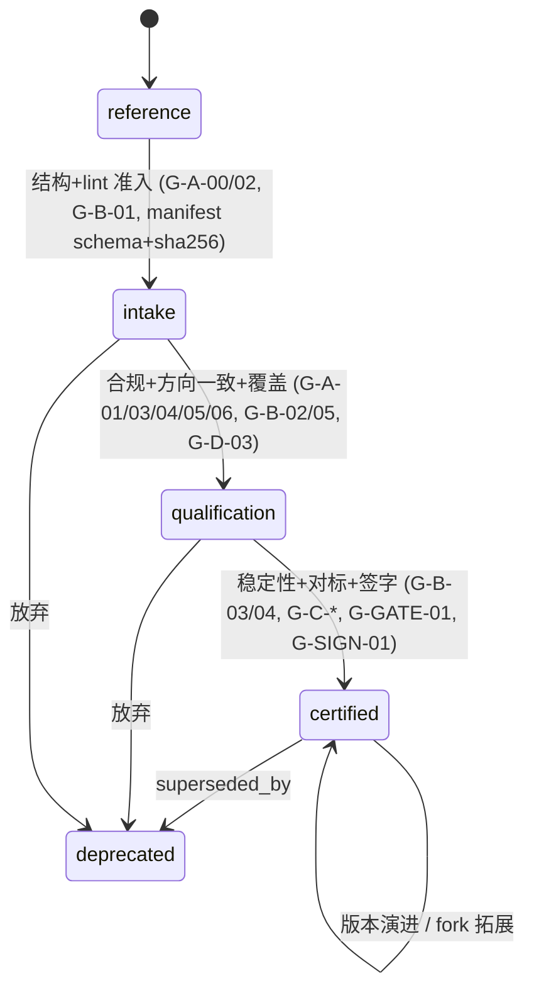

# FPGA CBB 库治理与生产级准入规范 V1.0

> 基线蓝本。合并 production-grade-gate / doc-standards / code-standards / library-management 四支柱草案，并**已吸收** checkability / solo-realism / consistency 三视角红队修正。
> 权威依据：`skills/hdl-coding/SKILL.md`、`skills/hdl-coding/references/rtl-code-review.md`、`RTL_DESIGN_RULE.md`、`comment-standards.md`、`engine/schemas/hdl-project-spec.schema.json`、`engine/schemas/fpga-constraints.schema.json`、`engine/schemas/artifact-manifest.schema.json`、`rules/03-gates.md`、`rules/archive/08-constraints.md`。冲突一律以这些既有资产为准。

---

## 1. 总则

这套规范服务**一个目的：防止设计偏离需求**。它不是归档/复用便利工具，而是一套把"偏离"挡在门禁处、而非等流片/上板才暴露的设计支撑系统。三个域各是设计流程里的一个锚：

- **文档 = 方向锚**：设计前期的重要参考资料，锚住决策方向。
- **MATLAB Golden Model = 正确性锚**：验收基准。它必须同时握住一对张力——**普遍性**（可跨项目当基准）与**设计特性**（承载本设计的定点/架构/需求特征）。这正是每个算法列两个模型的原因：`<name>_reference`（浮点/普遍性）+ `<name>_fixed_point`（定点/设计特性）。
- **CBB = 实现锚**：可复用，也可作为"演化/拓展的可信基线"针对特定设计改。

贯穿一切的**反偏离锚链**：`需求 → 文档(方向) → golden model(基准) → CBB(实现)`，且 CBB 必须与 golden bit-true 对齐。

**"进 `cbb/` 即生产级"的承诺含义**：一个资产一旦进入 `cbb/` 正式目录，即对所有下游复用者承诺它同时满足生产级四条——(1) 符合 hdl-coding 约束、(2) 真实实现需求且有 golden 对标与场景覆盖、(3) 稳定性达标、(4) 通用性达标。未达四条的资产只能停在 `reference-assets/` 或 `incubator/`，不得进 `cbb/`。这条承诺由**可机器/客观检查**的准入门（第 2 节）背书：certified = A/B/C 三维全部 MUST 项为绿 + 一名具名真人 owner 签字（D 维降为徽章，理由见 §2.6）。

**本规范的裁决哲学**（吸收 solo-realism）：1–3 人团队里"独立评审"名存实亡——唯一真正与作者独立的客观性来自机器检查。因此**机器门是准入的实际裁决者**；ce-\* AI 面板只出"建议 + 证据定位"的结构化 finding，**绝不授予放行权**；人类签字语义 = "已跑全部机器门并复核其输出并担责"，不含任何"签字人≠实现者"的第二真人要求。门禁宁可少而硬，不多而虚（对齐 `CLAUDE.md` 与 `rules/03-gates.md`）。

---

## 2. CBB 生产级准入门（核心）

### 2.1 反偏离锚链与四维对应

| 维度 | 锚角色 | 为何这维是生产级/反偏离所必需 |
|:--|:--|:--|
| **A hdl-coding 约束合规** | 实现锚的可综合底线 | 违反五条红线/推 latch 的代码"仿真对、上板错"，偏离在流片后才暴露——A 把它挡在综合前。 |
| **B 需求功能达标** | 正确性锚绑定 | 不绑定 golden、无 bit-true 对标与场景覆盖，就无法证明实现没偏离需求——B 是锚链落地核心。 |
| **C 稳定性** | 实现锚的物理可用性 | 时序不收敛/资源超包络/复位不过 = 换器件或加负载即失效，复用即引入隐性偏离——C 保证到哪都稳。 |
| **D 通用性** | 实现锚的可移植性（**徽章，非 certified 硬维**） | 项目专用硬编码使复用被迫魔改，魔改即脱离已验证基线。但把通用性当成熟度硬门会诱导为想象复用面投机参数化——故 D 除"无项目专用硬编码"一条外，整体降为与 certified 正交的 `generic-capable` 徽章（见 §2.6）。 |

### 2.2 图例与判定基座（吸收 checkability + solo-realism）

- **级别**：该 MUST 项**首次被强制**的成熟度级。`intake`=进 incubator 的卫生底线；`qualification`=功能+合规证据齐备；`certified`=进 `cbb/` 全维通过。`reference` 级不强制本门任何项。
- **如何检查**：`machine`=脚本/grep/node（无外部 EDA，确定性）；`tool`=外部 EDA（iverilog / Vivado synth/STA）；`hybrid`=脚本先 flag、结构化裁决 flag；`attestation`=owner 具名担责（**不是机器可判 pass**，只作问责）。
- **硬门/加分**：`MUST`=红则该级不予晋升；`SHOULD`/`BADGE`=记录但不阻断（多为徽章或规模化后再上）。
- **消灭语义为空硬门的五条铁律**（所有门禁判据必须满足）：
  1. **严重度按固定表计数**：不用"高严重项/blocking"这类临场措辞。见 §2.3 severity 映射表。"无高严重项" = 严重度=高 的失败复选框计数 = 0，由脚本按表计数。
  2. **阈值钉死数字或交叉核对既有 schema 字段**：不用"真实时钟约束/相似度≥阈值/边角配置"。例：时钟约束 `period_ns ≤ 1000/target.fmax_mhz`。
  3. **聚合项炸开为命名子结果 JSON**："全过" = 命名子结果的机器 AND，不是复核者一句汇总。
  4. **豁免必须结构化、可计数、引 waiver-ledger**：门禁在"0 个未处置 flag"时放行，**绝不在"存在理由"时放行**。自由文本理由不计分。
  5. **owner 背书 / 面板散文 ≠ 机器校验**：文档不得声称"已机器校验适用边界完整性"这类由人裁量的项。

### 2.3 severity 映射表（补入 rtl-code-review.md，供脚本按表计数）

| 复选框类别 | 严重度 | 门禁语义 |
|:--|:--|:--|
| 五条红线违反 / latch / 组合直出 / initial 直出 / 算法方向偏离 / 映射与 golden 不符 | **high (blocking)** | 该级失败，回退 incubator，**禁开 waiver** |
| 命名前缀缺失 / 隐含位宽不匹配 / 段顺序乱序 / 参数缺默认或范围注释 | **mid (major)** | 计入未处置 flag；可走结构化 waiver-ledger 豁免 |
| 模块头注释缺项 / 注释缺失 / CHANGELOG 缺条目 | **warning (minor)** | 记录，qualification 前须清零；可豁免 |

`ce-*` 面板结论必须是结构化 finding 数组 `{checklist_id, severity∈{blocking,major,minor}, evidence_locator, quote}`；`verdict=PASS` 当且仅当 `blocking 计数=0` 且每个 MUST 项有显式 disposition（pass/na/waived）。散文"looks good/OK"不计分、不作证据。

### 2.4 跨维门禁（certified 必过）

| ID | 判据 | 如何检查 | 通过条件 | 证据产物 | 硬门 | 级别 |
|:--|:--|:--|:--|:--|:--|:--|
| G-GATE-01 | 证据齐备 | machine | 每条 MUST 项在 `var/gates/pg/<asset_uid>/` 下有对应产物文件；缺项 ⇒ 认证不成立。**加密冻结 bundle + sha256 规范化 = 规模化后**（团队≥N 或需外部审计时启用） | `var/gates/pg/<asset_uid>/` 目录清单 | MUST | certified |
| G-SIGN-01 | 具名签字 + 面板留痕 | hybrid | `manifest.signoff.by` 为具名真人、`signoff.at` 有时间戳、`scope` 覆盖目标文件；`panel_verdicts_ref` 指向 ce-\* 结构化 finding（无 blocking）。签字语义 = "已跑全部机器门并复核其输出并担责"，**无第二真人要求** | signoff 块 + `panel-report.json` | MUST | certified |

`manifest.signoff{by,at,scope,panel_verdicts_ref}` 是**唯一** canonical 签字字段（吸收 solo-realism：取代原四支柱的 `certified_by`/`promoted_by`/`owner_signoff`/`signoff` 四套字段名）。

### 2.5 维度 A — hdl-coding 约束合规（唯一 owner，其余支柱按 ID 引用其 PASS/FAIL bundle）

> 本维是"生产级四条"的第 (1) 条。合规判据以 `SKILL.md` + `rtl-code-review.md §0–§6` 为**唯一真相源**，本表**引用不重定义**（吸收 consistency：hdl-coding 合规维只有一个 owner，production-grade / library-management 改为引用结论，不再各自枚举条文与阈值）。

| ID | 判据（源） | 如何检查 | 通过条件 | 证据产物 | 硬门 | 级别 |
|:--|:--|:--|:--|:--|:--|:--|
| G-A-00 | §0 lint 编译门禁 | tool | `iverilog -g2012 -t null <所有综合 RTL 与 tb_*.v>` 退出码 0、error=0。（iverilog 不查 latch/命名，见 G-A-05） | `lint.log` | MUST | intake |
| G-A-02 | §2 命名规范 | machine | `i_/o_/ri_/ro_/r_/w_/P_/i_clk*/i_rst*/_cdc/_array` 前缀违规计数=0；AXI/Wishbone/JTAG 协议原名在豁免名单 | `naming-scan.json` (violations=0) | MUST | intake |
| G-A-01 | §1 时序安全 + **复位红线绑定** | hybrid | 结构化扫描：(a) input 不直通、有 `ri_` 寄存；(b) output 由 `ro_` 驱动、无组合直出；(c) 跨时钟双 FF 且 `_cdc` 命名。**复位红线（吸收 consistency）**：`reset.polarity=active_low` 或 `(type=async 且无同步释放证据)` ⇒ **FAIL**，不因 schema 合法而放行。每个 flag 必须是结构化 disposition `{flag_id,file:line,category,disposition∈{false_positive,accepted_risk},reviewer,rationale}`；`accepted_risk` 须引 waiver-ledger。门禁 = 未处置 flag 计数=0 | `timing-safety-scan.json` | MUST | qualification |
| G-A-03 | §4 状态机 | hybrid | 含状态寄存器模块：三段式 + `localparam` 状态 + `case` 有 `default`；编码位数 ≤5 二进制 / 5–50 独热 / >50 格雷；无 FSM 标 na | `fsm-scan.json` | MUST | qualification |
| G-A-04 | §3 结构 + §4.1 模块头 | machine | 每模块 ≤300 行、每 always ≤50 行（超限走 §5.F 白名单豁免）；代码顺序按 **SKILL.md §3 权威序**：`声明→P_→ri_→ro_→例化→FSM→组合→时序→数组`（吸收 consistency：`RTL_DESIGN_RULE §3` 的 `ri_→ro_→P_` 已被 SKILL.md 取代，structure-scan 以 SKILL.md 为准），按块首次出现行号验证单调递增，乱序对写入 JSON；模块头含 **4 字段**（名称/功能描述/端口说明/主要逻辑，非占位符 TODO/TBD/xxx）——**回退到源规则 4 字段**（吸收 consistency：CS-5 "8 字段对齐"是虚构；版本/作者由生成器从 manifest 注入、不入注释；已知限制引用 G-DOC-04） | `structure-scan.json` + `section-order.json` + `header-audit.json` | MUST | qualification |
| G-A-05 | §5/§8 质量：latch/位宽/赋值纪律 | tool+machine | **MVP 路径**（吸收 solo-realism：环境仅 iverilog+Vivado）：iverilog 编译干净 + **Vivado `synth_design` 的 inferred-latch / width-mismatch 告警 = 0** + grep 级 latch 启发式（`if→else`、`case→default`、`assign` 完整）+ 同一 always 内 `=`/`<=` 混用块数=0。**规模化后**：`verilator --lint-only -Wall` 具名规则 `LATCH/WIDTH/UNOPTFLAT`=0；`verible-verilog-lint`=0。verilator/verible 缺失只让**该子项** blocked，不阻断整个 qualification。核心红线类违规**禁开 waiver** | `synth-warn.json` / `verilator-lint.log` + `blocking-mix-scan.json` | MUST | qualification |
| G-A-06 | §6 Testbench | hybrid | 存在唯一 `tb_<module>.v`（`02_sim/` 或 `tb/`）；含时钟生成、超时 `$finish`、波形 dump、对 golden 的 scoreboard 自动比对；场景见 G-B-04 | tb 文件 + sim 日志 | MUST | qualification |
| G-A-07 | **映射/LUT 门禁（新增，源 `RTL_DESIGN_RULE §1`）** | hybrid | 映射/星座/查找表/比特-符号类模块（吸收 consistency：四支柱原缺此项，对 WiFi PHY 是刚需）：(a) 映射代码附近有**比特流追踪注释**；(b) `unique case` 全索引覆盖，`default` 仅作防误；(c) 精确复现 MATLAB `bi2de('left-msb') + cnstPattern`，由 G-B-03 对 golden bit-true 验证。非映射模块标 na | `mapping-scan.json` + golden 对标 | MUST（映射类适用） | qualification |

### 2.6 维度 B — 需求功能达标（反偏离锚链落地）

| ID | 判据 | 如何检查 | 通过条件 | 证据产物 | 硬门 | 级别 |
|:--|:--|:--|:--|:--|:--|:--|
| G-B-01 | 需求/文档锚绑定 | machine | `manifest.requirement_ref` 非空且解析到存在的需求/文档资产；`doc_refs` 全部解析；断链=0 | `link-check.json` | MUST | intake |
| G-B-02 | 正确性锚绑定（双模型张力） | machine | `golden_model_ref` 指向存在的 golden 资产，该资产同时含 `<name>_reference`（浮点/普遍性）与 `<name>_fixed_point`（定点/设计特性）；`alignment.compare_mode ∈ {cycle_accurate, transaction_based, scoreboard}` | `golden-link.json` | MUST | qualification |
| G-B-03 | bit-true / **预登记容差** 对标 | tool | 以 golden 定点模型跑全部 test_vectors：`fidelity.status=bit_true` ⇒ mismatch=0（逐拍/逐事务）。`status=tolerance` ⇒ **容差及理由必须在 golden 资产 manifest 中于 RTL 对齐运行之前登记**（吸收 solo-realism：单人无法人为分离 owner，改用时间戳客观约束），机器校验 `tolerance.set_at < alignment_run.at`，禁止事后回填；且须过 G-B-05 方向一致。**声明 bit_accurate 却有 mismatch ⇒ FAIL** | `alignment-report.json`（mismatch/max_err/set_at/run_at） | MUST | certified |
| G-B-04 | 场景+类别覆盖 | hybrid | `var/gates/verification-quality.json` 中 S1–S5 每个适用场景 ≥1 可执行且通过，不适用者 na+理由；`golden_model.test_cases` 覆盖 normal+boundary+error 且全通过。**MVP：S1 基础功能为 MUST**；S2–S5 按适用性 | `verification-quality.json` + 各场景 sim | MUST（S1 至 intake/qualification 即强制） | certified |
| G-B-05 | 算法方向一致（源 `08-constraints §3`） | hybrid | 从该资产 **Phase-2 定点记录派生有限判决轴清单**（吸收 checkability：判决类型 / 时域-频域 / 舍入-饱和模式 / 迭代收敛方案），逐轴 `match=yes/no` 记入 correctness-review。任一轴=no ⇒ FAIL 回退 incubator。**bit-true 与容差两条路径都不得绕过本项** | `correctness-review.json`（逐轴） + Phase-2 定点记录 | MUST | qualification |
| G-B-06 | RTL 覆盖率 | — | **从 certified 证据链移除**（吸收 solo-realism：仓内无 RTL 覆盖引擎，`coverage-runner.cjs` 是面向 hook JS 的 V8 行覆盖，非 RTL）。拿到商业仿真器或 `iverilog+vpi toggle` 后再启用；分母须机器定义：整体=`rtl/` 下全部可综合模块（TB 排除），核心逻辑=`manifest.generality.core_modules[]` 显式列表 | 纯文字备注，**不进 `gate_results`** | 规模化后 | — |

### 2.7 维度 C — 稳定性

> **无 EDA license ⇒ 该维封顶 qualification**（吸收 solo-realism，写进门禁而非开放问题）。certified-C 只要求对**一个代表性器件+速度等级**的综合级 util 与时序估计（本用户 Vivado 可跑）；完整 P&R STA / 多角 / CDC 工具报告 = 规模化后。CBB 作为跨器件库件默认无"唯一目标器件"，单器件资产的多器件收敛证据默认 na。

| ID | 判据 | 如何检查 | 通过条件 | 证据产物 | 硬门 | 级别 |
|:--|:--|:--|:--|:--|:--|:--|
| G-C-01 | 目标 fmax 收敛（**紧时钟交叉核对**） | tool | 吸收 checkability（堵"松时钟白 WNS"后门）：解析 `constraints.target.fmax`（字符串带单位，如 `250MHz`）为 `fmax_mhz`，`required_period_ns = 1000/fmax_mhz`；SDC/XDC `create_clock` 的 `period_ns ≤ required_period_ns`（约束不松于目标）；WNS≥0 只有在此时钟下才计。约束缺失或周期宽于目标 ⇒ FAIL。MVP=Vivado synth 级时序估计 | `timing-summary.rpt` + `envelope-check.json`（constrained vs required） | MUST（无 EDA 则封顶 qualification） | certified |
| G-C-02 | 资源在包络内（**fail-closed**） | tool | 吸收 checkability（堵"空包络静默通过"）：`constraints.target` 缺任一 `lut/ff/bram/dsp` 数值预算 ⇒ 标 **blocked**（不可在无包络下认证资源稳定），非 pass；有预算则实测 ≤ 预算逐项比对 | `utilization.rpt` + `envelope-check.json`（每资源 budget/achieved/status） | MUST | certified |
| G-C-03 | 无仿真-综合差异 | machine | 综合源 `initial` 块=0（TB 豁免，源 `RTL_DESIGN_RULE §2`）且推断锁存器=0（引 G-A-05） | `no-initial-scan.json` | MUST | qualification |
| G-C-04 | 复位/CDC 健壮（S4） | hybrid | 吸收 checkability（机器化"回到已知复位态"）：assert `i_rst`≥N 拍后，去断言 +1 拍内**每个已声明状态/输出寄存器 == 其复位值**（对照 reset-value 表逐寄存器比对），且复位后二次激励与 golden 一致 → `reset-sim.json` 逐寄存器 pass。CDC：`clean`=具名 CDC 工具报告未同步跨时钟违规=0；**无 CDC 工具则降级为双 FF 结构扫描并标 `cdc_tool=na`，禁止在无工具时声称 clean** | `reset-sim.json` + `cdc-report.json` | MUST（reset MVP 可跑；CDC 工具规模化后） | certified |
| G-C-05 | 边界/压力/回归（**炸开为命名子结果**） | tool | 吸收 checkability（消灭聚合散文伞）："全过"=以下四个子结果 JSON 均存在且 pass 的机器 AND：`boundary`=S3 指定边界向量集通过；`stress`=S5 给出**数值吞吐目标**并达标；`regression`=全向量 100% 通过且同 seed 双跑 bit-identical；`backpressure`=S2 背压流控通过 | `stability/{boundary,stress,regression,backpressure}.json` | MUST | certified |
| G-C-06 | 记录 achieved fmax/slack（drift 追踪） | machine | `manifest.timing_closure` 记录 `achieved_fmax`/`slack`/`sdc_ref` | `manifest.timing_closure` | SHOULD | certified |

### 2.8 维度 D — 通用性（**降为 `generic-capable` 徽章**，与 certified 正交）

> 吸收 solo-realism / over-engineered：把通用性当成熟度硬门会诱导投机参数化。**certified = A+B+C 三维**；D 仅保留一条硬检查（关乎复用正确性），其余为徽章。

| ID | 判据 | 如何检查 | 通过条件 | 证据产物 | 硬门/徽章 | 级别 |
|:--|:--|:--|:--|:--|:--|:--|
| G-D-03 | 无项目专用硬编码 | hybrid | 综合源无硬编码器件原语/板级引脚/项目常量；厂商原语置于 `generate`+参数后；已知原语名扫描 + 结构化 disposition，门禁 = 未处置 flag=0（**唯一保留的硬检查**，因其关乎复用正确性而非投机通用性） | `hardcode-scan.json` | **MUST** | qualification |
| G-D-01 | 参数化形态 | hybrid | 吸收 checkability（收窄魔数扫描）：只 flag 整数字面量 ≥2（排除 0/1、2 的幂位切界、coeff/rom 白名单文件内字面量），且出现在 ≥2 处或端口/循环边界上下文；每 flag 要么被 `P_` 参数替换、要么在 `param-scan.json` 有结构化 disposition。删除"应参数化"等无检测器措辞。仅查被 `generality.dims[].in_scope=true` 的维度 | `param-scan.json` | BADGE | — |
| G-D-02 | 接口通用 | hybrid | 吸收 checkability：`streaming_interface=true` 的资产要求存在匹配握手命名的端口对（`valid/ready` 或 `tvalid/tready`）+ SVA 覆盖握手稳定性（`valid&&!ready` 期间 data 不变）；时序图作为该 SVA 的可视化渲染而非独立事实源。非流式资产标 na。删除"ad-hoc/齐备"措辞 | `interface-sva.json` | BADGE | — |
| G-D-04 | tested_configs 名副其实 | tool | 吸收 checkability+solo（闭集相等，删"边角"）：`tested_configs` 恰等于 `param_space` 中 `support=true` 的配置集合——默认配置 + 被某真实项目 manifest 实际引用（有 consumer）的配置点必须有通过 sim；无 consumer 的参数值记 `declared-untested`（合法，不算失败）；`param_space` 中未进 tested 的条目必须标 `support=false` | `tested-configs-matrix.json` | BADGE | — |
| G-D-05 | 跨器件/工具可移植 | tool | **单目标 na = 默认路径**（吸收 solo-realism，非例外）：仅当团队真的装了第二工具链/器件族时才触发，通过 ≥2 目标下的 lint/综合；否则字段缺省即"未声明可移植"，不产生 blocked | `portability-matrix.json` | BADGE / 规模化后 | — |

### 2.9 认证判定规则

```
certified  ⟺  A/B/C 三维全部 MUST 项为绿
              ∧ G-D-03（无项目专用硬编码）为绿
              ∧ G-GATE-01 每条 MUST 项证据文件存在
              ∧ G-SIGN-01 具名真人 owner 签字 + ce-* 面板无 blocking finding
任一 MUST 红        → 停在 qualification（incubator/），不得进 cbb/
D-01/02/04/05 达标  → 追加授予 generic-capable 徽章（不影响 certified 成立）
仅 SHOULD/BADGE 未达 → 可 certified，缺口记入 manifest
MUST 红但业务需放行 → 仅经审计 waiver（结构化、引 waiver-ledger、有 approver+expires_at）→ certified-with-waiver（见 §3）；核心红线/G-B-05 禁开 waiver
```

---

## 3. 成熟度生命周期

### 3.1 五级状态机（schema 权威枚举）与目录映射

`manifest.maturity.level` 是**唯一权威**（吸收 consistency：统一为 `maturity.level`，5 级含 deprecated；doc-standards 的 `status`、code-standards 的 `certification.level` 一律改为对本字段的引用视图，不得就地扩展封闭的 `artifact-manifest.status` enum）。目录位置由 catalog 工具按 level **派生**。



| 级别 | 目录 | 准入判据 | 准出到下一级需过的门子集 | 签字人 |
|:--|:--|:--|:--|:--|
| **reference** | `reference-assets/` | `asset_uid` + `provenance{source,license,retrieved}` + `owner` + "未认证"横幅 | 晋级 intake：manifest schema-valid + 源文件 sha256 匹配、无未登记文件 + G-A-00/02 + G-B-01 | owner 登记 |
| **intake** | `incubator/`（新进） | schema-valid manifest + iverilog 编译干净 + 锚链起点（`requirement_ref`+`doc_refs≥1`）已连 | 晋级 qualification：G-A-01/03/04/05/06、G-A-07（映射类）、G-B-02/05、G-D-03 全绿 | owner 复核 |
| **qualification** | `incubator/`（合格） | hdl-coding 全合规 + golden 绑定 + 方向一致 | 晋级 certified：G-B-03/04、G-C-01..05、G-GATE-01、G-SIGN-01 | owner + ce-\* 面板初评（建议，无放行权） |
| **certified** | `cbb/` | A+B+C 全 PASS + G-D-03 + 证据齐备 + signoff | 终态；仅可 → deprecated 或版本演进 | signoff.by（具名真人） |
| **deprecated** | `cbb/`（标记） | `maturity.level=deprecated` + `superseded_by`（替代 uid 或 null+`retire_reason`） | 终态；资产不删除；新项目绑定被阻断（除非有效 waiver） | owner |

**solo/MVP 运行折叠**（吸收 solo-realism）：schema 保留 5 级（满足 consistency 统一枚举），但**日常只跑 3 个仪式**——reference 登记 / incubator 准入（结构+lint 一次门+一签）/ certified 认证（一次全门+一签）。intake→qualification 作为 incubator 内的两个 level 存在，但"qualification 独立评审仪式"是规模化后的细化，MVP 不单独设第二次签字。

### 3.2 演化/拓展基线

| 场景 | asset_uid | version | lineage |
|:--|:--|:--|:--|
| 就地演进（bug fix / 参数扩展，契约兼容） | 不变 | patch/minor 递增 | `parent_uid=null`，changelog 记录 |
| 契约破坏性变更（端口/位宽/延迟改） | 不变 | major 递增 | changelog 标 breaking |
| 针对特定设计 fork 出专用变体（拓展可信基线） | **新 uid** | 从 `1.0.0` 起 | `parent_uid=基线uid`，`base_version=基线版本` |

semver 由机器校验；major 递增必须伴随 breaking changelog；fork 必须写 `parent_uid`。**基线 vs 变更**通过 `lineage{parent_uid,base_version,changelog}` 表达，**禁止用文件名后缀**（`_v2`/`_new`）承载版本（与 `rules/archive/14-fix-in-place.md` 一致）。

### 3.3 waiver（certified-with-waiver）与退役

- **waiver（受审计）**：结构固定 `{gate, reason, approver(真人), expires_at, evidence_ref}`，写入 `var/cbb/waiver-ledger.json`。带未过期 waiver 晋级 certified 的资产，catalog 标 `certified-with-waiver`。`expires_at` 过期 ⇒ 即时 CI fail，资产回落。核心红线 / G-B-05 方向一致 **禁开 waiver**。门禁在"0 个未处置 flag"时放行，绝不在"存在自由文本理由"时放行。
- **退役**：`maturity.level=deprecated` + `superseded_by`。资产**不删除**（审计留痕）。新项目对 deprecated 资产的绑定无有效 waiver 时 CI fail。

### 3.4 catalog / drift / 链接完整性（规模化后 CI，MVP 为轻量脚本）

- **catalog 派生**：`catalog.json` 由全部 manifest 机器聚合，不手工编辑。
- **drift-check**（规模化后）：CI 重生成 catalog 并 diff；非空 diff（含目录↔level 不一致）⇒ fail-closed。
- **链接完整性**：逐条解析 `requirement_ref`/`doc_refs`/`golden_model_ref`/`superseded_by`/`lineage.parent_uid`，断链=0。这条把锚链变成可执行硬约束。
- **golden 版本联动**：`golden_model_ref` 指向资产 version 递增时，仍钉旧版本的 `fidelity.bit_accurate_against` 被标 `fidelity_stale`，触发强制复认证。

---

## 4. 文档规范

> 文档是方向锚。本节不重复 hdl-coding 编码规则，只规定"资产带哪些文档、每种必含什么、谁产出、何时更新、如何被机器挡住漂移"。单一真相源 = `manifest.json`（吸收 consistency：统一 JSON，见 §6）。

### 4.1 MVP 随包文档集（吸收 solo-realism：8 类文档→精简派生视图）

原四支柱的 8 类独立文档（interface.md / clock_reset.md / applicability.md / limitations.md …）对 1–3 人团队多而虚，且 interface/clock_reset 是 `manifest.ports/clock/reset` 与 RTL 的副本=三处双写漂移源。**MVP 文档集只留三样**，接口表/参数表/时钟复位段作为**由 manifest 注入的派生视图**内嵌 README，不得手写：

| 文档 | 必含项（最小） | 格式 | 产出者 | 更新时机 | 机器检查 | 门 ID | 级别 |
|:--|:--|:--|:--|:--|:--|:--|:--|
| **README** `README.md` | 一句话用途；功能摘要；实例化示例（含参数）；**接口表/参数表/时钟复位段（manifest 派生视图）**；version+asset_uid；owner；级别横幅（reference→"未认证"） | Markdown | 逻辑工程师 | 版本/接口变更 | 文件存在 + 必需小节标题正则 + `version==manifest.version` + 派生视图与 manifest 一致 | G-DOC-01 | intake |
| **模块头注释** `rtl/*.v` | **4 字段**：名称/功能描述/端口说明/主要逻辑（源 comment-standards §5.1 / rtl-code-review §4.1；吸收 consistency：不升 8 字段，版本/作者由 manifest 注入或不入注释，已知限制引用 G-DOC-04） | Verilog 注释 | 逻辑工程师 | 端口/逻辑变更 | 4 字段标签存在且非占位符 | G-DOC-02（=G-A-04 头部分，单 owner） | qualification |
| **CHANGELOG** `CHANGELOG.md` | 版本号、日期、变更摘要、破坏性变更标注、asset_uid | Keep-a-Changelog | 逻辑工程师 | 每次版本递增 | 存在 `==manifest.version` 的条目 + 日期 | G-DOC-03 | qualification |
| **限制与适用边界**（合并）`docs/limitations.md` | 已知限制（条件/影响/规避）；适用器件/工具链；参数有效范围（与参数表一致）；**不适用场景**（明确列出会误用的用法） | Markdown 表 | 逻辑工程师 + owner | 新限制/器件/范围变更 | 结构化四块存在；`param_ranges` ⟷ 参数表机器一致；**"真实反映边界"= owner attestation，非机器 pass** | G-DOC-04 | qualification |
| **映射资产附加**（G-A-07 适用时）`docs/mapping.md` | 比特流追踪路径；bi2de 约定；golden 映射表出处 | Markdown | 逻辑工程师 | 映射变更 | 比特流路径字段存在 | G-DOC-04b | qualification |

**验证报告摘要不单独成文**：其数字（bit_true/覆盖/fmax/资源）作为 README 派生视图从证据 JSON 注入，"报告数字忠实于证据"由生成器保证，不重算证据。

### 4.2 反漂移：派生而非哈希锁（吸收 over-engineered）

MVP **去掉 `documents_hash` staleness 硬门**（单人=唯一读者，收益为零且诱发"假刷新"）。改用**生成器把接口表/参数表/时钟复位段从 manifest 注入 README 派生视图**——用重生成而非 hash 锁防漂移。**规模化后**再上 staleness hash 门 + 完整 8 类文档。

### 4.3 资产内 vs knowledge/ 判定规则

| 内容类型 | 归属 | 判据 |
|:--|:--|:--|
| 该资产的接口/参数/时钟/验证结论/限制/边界 | **资产内**（README 派生视图/docs） | 与本版本强耦合，改了资产就得改 |
| 算法原理、推导、方法论 | **knowledge/** | 跨项目通用，与版本弱耦合 |
| 工具指南、EDA 流程、环境搭建 | **knowledge/** | 与具体资产无关 |
| 选型对比、架构权衡、设计模式 | **knowledge/** | 面向"选哪个/为什么" |
| 故障排查手册、常见坑 | **knowledge/**（可反链多个资产） | 复用于同类资产 |

口诀：**"改了这个资产版本必须改" → 资产内；"换个项目还成立" → knowledge/**。

### 4.4 链接 / 断链 / 防复制校验

| ID | 校验 | 判据（钉死数字，吸收 checkability） | 级别 |
|:--|:--|:--|:--|
| G-DOC-05 | 断链 | knowledge/ 内每个 `asset_uid@version` 解析到 manifest 存在条目且 version 有效；dead link=0 | certified |
| G-DOC-06 | 整段复制 | flag 任一 code fence **≥15 行** 且 与某源文件 token-shingle（MinHash/Jaccard）相似度 **≥0.85**；<15 行或 <0.85 自动 pass；被 flag 强制人工确认并留痕 | certified |

- knowledge/ 引用资产一律用稳定引用 `asset_uid@version`，落为 `relationships(type=references)`；禁止粘贴 RTL/MATLAB 整段源码。

### 4.5 门禁产物

`var/gates/doc-standards.json`：每项 `{id, level, status: pass|fail|manual, detail, evidence_ref}`。不得手删；`param_ranges`/派生视图由生成器计算而非手填。

---

## 5. 代码规范 + 资产包骨架

> 本节只定义"超出 `rules/01-hdl.md` 五条红线之外、进 `cbb/` 才强制"的**增量**，以及标准目录布局。五条红线 / `ri_·ro_` 命名 / 三段式 FSM / 无锁存器 / 同步复位高有效以 `SKILL.md` + `rules/01-hdl.md` 为**唯一真相源**，本节**引用不复制**（避免双重加权与漂移）。

### 5.1 CBB 资产包标准骨架

```
<cbb-asset>/
├── manifest.json         # 单一真相源(JSON, ajv 校验): 元数据 + source_files[]{path,role,sha256}
│                         #            + maturity + signoff + 各门禁证据指针
├── rtl/                  # 只放可综合 .v/.sv; lint/红线/initial/尺寸/映射证据在此定位
│   └── <module>.v
├── tb/                   # 只放 tb_<module>.v; 唯一允许 CJK 注释的豁免区
│   └── tb_<module>.v
├── constraints/          # .sdc/.xdc (对齐 fpga-constraints.schema.json)
│   └── <module>.sdc
├── vectors-ref/          # golden 激励 + 期望输出 (对齐 hdl-project-spec.golden_model)
│   ├── stimulus.<hex|bin|csv>
│   └── expected.<hex|bin|csv>
└── README.md             # 随包文档(内嵌 manifest 派生视图) + CHANGELOG.md + docs/limitations.md
```

门禁证据产物**不入包**，统一写到 `var/gates/pg/<asset_uid>/`（对齐 `var/gates/` 惯例），由 `manifest.json` 以路径引用。**布局硬约束**：`rtl/` 下不得出现 TB，`tb/` 下不得出现综合源；`manifest.json` 必须存在且 JSON 可解析；缺任一 required 目录/文件 = 连 intake 都进不去。

### 5.2 增量代码规范（进 `cbb/` 才强制，引用而非重复红线）

| # | 规范 | 判据（客观） | 检查 | 证据 | 引用门 |
|:--|:--|:--|:--|:--|:--|
| CS-1 | 目录布局合规 | required 目录/文件齐全；`rtl/` 只含综合源、`tb/` 只含 TB；`manifest.json` 可解析 | machine | `layout-check.json` | intake |
| CS-2 | manifest = 单一真相源 | 过 `cbb-manifest.schema.json`（ajv）；`rtl/`+`tb/` 每文件 sha256==声明值；无未登记源文件 | machine | `manifest-hash-audit.json` | intake |
| CS-3 | lint 契约（**统一定义，分层填充**，吸收 consistency+solo） | **MVP 层**：iverilog `-g2012 -t null` 编译 exit 0（=G-A-00）+ Vivado synth latch/width 告警=0（=G-A-05 MVP）。**规模化层**：verible/verilator 结构 lint=0。iverilog-only 达不到 latch/命名（SKILL.md §7 明载），故不采用"iverilog-only warning=0"；verilator/verible 缺失只 blocked 该子项，不阻断 qualification | tool | `lint/lint.json` | G-A-00/G-A-05 |
| CS-4 | hdl-coding 红线合规（引用 G-A-01/03，**不重定义**） | 按 ID 引用 A 维结论 bundle | — | 引 A 维 JSON | G-A-01/03/04/05 |
| CS-5 | 模块头 **4 字段**（吸收 consistency，回退 4 字段） | 名称/功能/端口/主要逻辑，非占位符 | machine | `header-audit.json` | G-A-04/G-DOC-02 |
| CS-6 | RTL 禁 `initial`（源 `RTL_DESIGN_RULE §2`） | `rtl/` 综合源 `initial` 计数=0（TB 豁免）；数组用 `{default:'d0}` | machine | `initial-scan.json` | G-C-03 |
| CS-7 | 尺寸上限（源 `SKILL.md §3`） | ≤300 行/模块、≤50 行/always；超限走 §5.4 审计豁免 | machine | `size-metrics.json` | G-A-04 |
| CS-8 | 赋值纪律 + 段顺序 | 无 always 混用 `=`/`<=`；段顺序按 **SKILL.md §3 确定序**逐块首现行号单调递增（吸收 consistency：机器判，去掉"启发式+owner 整体印象"；`RTL_DESIGN_RULE §3` 已被取代） | machine | `assignment-discipline.json` + `section-order.json` | G-A-04/G-A-05 |
| CS-9 | 映射/LUT 门禁（源 `RTL_DESIGN_RULE §1`，新增） | 比特流追踪注释 + `unique case` 全覆盖 + 精确复现 `bi2de('left-msb')+cnstPattern` | hybrid | `mapping-scan.json` | G-A-07 |
| CS-10 | 注释规范（源 comment-standards §5.2） | 每 always/generate/task/function ≥1 注释；`rtl/` 注释英文（tb/ 豁免）；算术块公式注释（**"公式真实性"= attestation，非机器 pass**） | hybrid | `comment-audit.json` | — |

### 5.3 参数化：只认"会被用到"的通用性

| 层 | 规则 | 检查 |
|:--|:--|:--|
| 形态（机器） | `P_` 前缀；每参数默认值 + 合法范围注释（如 `// range: 4..64, power-of-2`）；参数间约束注释成文 | 缺默认/缺范围 = fail |
| 范围（布尔标志，非判断题） | `manifest.generality.dims[].in_scope` 逐维度布尔（吸收 checkability：删"该不该用到"的主观判断）；门禁只查 `in_scope=true` 的维度是否残留应参数化魔数（魔数扫描按 §2.8 G-D-01 收窄规则） | owner 标 in_scope；魔数 flag 未处置=0 |

### 5.4 尺寸豁免路径（避免误杀合法大资产）

硬 300 行会误杀合法 CBB（如系数表，仓库已知 `twiddle_1024_32b.v` 98KB）。CS-7 超限不直接 fail：属白名单类别（`coeff_table`/`rom_lut`/`generated`）且 `manifest.size_metrics.waivers[]` 记 `{file,reason,owner}` → conditional-pass；无 waiver 超限 → fail。waiver 走审计路径，不得当万能后门。

### 5.5 向量路径与 TB 反假绿约定（库级裁决，2026-07-25）

> 起因：全库 5 个包的 TB 向量路径 `../golden_model/vectors/` 指向不存在的目录，
> 而 `ofdm_tx_top` 在实际捕获输出**全为 `zzzzxxxx`** 的情况下报告 "Matched 80/80,
> 0 LSB 误差, TEST PASSED"。三层机制叠加造成"假绿"，本节把它们一次性堵死。

**V-1 向量权威位置**：`models/<domain>/<algo>/vectors/`，由 golden-model 资产
（`kind=golden-model`）拥有并在其 manifest `vectors` 字段登记。资产包**不复制**向量。

**V-2 注入而非硬编码**：TB 经 `+VEC_DIR` / `+RPT_F` plusarg 取路径，由包内 `run.do`
提供。TB 内**禁止**硬编码绝对路径，也禁止指向包外的相对路径（`../golden_model/...`
这类跨包相对路径是本次全库失效的直接原因）。plusarg 缺失 ⇒ `$fatal`，不得回落默认值。

**V-3 空载即失败**：激励或期望装载样点数为 0 ⇒ `$fatal`。
理由：0 个样点的比对必然得到 0 失配，是假绿的最短路径。

**V-4 计数必须被赋值**：捕获长度这类循环上界必须由实际驱动量推出并断言非零。
`ofdm_tx_top` 原 `int expected_len;` 声明后从未赋值（automatic int 默认 0），
`while (capture_cnt < 0)` 一次不执行 ⇒ 捕获 0 ⇒ 比对 0 ⇒ PASS。

**V-5 X/Z 必须显式计为失配**（本次最隐蔽的一条）：
比对前先判 `(^captured[i]) === 1'bx`，命中即记失配。
理由：`$signed(x) - $signed(golden)` 得 X，而 `if (X > 1)` 求值为 X、被 `if` 当作
**假** —— 失配分支永不进入，逐样点静默"匹配"。**仅靠容差比较无法发现全 X 输出。**

**V-6 证据落盘**：cosim 报告写入 `var/gates/pg/<asset_uid>/`，路径同样由 plusarg 注入。

门禁挂靠：V-1..V-6 属 G-A-06（Testbench）与 G-B-03（bit-true 对标）的前置条件；
任一条不满足，该 TB 产出的 PASS **不得作为 gate_results 证据**。

---

## 6. CBB manifest schema

> **序列化统一为 JSON**（`manifest.json`，`cbb-manifest.schema.json` + ajv 校验）——吸收 consistency：原 code-standards 的 `manifest.yaml` 与其余支柱的 `manifest.json` 冲突会导致格式分裂、hash 与 schema 校验对象分叉；统一 JSON 对齐仓内既有 `engine/schemas/*.schema.json` + ajv 校验链。下方示例即以 JSON 给出（合并了 library-management 草案的 YAML 变体）。

### 6.1 字段表（canonical 命名空间，每概念只有一个权威字段）

| field | 类型 | 用途 | 来源 |
|:--|:--|:--|:--|
| `schema_version` | string | manifest 格式版本 | new |
| `asset_uid` | string | **唯一引用锚**：证据路径/knowledge 链接/golden_model_ref/lineage 均以它为锚。MVP 允许人读 slug（如 `cordic_rot`），**规模化后**换不透明 Crockford base32 + 不可变审计（吸收 solo：字段统一满足 consistency，值格式的不透明化是 MVP-vs-scaleup 旋钮） | new |
| `name` | string | 人读模块名（**非引用锚**） | reuse-from: hdl-project-spec.module_name |
| `version` | string | semver | reuse-from: artifact-manifest.artifacts.version |
| `owner` | string | 具名真人 DRI | new |
| `maturity.level` | enum | **唯一权威成熟度字段**：reference/intake/qualification/certified/deprecated（doc-standards.status、code-standards.certification.level 改为引用视图；禁改 artifact-manifest 封闭 status enum） | new |
| `maturity.evidence_ref` | string | MVP=`var/gates/pg/<asset_uid>/` 目录；规模化后=冻结 bundle sha256 | new |
| `signoff` | object | **唯一 canonical 签字块** `{by,at,scope,panel_verdicts_ref}`（取代 certified_by/promoted_by/owner_signoff） | new |
| `requirement_ref` | string | 锚链起点：需求条目 id/URI | new |
| `doc_refs` | string[] | 方向锚：设计前期文档/ADR（≥1） | new |
| `golden_model_ref` | string | 正确性锚：配对 golden 资产的 `asset_uid`（非路径，保证 golden 本身受治理） | new |
| `fidelity.status` | enum | `bit_true`/`tolerance`/`pending` | new |
| `fidelity.bit_accurate_against` | string | bit-true 所钉 golden `asset_uid@version` | new |
| `fidelity.tolerance` | object | `{value, rationale, set_at}`；`set_at < alignment_run.at`（防回填） | new |
| `alignment` | object | `compare_mode` + `pipeline_delay_min/max` | reuse-from: hdl-project-spec.alignment |
| `golden_model` | object | 期望输出/激励/格式/`test_cases`（normal/boundary/error） | reuse-from: hdl-project-spec.golden_model |
| `ports` | array | 端口契约（接口表派生视图基准） | reuse-from: hdl-project-spec.ports |
| `clock` | object | **单时钟简化场景**（`{name,period_ns}`） | reuse-from: hdl-project-spec.clock |
| `constraints.clocks` | array | **多时钟/CDC 资产的时钟真相源**（吸收 consistency：单对象 clock 无法表达多时钟） | reuse-from: fpga-constraints.clocks |
| `reset` | object | `{name,polarity,type}`；**cbb 层 `type` 设为 required**；`polarity=active_low` 或 `type=async` 无同步释放 ⇒ 门禁 FAIL（schema 合法 ≠ 红线合规） | reuse-from: hdl-project-spec.reset（收紧） |
| `sva_assertions` | array | 内嵌断言（含握手稳定性 SVA） | reuse-from: hdl-project-spec.sva_assertions |
| `constraints.target` | object | **唯一资源/时序包络字段**：`{fmax,fmax_mhz,lut,ff,bram,dsp,latency}`（吸收 consistency：取代 resource_envelope/裸 target 三别名；`fmax` 字符串带单位，另存 `fmax_mhz` 数值供比对） | reuse-from: fpga-constraints.target |
| `timing_closure` | object | `{wns_ns, achieved_fmax, slack, sdc_ref}`（drift 追踪） | new |
| `generality.param_space` | array | `[{name, values, support}]` | new |
| `generality.dims` | array | `[{name, in_scope}]` 逐维度布尔 | new |
| `generality.tested_configs` | array | 实测配置点（闭集=support=true 集合） | new |
| `generality.core_modules` | string[] | 覆盖率分母显式列表（G-B-06 用） | new |
| `generality.target_devices` | string[] | 已验证器件族（单目标合法） | new |
| `streaming_interface` | bool | 是否流式（决定 G-D-02 是否 na） | new |
| `lineage` | object | `{parent_uid, base_version, changelog}` | new |
| `sources` | array | `[{path, role, sha256}]`；role∈rtl/tb/constraint/vector/doc | reuse-from: artifact-manifest.artifacts.checksum |
| `size_metrics.waivers` | array | `[{file, reason, owner}]`（尺寸豁免） | new |
| `waivers` | array | `[{gate, reason, approver, expires_at, evidence_ref}]` | new |
| `provenance` | object | reference 级 `{source, license, retrieved}` | new |
| `gate_results` | array | `[{id, status(pass/fail/na/bonus/blocked), how_checked, evidence_path, checked_at, checked_by}]`（准入透明账本） | new |
| `superseded_by` | string\|null | 退役替代 uid（或 null + `retire_reason`） | new |

### 6.2 真实 CBB manifest 示例（certified，含 fork 拓展）

```json
{
  "schema_version": "1.0",
  "asset_uid": "cordic_rot_pilot",
  "name": "cordic_rot_pilot",
  "version": "1.0.0",
  "owner": "zhang.wei",

  "maturity": {
    "level": "certified",
    "evidence_ref": "var/gates/pg/cordic_rot_pilot/"
  },
  "signoff": {
    "by": "zhang.wei",
    "at": "2026-07-20T09:12:00Z",
    "scope": ["rtl/cordic_rot_pilot.v", "tb/tb_cordic_rot_pilot.v"],
    "panel_verdicts_ref": "var/gates/pg/cordic_rot_pilot/panel-report.json"
  },

  "requirement_ref": "REQ-PHY-CORDIC-014",
  "doc_refs": [
    "docs/algo/cordic-rotation-mode.md#angle-convergence",
    "adr/ADR-031-cordic-iteration-count.md"
  ],
  "golden_model_ref": "cordic_rot_fp",
  "fidelity": {
    "status": "bit_true",
    "bit_accurate_against": "cordic_rot_fp@1.4.0"
  },

  "alignment": { "compare_mode": "cycle_accurate", "pipeline_delay_min": 16, "pipeline_delay_max": 16 },
  "golden_model": {
    "expected_output_path": "vectors-ref/expected.hex",
    "test_vectors_path": "vectors-ref/stimulus.hex",
    "format": "hex",
    "test_cases": [
      { "name": "quadrant_sweep",  "category": "normal"   },
      { "name": "angle_pi_over_2", "category": "boundary" },
      { "name": "zero_magnitude",  "category": "error"    }
    ]
  },

  "ports": [
    { "name": "i_clk",   "direction": "input",  "width": 1,  "type": "wire" },
    { "name": "i_rst",   "direction": "input",  "width": 1,  "type": "wire" },
    { "name": "i_valid", "direction": "input",  "width": 1,  "type": "wire" },
    { "name": "i_x",     "direction": "input",  "width": 16, "type": "wire" },
    { "name": "i_angle", "direction": "input",  "width": 16, "type": "wire" },
    { "name": "o_valid", "direction": "output", "width": 1,  "type": "reg"  },
    { "name": "o_x",     "direction": "output", "width": 16, "type": "reg"  }
  ],
  "clock": { "name": "i_clk", "period_ns": 4.0 },
  "reset": { "name": "i_rst", "polarity": "active_high", "type": "sync" },
  "sva_assertions": [
    { "name": "out_valid_after_lat", "expression": "i_valid |-> ##16 o_valid", "severity": "error" }
  ],

  "constraints": {
    "target": { "fmax": "250MHz", "fmax_mhz": 250, "lut": 1200, "ff": 1400, "bram": 0, "dsp": 0, "latency": 16 },
    "clocks": [ { "name": "i_clk", "period": 4.0, "ports": ["i_clk"] } ]
  },
  "timing_closure": { "wns_ns": 0.42, "achieved_fmax": "268MHz", "slack": 0.42, "sdc_ref": "constraints/cordic_rot_pilot.sdc" },

  "streaming_interface": false,
  "generality": {
    "param_space": [
      { "name": "P_WIDTH", "values": [12, 16], "support": true },
      { "name": "P_ITERS", "values": [14, 16], "support": true }
    ],
    "dims": [ { "name": "P_WIDTH", "in_scope": true }, { "name": "P_ITERS", "in_scope": true } ],
    "tested_configs": [
      { "P_WIDTH": 16, "P_ITERS": 16, "device": "xc7a100t", "consumer": "REQ-PHY-CORDIC-014" },
      { "P_WIDTH": 12, "P_ITERS": 14, "device": "xc7a100t", "consumer": "REQ-PHY-TRACK-009" }
    ],
    "core_modules": ["rtl/cordic_rot_pilot.v"],
    "target_devices": ["xc7a100t"]
  },

  "lineage": { "parent_uid": "cordic_rot", "base_version": "2.0.0", "changelog": "CHANGELOG.md" },

  "sources": [
    { "path": "rtl/cordic_rot_pilot.v",    "role": "rtl", "sha256": "1a2b3c4d5e6f7a8b9c0d1e2f3a4b5c6d7e8f9a0b1c2d3e4f5a6b7c8d9e0f1a2b" },
    { "path": "tb/tb_cordic_rot_pilot.v",  "role": "tb",  "sha256": "5e6f7a8b9c0d1e2f3a4b5c6d7e8f9a0b1c2d3e4f5a6b7c8d9e0f1a2b3c4d5e6f" }
  ],

  "gate_results": [
    { "id": "G-A-00", "status": "pass", "how_checked": "tool",    "evidence_path": "var/gates/pg/cordic_rot_pilot/lint.log",              "checked_at": "2026-07-19T14:00:00Z", "checked_by": "ci" },
    { "id": "G-B-03", "status": "pass", "how_checked": "tool",    "evidence_path": "var/gates/pg/cordic_rot_pilot/alignment-report.json", "checked_at": "2026-07-19T14:30:00Z", "checked_by": "ci" },
    { "id": "G-C-01", "status": "pass", "how_checked": "tool",    "evidence_path": "var/gates/pg/cordic_rot_pilot/timing-summary.rpt",    "checked_at": "2026-07-20T08:00:00Z", "checked_by": "ci" },
    { "id": "G-D-05", "status": "na",   "how_checked": "tool",    "evidence_path": null,                                                  "checked_at": "2026-07-20T08:00:00Z", "checked_by": "ci" }
  ],

  "waivers": [],
  "superseded_by": null
}
```

锚链 `requirement_ref → doc_refs → golden_model_ref → (本 CBB)` 与四维证据（`gate_results` + `constraints.target` + `alignment/fidelity` + `generality`）在此一并体现。`golden_model_ref` 指向的 `cordic_rot_fp` 资产自身也是受治理 CBB，含 `cordic_rot_fp_reference`（浮点）与 `cordic_rot_fp_fixed_point`（定点）两模型（G-B-02 校验）。

---

## 7. 落地优先级

### 7.1 MVP 硬门最小集（全部 iverilog+node+现有 Vivado 可跑，单人一签）

这一集 = 本用户环境下的**实际 certified 门槛**（吸收 solo-realism：与 `rules/03-gates.md`/`CLAUDE.md`"门禁宁可少而硬、只问会实质改变结果的未知项"对齐）。它把原四支柱的 intake+qualification 合并为一次 incubator 准入 + 一次认证：

| # | MVP 硬门 | 门 ID |
|:--|:--|:--|
| 1 | manifest schema 通过 + 源文件 sha256 匹配、无未登记文件 | CS-1/CS-2 |
| 2 | `iverilog -g2012 -t null` 联合编译 0 error | G-A-00 |
| 3 | 命名前缀扫描 violations=0 | G-A-02 |
| 4 | latch 启发式（case-default/if-else/assign 完整，grep 级）+ Vivado synth latch/width 告警=0 + 综合源无 initial | G-A-05(MVP)/G-C-03 |
| 5 | 模块 ≤300 行/always ≤50 行（系数表白名单）+ 段顺序机器判 | G-A-04/CS-7/CS-8 |
| 6 | golden bit-true，或"预先登记且带时间戳先于对齐运行"的容差，mismatch 判定 | G-B-03 |
| 7 | 验证场景 S1 基础功能通过 | G-B-04(S1) |
| 8 | README 存在 + 模块头 4 要素 | G-DOC-01/G-A-04 头 |
| 9 | 映射类资产：比特流追踪注释 + unique case 全覆盖 + 与 golden 映射精确一致（非映射标 na） | G-A-07 |
| 10 | 一名具名真人签"已跑门禁并复核输出并担责" | G-SIGN-01 |

无项目专用硬编码（G-D-03）在 MVP 作为 qualification 硬检查一并跑（它关乎复用正确性，不是投机通用性）。

### 7.2 规模化后再上（明确触发条件才开启）

**触发**：团队≥2 独立人 / 有第二 EDA license / catalog 资产数≥N。

verible/verilator 结构 lint、厂商 STA 时序收敛与资源包络 fail-closed、CDC 工具报告、RTL 覆盖率（商业仿真器或 iverilog+vpi toggle）、跨器件/双工具链可移植矩阵、闭集 tested_configs 组合覆盖、不透明 `asset_uid` + 不可变审计、证据 bundle hash 冻结 + drift CI、文档 staleness hash 门、完整 8 类随包文档、lineage/supersede 图 CI、ce-\* 双面板结构化 finding 常态化。

### 7.3 连回上一轮 P0/P1/P2

| 优先级 | 内容 | 本规范落点 |
|:--|:--|:--|
| **P0** | **补认证退出标准**（V0.9 最大缺口"认证无退出标准"） | §2 准入门 + §7.1 MVP 最小集 = certified 的可机器/客观退出标准；"全部 A/B/C MUST 项绿 + G-D-03 + owner 签字 = certified" |
| **P1** | manifest 单一真相源 + 签字问责 + 断链校验 | §6 canonical 字段（统一 maturity.level/signoff/constraints.target）+ G-GATE-01/G-SIGN-01 + G-B-01/G-DOC-05 |
| **P2** | catalog 派生 / drift CI / lineage / staleness / 不透明 uid / 证据 hash 冻结 | §3.4 + §4.2 + §7.2，全部标"规模化后" |

**"补认证退出标准"这条 P0 就是本规范存在的理由**：V0.9 只说"全部硬门禁通过"（语义为空），V1.0 用 §2 的分维、可计数、引证据的清单把它变成"一个人能照着判过或不过"的退出标准。

---

## 8. 对 V0.9 的增量

### 8.1 新增（V0.9 没有）

- **§2 CBB 生产级准入门整表**：补 V0.9 最大 P0 缺口（认证无退出标准）。每条准入项 = 判据 + 如何检查 + 通过条件 + 证据产物 + 硬门/加分 + 级别。
- **§2.3 severity 映射表**（补入 rtl-code-review.md）：消灭"无高严重项/blocking"这类语义为空硬门，改为按固定表脚本计数。
- **G-A-07 / CS-9 映射/LUT 门禁**（源 `RTL_DESIGN_RULE §1`）：吸收 consistency [missing]，对 WiFi PHY 映射类资产补上比特流追踪 + unique case 全覆盖 + bi2de 精确复现挡板。
- **复位红线与 schema 绑定**（G-A-01/reset 字段）：吸收 consistency——`reset.polarity=active_low` 或 `async` 无同步释放 ⇒ FAIL，堵住"schema 合法但违红线 3"的后门；cbb 层 `reset.type` 设为 required。
- **时间戳容差防回填**（fidelity.tolerance.set_at < alignment_run.at）：吸收 solo-realism，替代无法实现的"容差 owner 与实现者分离"。
- **紧时钟交叉核对**（G-C-01）、**资源包络 fail-closed**（G-C-02）：吸收 checkability，堵松时钟白 WNS 与空包络静默通过。
- **canonical 命名空间**（§6）：统一 `maturity.level` / `signoff` / `constraints.target` / `asset_uid`，消灭跨支柱字段名打架。
- **MVP-vs-scale-up 切分表**（§7）：吸收 solo-realism，给单人环境一个可达的 certified 门槛。

### 8.2 改写（V0.9/四支柱草案里被本规范修正）

- **成熟度字段**：三处 `status`/`maturity.level`/`certification.level` → 统一 `maturity.level`（5 级枚举）；不再就地扩展封闭的 `artifact-manifest.status` enum。
- **签字字段**：四套 `certified_by`/`promoted_by`/`owner_signoff`/`signoff` → 统一 `signoff{by,at,scope,panel_verdicts_ref}`；语义改为"已跑机器门并复核担责"，删除"签字人≠实现者"的第二真人要求。
- **manifest 格式**：`manifest.yaml` 与 `manifest.json` 并存 → 统一 **JSON**（对齐 ajv 校验链）。
- **代码顺序权威**：钉死 `SKILL.md §3`（P_ 在 ri_ 之前），显式标注 `RTL_DESIGN_RULE §3`（ri_→ro_→P_）已被取代，structure-scan 不再是 flaky 门禁。
- **模块头字段数**：CS-5 "8 字段对齐" → 回退源规则 **4 字段**，与 G-DOC-02 一致；版本/作者由 manifest 注入、已知限制引用 limitations，不在注释重复。
- **0 级 lint 契约**：三处不一致（iverilog-only vs iverilog+verilator/verible）→ 单一分层契约：MVP=iverilog 编译 + Vivado synth latch/width；规模化=+verible/verilator（缺失只 blocked 子项）。
- **hdl-coding 合规维 owner**：三支柱各枚举一遍 → 单一 owner（A 维/code-standards），production-grade / library-management 按 ID 引用 PASS/FAIL bundle。
- **维度 D 定位**：certified 硬维 → `generic-capable` 徽章（仅保留 G-D-03 无硬编码为硬检查）；certified = A+B+C。
- **tested_configs / "被用到"**：模糊"边角配置/被用到" → 闭集相等（support=true）+ 有 consumer 引用 + 逐维度 `in_scope` 布尔。
- **文档集**：8 类独立文档 → MVP 三样（README 内嵌 manifest 派生视图 + 模块头 + CHANGELOG + 合并的 limitations/applicability）；staleness hash 门降为规模化后。
- **证据 bundle**：hash 冻结+规范化 → MVP 只要"证据文件存在"，加密冻结+drift CI 降为规模化后。
- **LM-ALIGN 容差路径**：补挂 `08-constraints §3` 算法方向一致（G-B-05），bit-true 与容差都不得绕过。

### 8.3 保留（V0.9 已对、继续沿用）

反偏离锚链四维定义、"生产级四条"、manifest=单一真相源不变量、多数字段对 `hdl-project-spec`/`fpga-constraints` 的 reuse-from、fix-in-place 版本纪律、waiver 受审计结构。

---

**交付说明**：本文即 V1.0 蓝本正文，可直接作为建库依据。落地第一步照 §7.1 十条 MVP 硬门建 `cbb-manifest.schema.json`（JSON+ajv）与 `var/gates/pg/<asset_uid>/` 证据目录约定；映射类资产额外接 §2.5 G-A-07。所有"规模化后"项在触发条件满足前不进 `gate_results`，避免首发即背满配置。