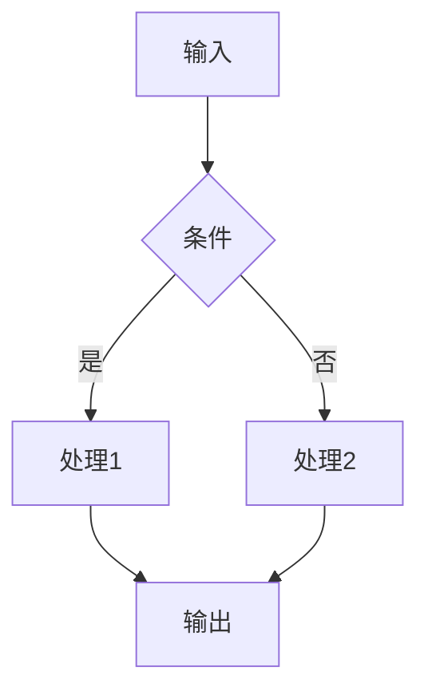

# Presentation — 图表与文档生成

按输出类型选择模式：

| 模式 | 命令前缀 | 工具链 | 适用 |
|:----|:---------|:-------|:-----|
| **架构图** | `diagram:` | Mermaid / Draw.io | 系统架构/流水线/FSM/时序图 |
| **HTML 幻灯片** | `slides:` | HTML+CSS+JS | 分享稿、技术演讲 |
| **PowerPoint** | `pptx:` | pptxgenjs (新建) / python-pptx (编辑) | 正式演示文稿 |
| **Excel** | `xlsx:` | pandas + openpyxl | 数据报告、表格输出 |

---

## 模式 1：架构图 (diagram)

### 工具选择

| 工具 | 适用复杂度 | 节点数 | 输出 |
|:----|:---------|:-------|:-----|
| **Mermaid** | 简单-中等 | ≤50 | 嵌入 Markdown |
| **Draw.io** | 复杂 | ≤200 | `.drawio.png`（含可编辑 XML） |

### Mermaid 规范

- 流程图：`flowchart TD` 方向，子图用 `subgraph`
- 时序图：参与者用全名，`activate/deactivate` 标注生命周期
- 状态图：`stateDiagram-v2`，`[*]` 表示起止状态
- FSM 图：用状态图表示三段式状态机



### Draw.io 核心规则

1. **布局**：坐标对齐 10 的倍数，正交走线，间距 ≥ 30px
2. **连线**：`edgeStyle=orthogonalEdgeStyle;rounded=1;` （确保 `orthogonalLoop=1;jettySize=auto;html=1;`）
3. **文本**：`html=1`，多行用 `&#xa;`，框高容纳全部文字
4. **颜色**：同图 ≤ 5 色，背景亮度 ≥ 200，文字亮度 ≤ 80
5. **导出**：
   ```bash
   draw.io -x -f png -e -s 2 -o diagram.drawio.png input.drawio
   # 导出后修复: python3 skills/presentation/scripts/repair_png.py diagram.drawio.png
   ```

> 详细参考：`skills/presentation/references/drawio-core.md`、`skills/presentation/references/style-presets.md`

---

## 模式 2：HTML 幻灯片 (slides)

纯静态 HTML 演示文稿。

### 结构模板

```html
<!DOCTYPE html>
<html lang="zh-CN">
<head>
  <meta charset="UTF-8">
  <title>标题</title>
  <link rel="stylesheet" href="theme.css">
</head>
<body>
  <div class="slide" id="slide1">
    <h1>标题</h1>
    <p>内容</p>
  </div>
  <!-- 更多 slide -->
  <script src="nav.js"></script>
</body>
</html>
```

### 功能支持

- 多种布局（标题/两栏/三栏/图文混排）
- 入场动画（fade/slide/zoom）
- 键盘导航（←/→翻页）
- 代码高亮（hljs 或 Prism）
- Mermaid 嵌入

### 准则

- 一个主题 CSS 文件统一视觉风格
- CDN 加载字体（避免本地缺失）
- 每个 Slide 配一个视觉元素（图/表/背景）

---

## 模式 3：PowerPoint (pptx)

### 创建方式选择

| 场景 | 方案 | 工具 |
|:----|:-----|:-----|
| 从零创建 | pptxgenjs（npm） | `npm install -g pptxgenjs` |
| 编辑已有文件 | python-pptx | `pip install python-pptx` |
| 从模板创建 | python-pptx | 基于模板修改 |

### pptxgenjs 快速开始

```javascript
const pptxgen = require("pptxgenjs");
const pptx = new pptxgen();

const slide = pptx.addSlide();
slide.addText("标题", { x: 0.5, y: 0.3, w: 9, h: 1, fontSize: 36, bold: true, fontFace: "Arial" });
slide.addText("正文内容", { x: 0.5, y: 1.5, w: 9, h: 5, fontSize: 16, fontFace: "Calibri" });

pptx.writeFile({ fileName: "output.pptx" });
```

### 设计指南

**配色方案** — 不要默认蓝色，选与主题匹配的色板：

| 主题 | 主色 | 辅色 | 强调色 |
|:-----|:-----|:------|:-------|
| 科技蓝 | `1E2761` | `CADCFC` | `FFFFFF` |
| 深色商务 | `36454F` | `F2F2F2` | `212121` |
| 森林绿 | `2C5F2D` | `97BC62` | `F5F5F5` |
| 珊瑚橙 | `F96167` | `F9E795` | `2F3C7E` |
| 海洋渐变 | `065A82` | `1C7293` | `21295C` |

**排版**：
| 元素 | 字号 |
|:-----|:-----|
| 幻灯片标题 | 36-44pt 粗体 |
| 节标题 | 20-24pt 粗体 |
| 正文 | 14-16pt |
| 标注 | 10-12pt 淡化色 |

**每页必须有一个视觉元素**（图/表/图标/形状），纯文字页不合格。

**常见错误**：
- ❌ 每页相同布局 → ✅ 变化列/卡片/标注布局
- ❌ 正文居中 → ✅ 左对齐（只有标题居中）
- ❌ 标题下加 accent 线（AI 生成标志） → ✅ 用留白或背景色区分
- ❌ 默认蓝色 → ✅ 选主题色
- ❌ 纯标题+要点 → ✅ 每页有视觉元素

### ⚠️ 强制 QA 循环

**你的第一版几乎一定有 bug。把它当 bug hunt，不是确认步骤。**

```
loop:
  1. 生成幻灯片
  2. 转图片: 
     ```bash
     python scripts/office/soffice.py --headless --convert-to pdf output.pptx
     pdftoppm -jpeg -r 150 output.pdf slide
     ```
  3. 子代理视觉检查（即使只有 2-3 页也要用子代理——你盯着代码会看到你想看的，不是实际存在的）
  4. 列出所有发现的问题（如果 "没发现"，再仔细看一遍）
  5. 修复问题
  6. 重新验证受影响页面（一个修复常引起另一个问题）
until 完整一轮无新发现
```

**检查要点**：元素重叠、文字溢出/截断、间距不足(<0.3")、边距不足(<0.5")、低对比度文本、占位符残留。

---

## 模式 4：Excel (xlsx)

### 工具选择

| 场景 | 推荐工具 | 说明 |
|:----|:---------|:------|
| 数据分析/批量操作 | pandas | `pd.read_excel()` / `pd.to_excel()` |
| 公式/格式/专业化 | openpyxl | 保留公式、设置样式 |
| 新建高级格式 | xlsxwriter | 图表/条件格式（新建专用） |

> **同一文件不要混用 openpyxl 和 xlsxwriter**。

### 铁律：用 Excel 公式，不用 Python 硬编码

```python
# ❌ 错误：Python 算好写死
total = df['Sales'].sum()
sheet['B10'] = total  # 硬编码 5000

# ✅ 正确：用 Excel 公式
sheet['B10'] = '=SUM(B2:B9)'
```

### 财务色彩编码标准

| 颜色 | 用途 | RGB |
|:-----|:-----|:----|
| 🔵 蓝色文字 | 硬编码输入、用户会改的场景参数 | `0,0,255` |
| ⚫ 黑色文字 | 所有公式和计算 | `0,0,0` |
| 🟢 绿色文字 | 同工作簿内跨表引用 | `0,128,0` |
| 🔴 红色文字 | 外部文件链接 | `255,0,0` |
| 🟡 黄色背景 | 关键假设、需要关注或更新的单元格 | `255,255,0` |

### 必备步骤

```bash
# 保存后用 recalc 脚本重新计算所有公式
python skills/presentation/scripts/recalc.py output.xlsx
```

该脚本自动配置 LibreOffice，重新计算所有公式，扫描并报告 `#REF!`/`#DIV/0!`/`#VALUE!`/`#NAME?` 等错误。

### 公式验证清单

- [ ] 测试 2-3 个样本引用，确认取值正确
- [ ] Excel 列映射正确（第 64 列 = BL，不是 BK）
- [ ] 行偏移正确（DataFrame 第 5 行 = Excel 第 6 行）
- [ ] NaN 处理：`pd.notna()` 过滤空值
- [ ] 分母不为零（`#DIV/0!` 预防）
- [ ] 跨表引用格式正确（`Sheet1!A1`）

---

## 跨模式通用原则

1. **每页/每页必须有视觉元素** — 纯文字不合格
2. **使用前检查环境依赖** — 没有工具链就提前说明
3. **QA 不可跳过** — PPT 和 Excel 必须有验证步骤
4. **第一次渲染几乎一定有问题** — 预设找 bug 的心态

## 关联 Skill

- [doc-gen](../doc-gen/SKILL.md) — 配套的文档生成（文本内容）
- [hdl-coding](../hdl-coding/SKILL.md) — 架构图涉及 HDL 模块
